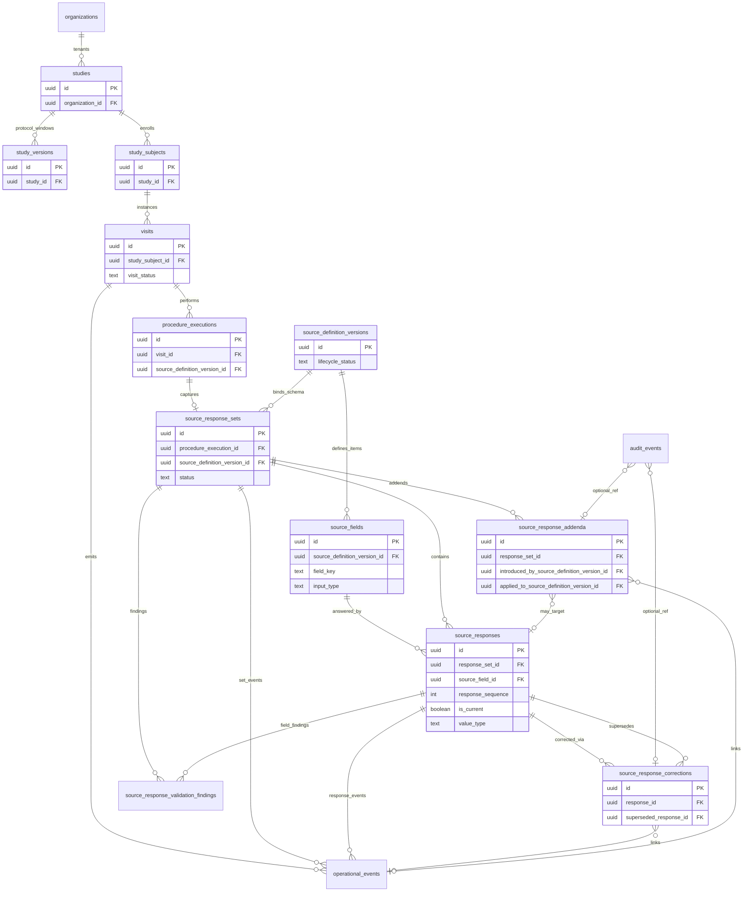

# Phase 4B — Versioned Dynamic eSource Runtime (schema design)

**Status:** Planning / documentation only. **No DDL, UI, RPCs, PDF, signatures, or queries in this artifact.**

**Core principle:** The authoring layer (Protocol Builder, future form canvas) is **not** the system of record. **Persisted `source_response_*` facts + append-only `operational_events` / `audit_events` references** are the system of record.

**Baseline (GREEN — do not alter):** Phase **1b**, **2**, **3A**, **3B**, **3C** RPCs (`complete_procedure_execution`, `complete_visit`, `lock_visit`). Phase **4A** versioned protocol builder schema applied.

**Companion docs:**  
[`REGULATORY-CORE-BLUEPRINT.md`](./REGULATORY-CORE-BLUEPRINT.md) · [`PHASE4A-VERSIONED-PROTOCOL-BUILDER-SCHEMA.md`](./PHASE4A-VERSIONED-PROTOCOL-BUILDER-SCHEMA.md) · [`FDA-ESOURCE-PART11-READINESS.md`](./FDA-ESOURCE-PART11-READINESS.md) · [`ARCHITECTURE-VERSIONED-EXPORTS.md`](./ARCHITECTURE-VERSIONED-EXPORTS.md) · [`ARCHITECTURE-VISIT-PDF-PACKET.md`](./ARCHITECTURE-VISIT-PDF-PACKET.md)

**Canonical codebase:** `vilo-os` — migrations **`0020`–`0025`** planned **after** **`0019`** (Phase 4A).

---

## A. ERD



**Spine (read left → right):**

`Study` → `Study Version` (context on set) → `Visit` → `Procedure Execution` → `Source Response Set` → `Source Responses`

**Schema spine (vertical bind):**

`Source Definition Version` → `Source Fields` → `Source Responses` (each response **must** reference the **execution-bound** `source_definition_version_id`, not “latest published”).

**Change spine:**

`Source Response Corrections` / `Source Response Addenda` → link to responses/sets + **`operational_events`** (required on regulated transitions) + optional **`audit_events`** (export-sensitive or policy-mandated).

---

## B. Tables and key columns

All tables: `organization_id` NOT NULL; RLS enabled; **no DELETE** for application clinical roles on submitted/locked artefacts.

### B.1 `source_response_sets`

Container for one capture episode on a **procedure execution**, bound to exactly one **published** `source_definition_version_id` at instantiation.

| Column | Type | Notes |
|--------|------|-------|
| `id` | uuid PK | |
| `organization_id` | uuid NOT NULL FK | Tenancy |
| `study_id` | uuid NOT NULL FK | Denormalized for RLS |
| `study_version_id` | uuid NULL FK → `study_versions` | Protocol window at open; snapshot for exports |
| `study_subject_id` | uuid NOT NULL FK → `study_subjects` | Subject context |
| `visit_id` | uuid NOT NULL FK → `visits` | Visit context |
| `procedure_execution_id` | uuid NOT NULL FK | **Required** — anchor for runtime |
| `source_definition_version_id` | uuid NOT NULL FK | **Required** — must be **`published`** at bind |
| **`status`** | text CHECK | See **§D** lifecycle enum |
| `opened_by_user_id` | uuid NOT NULL | First authorized open |
| `opened_at` | timestamptz NOT NULL | Server UTC |
| `submitted_by_user_id` | uuid NULL | Set on submit transition |
| `submitted_at` | timestamptz NULL | Server UTC |
| `locked_by_user_id` | uuid NULL | Visit/procedure freeze attribution |
| `locked_at` | timestamptz NULL | Aligns with visit `locked` or set-level lock |
| `reviewed_by_user_id` | uuid NULL | User who completed **review** (CRC/QA/PI review lane) |
| `reviewed_at` | timestamptz NULL | Server UTC when set enters `reviewed` |
| `signed_by_user_id` | uuid NULL | User who completed **signoff** (investigator attestation when applicable) |
| `signed_at` | timestamptz NULL | Server UTC when set enters `signed` |
| **`source_origin`** | text CHECK | `manual` \| `imported` \| `device` \| `system` |
| `created_at` | timestamptz NOT NULL | Server default |
| `updated_at` | timestamptz NOT NULL | Allowed **only** while `status ∈ {draft, in_progress}` on set metadata (not on submitted facts) |

**Indexes (planned):**

- `UNIQUE (procedure_execution_id, source_definition_version_id)` where `status NOT IN ('archived')` — one active set per execution+version unless superseded-set policy added later.
- `(organization_id, study_id, visit_id)`, `(study_subject_id)`, `(status)`.

**FK consistency triggers (planned):** `visit_id` / `study_subject_id` / `study_id` must match parent `procedure_executions` / `visits` row.

**Review vs signature attribution (required for FDA / Part 11 reconstruction):**

| Concern | Columns | Rule |
|---------|---------|------|
| **Review lifecycle** | `reviewed_by_user_id`, `reviewed_at` | Set when status → `reviewed` after CRC/QA/PI **review** (data check, not legal signoff). May occur while `signed_*` is still NULL. |
| **Signature lifecycle** | `signed_by_user_id`, `signed_at` | Set when status → `signed` after **electronic signature** attestation (**Phase 4E** binds meaning). Distinct actor and timestamp from review. |
| **Separation** | Both pairs nullable until each transition | **Never** infer signoff from review completion. CRC/reviewer workflow MUST remain distinguishable from PI/sub-I signoff in exports and reconstruction (**§G**, **§H**). |
| **Lock** | `locked_by_*` separate again | Visit/QC freeze is a third axis — do not overload `reviewed_*` or `signed_*`. |

Operational events (planned): `SOURCE_RESPONSE_SET_REVIEWED` vs `SOURCE_RESPONSE_SET_SIGNED` — separate `event_type` strings.

---

### B.2 `source_responses`

Atomic captured value for one **`source_fields`** item within a set.

| Column | Type | Notes |
|--------|------|-------|
| `id` | uuid PK | |
| `organization_id` | uuid NOT NULL | Matches set |
| **`response_set_id`** | uuid NOT NULL FK → `source_response_sets` | |
| `source_definition_version_id` | uuid NOT NULL FK | **Denormalized** — must equal set’s bound version |
| `source_field_id` | uuid NOT NULL FK → `source_fields` | Field must belong to bound version |
| `procedure_execution_id` | uuid NOT NULL FK | Denormalized execution anchor |
| **`response_sequence`** | integer NOT NULL DEFAULT 1 | Monotonic per `(response_set_id, source_field_id)`; increments on each new row in chain |
| **`is_current`** | boolean NOT NULL DEFAULT true | **Regulatory-visible “current” value** for the field within the set |
| `originator_user_id` | uuid NOT NULL | **Attributable** |
| `originator_role` | text NOT NULL | Snapshot of `study_members.role` at capture |
| `captured_at` | timestamptz NOT NULL | **Server UTC** — authoritative capture time |
| **`value_type`** | text NOT NULL | Aligns with `source_fields.input_type` / storage primitive |
| `value_text` | text NULL | Single-line / short text |
| `value_number` | numeric NULL | Integer or decimal per field definition |
| `value_boolean` | boolean NULL | |
| `value_date` | date NULL | |
| `value_datetime` | timestamptz NULL | Stored UTC |
| `value_json` | jsonb NULL | **Restricted** — see **§C** (structured rows/cells only) |
| `unit` | text NULL | UCUM or study-configured unit label |
| `normalized_value` | text NULL | Optional canonical form for exports/EDC |
| `source_system` | text NULL | e.g. `vilo_web`, `import_batch` |
| `source_device_id` | text NULL | Device/integration identifier |
| `is_submitted` | boolean NOT NULL DEFAULT false | Flips true on set submit; thereafter immutable value columns |
| `submitted_at` | timestamptz NULL | Server UTC when submitted |
| `supersedes_response_id` | uuid NULL FK self | Prior row in correction chain |
| `correction_chain_root_id` | uuid NULL FK self | Head of chain for export grouping |
| `operational_event_id` | uuid NULL FK → `operational_events` | Last substantive write event |
| `created_at` | timestamptz NOT NULL | Insert time |

**Correction chain / current-value rules:**

| Rule | Detail |
|------|--------|
| Only one **current** row per field | At most one row with `is_current = true` per `(response_set_id, source_field_id)` — see **§B.7** partial unique index |
| Submitted values never overwritten | No `UPDATE` to `value_*` after `is_submitted = true` |
| Corrections = new rows | INSERT new `source_responses` row; increment `response_sequence` |
| Prior row demoted | On correction, set prior row `is_current = false` in same transaction |
| Latest regulatory value | Queries, exports, EDC, and PDF “current answer” use `is_current = true` (join full chain for history) |
| Draft capture | First draft row: `response_sequence = 1`, `is_current = true`; draft edits UPDATE only while `is_submitted = false` and `is_current = true` |

**CHECK (planned):** Exactly one typed value column populated per `value_type` (enforced in RPC + optional DB constraint).

**Constraints:** See **§B.7** for uniqueness strategy (replaces single-row draft unique on `(response_set_id, source_field_id)` alone).

---

### B.3 `source_response_corrections`

Append-only correction record; **does not delete** superseded response.

| Column | Type | Notes |
|--------|------|-------|
| `id` | uuid PK | |
| `organization_id` | uuid NOT NULL | |
| `response_id` | uuid NOT NULL FK | New **replacement** response row (post-correction value) |
| `superseded_response_id` | uuid NOT NULL FK | Prior submitted response |
| **`correction_type`** | text NOT NULL | Controlled taxonomy e.g. `data_entry_error`, `new_information`, `query_resolution` |
| **`correction_reason`** | text NOT NULL | **Required** narrative/code |
| `prior_value_reference` | text NOT NULL | Digest, JSON pointer, or redacted snapshot ref — **no silent wipe** |
| `corrected_by_user_id` | uuid NOT NULL | |
| `corrected_at` | timestamptz NOT NULL | Server UTC |
| `operational_event_id` | uuid NULL FK | **Required** when policy = clinical correction |
| `audit_event_id` | uuid NULL FK | Optional; export/break-glass paths |
| `created_at` | timestamptz NOT NULL | |

**Rules:** INSERT-only for app roles. `response_id` must share `response_set_id` and `source_definition_version_id` with `superseded_response_id`.

---

### B.4 `source_response_addenda`

Late-entry / post-lock field introduction with **explicit version provenance** (not a relabel of v1 as v2).

| Column | Type | Notes |
|--------|------|-------|
| `id` | uuid PK | |
| `organization_id` | uuid NOT NULL | |
| `response_set_id` | uuid NOT NULL FK | Target set (may be **locked**) |
| **`introduced_by_source_definition_version_id`** | uuid NOT NULL FK | Version that **defines** the new field |
| **`applied_to_source_definition_version_id`** | uuid NOT NULL FK | Version the runtime capture was **under** (historic bind) |
| **`introduced_source_field_id`** | uuid NOT NULL FK | Field introduced by newer version |
| **`late_entry_reason`** | text NOT NULL | **Required** |
| `added_by_user_id` | uuid NOT NULL | |
| `added_at` | timestamptz NOT NULL | Server UTC |
| `response_id` | uuid NULL FK → `source_responses` | Populated when addendum materializes a new response row |
| `operational_event_id` | uuid NULL FK | **Required** on apply |
| `audit_event_id` | uuid NULL FK | Optional |
| `created_at` | timestamptz NOT NULL | |

**Rules:** `introduced_by_*` may be **newer** than `applied_to_*`; exports must show both ids/labels. Never UPDATE published `source_definition_versions` or historic field labels.

---

### B.5 `source_response_validation_findings`

Server-side rule evaluation results (edit checks); distinct from corrections.

| Column | Type | Notes |
|--------|------|-------|
| `id` | uuid PK | |
| `organization_id` | uuid NOT NULL | |
| `response_set_id` | uuid NOT NULL FK | |
| `response_id` | uuid NULL FK | Field-level finding when set |
| **`finding_type`** | text NOT NULL | e.g. `range`, `required`, `consistency`, `format` |
| **`severity`** | text NOT NULL | `info` \| `warning` \| `error` |
| `rule_code` | text NOT NULL | Stable machine code |
| `message` | text NOT NULL | Human-readable (**Legible**) |
| **`status`** | text CHECK | `open` \| `acknowledged` \| `resolved` \| `waived` |
| `created_at` | timestamptz NOT NULL | |
| `resolved_by_user_id` | uuid NULL | |
| `resolved_at` | timestamptz NULL | Server UTC |
| `resolution_reason` | text NULL | Required when `resolved` or `waived` |

Findings **do not** mutate `source_responses.value_*`; resolution may require correction workflow or waiver with reason.

---

### B.6 Phase 4A extensions (DDL note — may ship in `0020` preamble)

Extend **`source_fields`** (authoring) to support runtime typing — **only while parent version `draft`/`in_review`**:

| New / clarified column | Purpose |
|------------------------|---------|
| `input_type` | Enum from **§C** (replaces or narrows `widget_hint`) |
| `options_manifest` | jsonb — version-frozen coded options for dropdown/radio/checkbox |
| `table_schema` | jsonb — column defs for `table` / `nested_list` (not free-form answers) |
| `unit_default` | Default unit for numeric fields |

Published **`source_fields`** rows remain immutable; new types/options require **new `source_definition_versions`**.

---

### B.7 Recommended constraints and uniqueness strategy

Planned DDL constraints (documentation targets — implement in **`0021_source_responses.sql`**):

**Composite uniqueness (full chain):**

```sql
UNIQUE (response_set_id, source_field_id, response_sequence)
```

Ensures each sequence slot in a correction chain is distinct and ordered for reconstruction.

**Partial uniqueness (current value):**

```sql
-- One current row per field per set (partial unique index)
UNIQUE (response_set_id, source_field_id) WHERE (is_current = true)
```

**Reconstructability:** Inspectors and exports MUST be able to walk `(response_set_id, source_field_id)` ordered by `response_sequence` and see every superseded value via `supersedes_response_id` / `source_response_corrections` — **no deleted history**.

**Draft editing (complement to partial unique):** While `is_submitted = false` and `is_current = true`, application may UPDATE the single current draft row for that field; on submit, row becomes immutable. Further changes require new sequence + correction flow.

**Trigger/RPC obligations:**

1. On correction INSERT: new `response_sequence = max(sequence)+1`, new row `is_current = true`, prior row `is_current = false`.  
2. Reject INSERT that leaves zero or two+ `is_current = true` for same `(response_set_id, source_field_id)`.  
3. Never satisfy “update in place” for submitted values — append-only chain only.

---

## C. Field / input type support

### C.1 Supported `input_type` values

| `input_type` | Storage primary | Notes |
|--------------|-----------------|-------|
| `text` | `value_text` | Short string |
| `textarea` | `value_text` | Longer narrative — minimize for codifiable concepts |
| `integer` | `value_number` | Whole number |
| `decimal` | `value_number` | Fixed precision per `validation_rules` |
| `boolean` | `value_boolean` | |
| `date` | `value_date` | |
| `datetime` | `value_datetime` | UTC |
| `dropdown_single` | `value_text` + coded key in `normalized_value` | Options from `options_manifest` |
| `dropdown_multi` | `value_json` | Array of coded keys — schema-validated per **§C.3** |
| `checkbox` | `value_json` | Multi-select coded keys — **same validated array shape as `dropdown_multi`** per **§C.3** (not a generic blob) |
| `radio` | `value_text` | Single coded key |
| `nested_list` | `value_json` | Repeating structured rows per `table_schema` |
| `table` | `value_json` | Row/cell matrix — **not** uncontrolled blob |
| `file_reference` | `value_text` | Storage object id + metadata row (future attachment table) |
| `signature_reference` | `value_text` | Pointer to `electronic_signatures` (**Phase 4E**) |
| `calculated` | `value_number` or `value_text` | Read-only; server-computed on save |

### C.2 Design rules

1. **Structured coded fields preferred** over free text where protocol allows (drop-down/radio vs textarea).
2. **Options are version-aware** — `options_manifest` frozen on **`source_definition_versions`** publish; responses store **code** + export resolves **label** from manifest at export time.
3. **Tables / nested lists** use `table_schema` + validated `value_json` shape `{ "rows": [ { "cell_key": value, ... } ] }` — reject arbitrary keys at RPC.
4. **`validation_rules`** on `source_fields` evaluated server-side on save/submit; findings persist to **`source_response_validation_findings`**.
5. **Exports (future)** must emit: field label, `input_type`, unit, option labels, `captured_at`, `originator_*`, `source_definition_version_id` / label — per [`ARCHITECTURE-VERSIONED-EXPORTS.md`](./ARCHITECTURE-VERSIONED-EXPORTS.md). **No mixed-version** rectangular tables.

### C.3 `value_json` restriction (hard guardrail)

**`value_json` is NOT allowed to become a generic uncontrolled source capture payload.**

Structured regulated data must remain **queryable and typed** (cell-level or coded-key arrays), never an opaque substitute for normalized columns.

**Allowed use only for:**

| `input_type` | Permitted `value_json` shape |
|--------------|------------------------------|
| `dropdown_multi` | Array of coded keys from frozen `options_manifest` |
| `checkbox` | Same as `dropdown_multi` — validated coded-key array only |
| `nested_list` | `{ "rows": [ … ] }` per published `table_schema` |
| `table` | Structured row/cell payloads per published `table_schema` — **not** free-form matrices |

**Explicitly prohibited:**

- Arbitrary clinical JSON blobs (whole-form dumps, “capture everything here”)
- Unversioned nested payloads (keys not declared in `table_schema` / `options_manifest` for the bound `source_definition_version_id`)
- Opaque runtime schemas (client-defined shape, debug payloads, adapter-specific trees)
- Using `value_json` for types that have dedicated columns (`text`, `integer`, `date`, etc.)

**Anti-pattern:** `value_json` as a **form blob** for an entire `source_response_set` — forbidden (“form blob anti-pattern” in **§K**).

**Enforcement:** RPC validates shape against `source_fields.input_type` + manifests before INSERT; optional DB `CHECK` rejects `value_json` when `input_type` ∉ allowed set.

---

## D. Runtime lifecycle

### D.1 `source_response_sets.status` enum

| Status | Meaning |
|--------|---------|
| `draft` | Set opened; no submitted facts |
| `in_progress` | Active capture |
| `submitted` | Required fields satisfied; facts marked submitted |
| `pending_review` | Awaiting PI/QA review (**Phase 4E/F** hooks) |
| `reviewed` | Review complete |
| `signed` | Attestation recorded (**Phase 4E**) |
| `locked` | Immutable except controlled correction/addendum |
| `corrected` | At least one correction in chain |
| `addended` | Late-entry addendum applied |
| `archived` | Retention tier |

### D.2 Transition rules

```text
draft → in_progress → submitted → pending_review → reviewed → signed → locked
locked → corrected (via correction RPC; may require re-sign policy in 4E)
locked → addended (via addendum RPC only)
* → archived (retention job)
```

| Rule | Enforcement |
|------|-------------|
| `draft` / `in_progress` | Authorized roles may INSERT/UPDATE **draft** responses (`is_submitted = false`) |
| `submitted` | `is_submitted = true`; **no UPDATE** to `value_*` columns |
| `locked` set or visit `locked` | Block normal edits; **only** correction/addendum RPCs |
| Corrections / addenda | INSERT-only tables + new `source_responses` rows |
| Visit lock (Phase 3C) | Trigger/RPC denies draft saves on executions under `visits.visit_status = locked` except addendum/correction paths |
| Review vs sign | `reviewed_*` populated on `reviewed`; `signed_*` on `signed` — independent transitions (**§B.1**) |

### D.3 Operational event pairing (planned types)

| Transition | `event_type` (proposed) |
|------------|-------------------------|
| Open set | `SOURCE_RESPONSE_SET_OPENED` |
| Save draft field | `SOURCE_DRAFT_SAVED` |
| Submit set | `SOURCE_RESPONSE_SET_SUBMITTED` |
| Review complete | `SOURCE_RESPONSE_SET_REVIEWED` |
| Sign complete | `SOURCE_RESPONSE_SET_SIGNED` |
| Correction | `SOURCE_RESPONSE_CORRECTED` |
| Addendum | `SOURCE_ADDENDUM_APPLIED` |
| Set locked | `SOURCE_RESPONSE_SET_LOCKED` |

---

## E. Late-entry / addendum model

**Problem:** Protocol publishes **v2** with new required fields; subject’s visit was captured under **v1** binding.

| Rule | Detail |
|------|--------|
| New fields come from **new** `source_definition_versions` | Authoring publishes v2; v1 rows unchanged |
| Historic runtime stays on **v1** `source_definition_version_id` on set | `applied_to_source_definition_version_id` |
| Late value introduced under **v2 field def** | `introduced_by_source_definition_version_id` + `introduced_source_field_id` |
| No mutation of v1 published schema | RLS + triggers on 4A tables |
| No relabeling | Exports show “Field X (introduced in v2) captured against visit bound to v1” |
| Provenance required | `late_entry_reason`, `added_by_user_id`, `added_at`, `operational_event_id` |
| PDF/export visibility | Dedicated **Addenda** section per [`ARCHITECTURE-VISIT-PDF-PACKET.md`](./ARCHITECTURE-VISIT-PDF-PACKET.md) |

**Flow:**

1. Authorized user invokes **addendum RPC** on **locked** (or submitted) set.  
2. RPC validates role, reason, field belongs to `introduced_by_*` version.  
3. INSERT `source_response_addenda` + new `source_responses` row + `operational_events`.  
4. Set `status` → `addended` (or `corrected` if combined policy — prefer distinct).

---

## F. Correction model

| Rule | Implementation |
|------|----------------|
| No overwrite of submitted value | `UPDATE` denied on `value_*` when `is_submitted = true` |
| New fact row | INSERT new `source_responses` with `supersedes_response_id`, `response_sequence` incremented |
| Current pointer | New row `is_current = true`; superseded row `is_current = false` (same transaction) |
| Correction metadata | INSERT `source_response_corrections` |
| Prior value preserved | `superseded_response_id` retained; `prior_value_reference` required |
| Reason required | `correction_reason` NOT NULL |
| Actor / time | `corrected_by_user_id`, `corrected_at` server UTC |
| Event link | `operational_event_id` NOT NULL on correction path (clinical) |
| Chain | `correction_chain_root_id` points to first response in chain; full history via `response_sequence` ordering (**§B.7**) |
| Regulatory “current” value | Readers use `WHERE is_current = true` unless rendering correction history |

**Correction types (initial CHECK list):** `data_entry_error`, `transcription_error`, `new_information`, `query_resolution`, `other` (requires free-text reason).

---

## G. RLS strategy

Align **`PHASE2-CLINICAL-DOMAIN-SCHEMA`**, **`rbac-model.md`**, **`REGULATORY-CORE-BLUEPRINT.md` §6**.

| Policy | Outline |
|--------|---------|
| **Tenancy** | `organization_id` on every Phase 4B table |
| **SELECT** | `user_has_study_access(study_id)` (existing helper pattern) |
| **INSERT set/response** | `coordinator`, `nurse`, `study_admin` — not `monitor` |
| **UPDATE draft** | Same roles; only when set `draft`/`in_progress` and visit not `locked` |
| **Correction/addendum** | `study_admin`, `coordinator` (+ PI when 4E signature rules land); **requires RPC** |
| **Locked visit** | Deny INSERT/UPDATE on draft paths; allow only correction/addendum RPCs |
| **Monitor** | SELECT only; optional future query write in 4F |
| **Cross-org** | User B / Org A → **zero rows** |
| **Same-org non-member** | Org member without `study_members` → **zero rows** |
| **anon** | No policies |
| **service_role** | **Not** used for routine clinical capture |

Prefer **`SECURITY INVOKER` RPCs** for submit, correct, addendum — mirror Phase **3C** pattern.

---

## H. ALCOA+ / FDA implications

| Pillar | Phase 4B enforcement |
|--------|----------------------|
| **Attributable** | `originator_user_id`, `originator_role`, `opened_by_*`, `reviewed_by_*`, `signed_by_*` (distinct), `corrected_by_*`, `added_by_*`; ops events |
| **Legible** | Values joined to `source_fields.label`, `input_type`, `options_manifest` at export |
| **Contemporaneous** | `captured_at`, `submitted_at`, `corrected_at`, `added_at` — **server UTC only** |
| **Original** | Responses bound to execution-time `source_definition_version_id`; authoring drafts never referenced |
| **Accurate** | `validation_rules` + `source_response_validation_findings`; typed columns |
| **Complete** | Submit RPC rejects missing `is_required` fields unless deviation/waiver hook (future) |
| **Consistent** | Same version id on set, responses, exports; no mixed-version tables |
| **Enduring** | No DELETE; corrections append-only; locked visit immutability |
| **Available** | RLS SELECT for entitled roles; persisted rows for PDF/CSV (**Phase 4C/D**) |

**Part 11 posture:** Phase 4B establishes **durable electronic source facts**; signatures (**4E**) and exports (**4D**) attach later without rewriting history.

---

## I. Validation plan

Future script: **`npm run db:validate-phase4b`** (companion: `scripts/validate-phase4b.mjs`).

| # | Test | Expected |
|---|------|----------|
| 1 | Create set without `procedure_execution_id` | **Reject** |
| 2 | Create set without `source_definition_version_id` | **Reject** |
| 3 | Create set with draft/unpublished version | **Reject** |
| 4 | Capture response without `source_field_id` | **Reject** |
| 5 | Capture field from wrong version | **Reject** |
| 6 | Submit with missing required fields | **Reject** (or waiver path when implemented) |
| 7 | UPDATE `value_*` on submitted response | **Reject** |
| 8 | Create correction with reason | **Pass**; new row + chain |
| 9 | Create correction without reason | **Reject** |
| 10 | Create addendum with full provenance | **Pass** |
| 11 | Addendum without reason / version ids | **Reject** |
| 12 | User B (cross-org) read/write | **Deny** |
| 13 | Same-org non-study member | **Deny** |
| 14 | Draft save on locked visit | **Deny** |
| 15 | Addendum on locked visit with valid role | **Pass** |
| 16 | Export model includes addendum block | **Pass** (fixture/assertion in 4D; schema FKs exist in 4B) |
| 17 | Response version id ≠ set version id | **Reject** |
| 18 | `service_role` direct INSERT on responses | **Out of band** — not used in harness |
| 19 | Two rows `is_current = true` same field/set | **Reject** (partial unique) |
| 20 | Correction without demoting prior `is_current` | **Reject** |
| 21 | `reviewed_*` set without `signed_*` confusion in export fixture | **Pass** — review recorded; sign remains NULL until signed |
| 22 | `value_json` on `text` / arbitrary blob | **Reject** |

Harness uses synthetic subjects per **`phi-boundaries.md`**.

---

## J. Migration sequence (planning only)

Apply **after** Phase 4A **`0019`**. **Do not apply** until this document is approved.

| Order | File | Content |
|-------|------|---------|
| 1 | **`0020_source_response_sets.sql`** | Table + status/origin CHECK + `reviewed_*` / `signed_*` + indexes + RLS policies + FK triggers |
| 2 | **`0021_source_responses.sql`** | Table + `response_sequence` / `is_current` + composite + partial unique indexes + immutability trigger + RLS |
| 3 | **`0022_source_response_corrections.sql`** | Table + INSERT-only policies + FK to responses |
| 4 | **`0023_source_response_addenda.sql`** | Table + provenance FKs + RLS |
| 5 | **`0024_source_response_validation_findings.sql`** | Table + status CHECK + RLS |
| 6 | **`0025_phase4b_validation_helpers.sql`** | SQL helpers for harness: `assert_response_immutable`, cross-org fixtures — **no capture RPCs yet** |

**Explicitly excluded from 4B migrations:**

- `submit_source_response_set` / capture RPCs (**4B-close or 4B.1 PR**)
- `electronic_signatures`
- `export_artifacts`
- UI / Server Actions
- Changes to **`complete_visit`**, **`lock_visit`**, **`complete_procedure_execution`**

Optional in **`0020`:** `ALTER source_fields ADD input_type, options_manifest, table_schema` if not already in 4A migrations.

---

## K. Risks / anti-patterns

| Anti-pattern | Risk | Mitigation |
|--------------|------|------------|
| JSON blob capture (whole form in one column) | Non-legible, non-queryable, audit failure | Typed columns + **§C.3**-limited `value_json` only |
| Arbitrary / opaque `value_json` | Unqueryable regulated data | Allowlist: `dropdown_multi`, `checkbox` (coded array), `nested_list`, `table` only |
| Multiple `is_current = true` per field | Ambiguous “truth” for inspection | Partial unique index + correction RPC (**§B.7**) |
| Mutable live forms as SoR | Cannot reconstruct history | Persist responses; UI is view |
| Overwriting submitted data | Part 11 / ALCOA+ violation | Immutability trigger + correction chain |
| Hidden addenda | Inspection finding | Explicit `source_response_addenda` + export section |
| Mixed-version exports | Inconsistent sponsor data | Version-scoped export units |
| `service_role` clinical writes | Broken attribution | JWT + INVOKER RPCs only |
| Free text for codifiable variables | Weak analysis, QC drift | `input_type` + coded manifests |
| Correction without reason | Audit trail gap | NOT NULL `correction_reason` |
| Missing actor/timestamp/provenance | Attributable failure | Server UTC + user ids on all paths |
| Trusting client clock | Contemporaneous failure | Server timestamps only |
| Deleting “wrong” responses | Enduring failure | Supersede + invalidate semantics only |
| PHI in `operational_events.payload` | Privacy breach | Reference `source_responses.id` only |

---

## L. Exact next step

**After this document is approved:**

1. **Generate Phase 4B DDL migrations only** (`0020`–`0025`) in `vilo-os/supabase/migrations/`.  
2. **QA review** — RLS policy review against cross-tenant matrix; immutability triggers.  
3. **Apply** to staging (`apply-migrations.mjs`).  
4. **Run** `db:validate-phase4b` harness (create script in same PR as migrations or immediately after).

**Do not** in the first DDL PR: UI, capture Server Actions, PDF/export, signatures, queries, or GREEN RPC edits.

**Follow-on PR (4B.1):** `SECURITY INVOKER` RPCs — `open_source_response_set`, `save_source_draft`, `submit_source_response_set`, `apply_source_correction`, `apply_source_addendum` — each pairing `operational_events` in one transaction.

---

## Appendix — Binding `procedure_executions.source_definition_version_id`

On **first open** of a response set (or first draft save — pick one rule at RPC time):

1. If `procedure_executions.source_definition_version_id` IS NULL → set from `procedure_source_bindings.default_source_definition_version_id` (must be **published**).  
2. If already set → new sets **must** use the same id (reject mismatch).  
3. Never auto-upgrade execution to newer published version without explicit migration/amendment workflow.

This preserves **Original / Consistent** ALCOA+ when bindings change for **future** visits only.

---

*Regulatory-informed engineering posture only — not validation certification or legal advice.*
