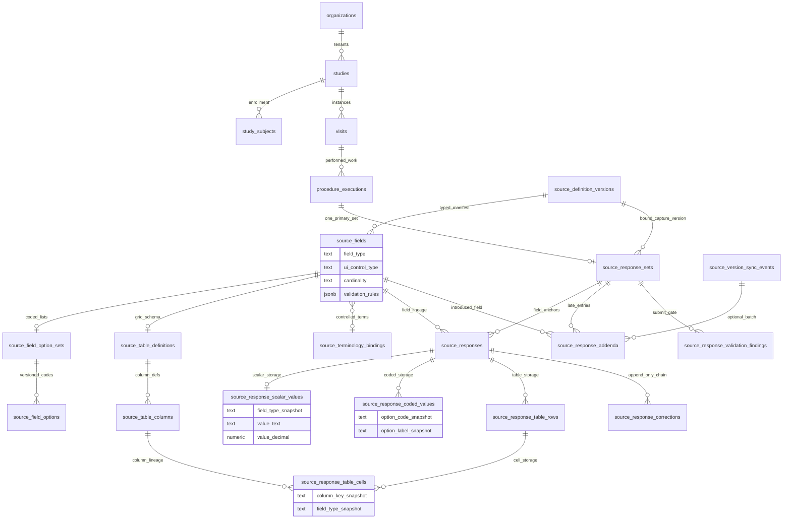

# Phase 4B — Versioned Dynamic eSource Runtime (schema design)

**Status:** **Planning / documentation only.** No DDL, UI, exports, signatures, or RPC changes to **GREEN** Phase **3C** in this artifact.

**Prerequisites:** Phase **4A** applied (`source_definitions`, `source_definition_versions`, `source_fields`, `procedure_source_bindings`, nullable `procedure_executions.source_definition_version_id`).

**Product rules (runtime):**

1. Capture binds to the **exact** `source_definition_version_id` on the **`procedure_execution`** (frozen at first substantive capture).
2. **Submitted** source values are **never overwritten** — only superseded via append-only **corrections** or **late-entry addenda**.
3. **Published** source definition versions remain **immutable**; amendments are **new version rows** (4A).
4. **Backward-compatible sync:** fields introduced in a **newer** published version may be **late-entered** on **older** runtime records (addenda), with explicit provenance — **v1 data is not relabeled as v2**.
5. **Historical reconstruction** uses **persisted** responses + addenda + correction chains — never live draft forms.

**Typed clinical field primitives (4B):**

6. **Structured coded fields** are preferred over free text when protocol-compatible (`field_type` ∈ coded family; `allows_free_text = false`).
7. **Free text** is limited to `clinical_use_category` ∈ {`comment`, `deviation`, `observation`, `unexpected_finding`} (and explicit protocol exceptions).
8. **Dropdown/select options** are **version-aware** via normalized **`source_field_option_sets`** / **`source_field_options`** — never live-only option lists.
9. **Dynamic tables** persist as **`source_response_table_rows`** + **`source_response_table_cells`** — regulated cell values are **not** opaque clinical JSON blobs.
10. **`validation_rules`** are **version-frozen** on the `source_fields` row (and table column rows) tied to `source_definition_version_id`.
11. **PDF/CSV exports** emit typed columns, coded **code + label** snapshots, and table row/column keys — not untyped strings alone.
12. **ALCOA+/FDA reconstruction** uses persisted typed runtime rows + snapshots — not current authoring definitions.

**Companion docs:** `PHASE4A-VERSIONED-PROTOCOL-BUILDER-SCHEMA.md`, `FDA-ESOURCE-PART11-READINESS.md`, `ARCHITECTURE-VERSIONED-EXPORTS.md`, `ARCHITECTURE-VISIT-PDF-PACKET.md`.

---

## A. Proposed ERD

**Cardinality notes**

- **One primary `source_response_set` per `procedure_execution`** for a given bound instrument (unique on `procedure_execution_id`). Re-instrumentation or rare re-bind flows use **`superseded`** set + new set (explicit, audited) — not silent replace.
- **`source_responses`** are **anchors** (metadata + status); **regulated values** live in typed child tables (**§B.0.4**).
- **`source_response_addenda`** cover fields **not** on the bound version but introduced by a **later** published version (late entry), using the **same typed storage pattern** as bound responses.
- **`source_version_sync_events`** batch or protocol-level **sync proposals**; materialized addenda reference the event when created from an approved sync.

---

## B.0 Typed clinical field primitives (authoring + runtime)

### B.0.1 Supported `field_type` (storage / validation semantics)

| `field_type` | Typical `ui_control_type` | Regulated storage |
|--------------|---------------------------|-------------------|
| `text` | `text` | `source_response_scalar_values.value_text` (length-capped; free-text gated) |
| `textarea` | `textarea` | `value_text` (multi-line; free-text gated) |
| `integer` | `text` / `integer` | `value_integer` |
| `decimal` | `text` / `decimal` | `value_decimal` |
| `boolean` | `boolean` / `checkbox` | `value_boolean` |
| `date` | `date` | `value_date` |
| `datetime` | `datetime` | `value_timestamptz` |
| `coded_single` | `dropdown_single`, `radio` | `source_response_coded_values` (one row) |
| `coded_multi` | `dropdown_multi`, `checkbox` (multi) | `source_response_coded_values` (one row per code) |
| `table` | `table` | `source_response_table_rows` + `source_response_table_cells` |
| `file` | `file` | Scalar FK to `attachments.id` + metadata snapshot |
| `signature_reference` | `signature_reference` | FK to future `electronic_signatures.id` (4E) — not a boolean flag |

**`ui_control_type` enum (presentation):** `text`, `textarea`, `integer`, `decimal`, `boolean`, `date`, `datetime`, `dropdown_single`, `dropdown_multi`, `checkbox`, `radio`, `table`, `file`, `signature_reference`.

**Compatibility rule:** RPC validates that `ui_control_type` is **allowed** for the declared `field_type` (compatibility matrix in `phase4b_validate_ui_control_for_field_type()`).

### B.0.2 Authoring model — `source_fields` (4A extension)

Extends **`PHASE4A-VERSIONED-PROTOCOL-BUILDER-SCHEMA.md` §B.3**. All columns are **immutable** once parent `source_definition_versions.lifecycle_status = published`.

| Column | Notes |
|--------|-------|
| `field_type` | Storage primitive (**§B.0.1**) |
| `ui_control_type` | Widget used at capture time (snapshotted on response) |
| `cardinality` | Scalar answer cardinality; for `table`, see row rules on `source_table_definitions` |
| `validation_rules` | JSON object **versioned with field row** — min/max, regex, precision, required row counts, cross-field refs (keys only, no PHI) |
| `clinical_use_category` | Gates `allows_free_text` — protocol items default **coded/numeric/date**, not narrative |
| `allows_free_text` | `true` only for comment/deviation/observation/unexpected_finding categories |
| `terminology_binding_id` | Optional FK → **`source_terminology_bindings`** (CDISC subset, local code list id, sponsor dictionary ref) |
| `option_set_id` | FK when `field_type` ∈ {`coded_single`, `coded_multi`} |
| `table_definition_id` | FK when `field_type = table` |

**Free-text policy (product rules 1–2):**

- Default **`allows_free_text = false`** for `clinical_use_category = protocol_item`.
- Permitted narrative fields must use `field_type` `text` or `textarea` with category ∈ {`comment`, `deviation`, `observation`, `unexpected_finding`}.
- Submit RPC **rejects** protocol items submitted as unconstrained long text when a coded option set exists for the same clinical concept.

### B.0.3 Versioned dropdown / select — `source_field_option_sets` + `source_field_options`

| Table | Purpose |
|-------|---------|
| **`source_field_option_sets`** | One set per coded field per **`source_definition_version_id`**; `option_set_key`, `version_id`, optional `terminology_binding_id` |
| **`source_field_options`** | Rows: `option_code` (machine), `display_label`, `sort_order`, `is_active`, optional `effective_start`/`effective_end` within version |

**Rules:**

- Options are **never** read from a global live catalog at export/replay time — only from **version-bound** rows (+ runtime snapshots).
- Publish freezes option rows; new codes require **new `source_definition_version`**.
- Runtime stores **`source_field_option_id`** + **`option_code_snapshot`** + **`option_label_snapshot`** on each `source_response_coded_values` row.

### B.0.3b Controlled terminology — `source_terminology_bindings` (optional)

| Column | Notes |
|--------|-------|
| `id` | uuid PK |
| `organization_id`, `study_id` | Tenancy |
| `terminology_system` | e.g. `local`, `cdisc_submission_val`, `sponsor_custom` |
| `value_set_code` | External or sponsor id |
| `value_set_version` | Version string frozen at publish |
| `description` | Human-readable |

Fields and option sets may reference the same binding so exports declare **value set identity** in metadata.

### B.0.3c Structured dynamic tables — `source_table_definitions` + `source_table_columns`

| Table | Purpose |
|-------|---------|
| **`source_table_definitions`** | Linked from `source_fields` where `field_type = table`; `min_rows`, `max_rows`, `row_label_template` |
| **`source_table_columns`** | One row per column: `column_key`, `label`, `field_type`, `ui_control_type`, `cardinality`, `validation_rules`, `is_required`, `option_set_id`, `sort_order` |

**Regulated data rule:** Clinical table **cell values** MUST NOT be stored as an unstructured JSON map on `source_responses`. They persist in **`source_response_table_cells`** (one row per cell) with typed columns mirroring scalars/coded values.

### B.0.4 Runtime typed value storage (replaces clinical `value_payload` JSON)

**`source_responses`** — anchor row per field (or per table field):

| Column | Notes |
|--------|-------|
| `field_type_snapshot` | From `source_fields.field_type` at bind/submit |
| `ui_control_type_snapshot` | From `source_fields.ui_control_type` |
| `cardinality_snapshot` | From `source_fields.cardinality` |
| `validation_rules_snapshot` | Frozen copy of `validation_rules` jsonb |
| `clinical_use_category_snapshot` | For export/PDF gating labels |
| `value_storage_kind` | `scalar` \| `coded` \| `table` \| `file` \| `signature_reference` |
| ~~`value_payload`~~ | **Not used for submitted regulated clinical values** — optional draft-only staging table or omitted |

**Child tables (1:1 or 1:N as appropriate):**

| Table | When |
|-------|------|
| **`source_response_scalar_values`** | `text`, `textarea`, `integer`, `decimal`, `boolean`, `date`, `datetime`, `file`, `signature_reference` |
| **`source_response_coded_values`** | `coded_single` / `coded_multi` — includes `source_field_option_id`, code/label snapshots, `terminology_binding_id_snapshot` |
| **`source_response_table_rows`** | `table` — `row_index`, `row_status`, `created_at` |
| **`source_response_table_cells`** | Per row × column — typed value columns + `source_table_column_id` + column snapshots |

**Corrections / addenda** duplicate the same typed pattern: correction rows reference prior child value row ids; addenda include full type snapshots from **introduced** field manifest.

**ALCOA+ reconstruction:** Inspector replay joins `source_responses` → typed children + snapshots; **no dependency** on live `source_fields` except for display convenience in UI.

### B.0.5 Validation implications (submit / correct / addendum)

| Layer | Behavior |
|-------|----------|
| **Authoring** | `validation_rules` jsonb on `source_fields` / `source_table_columns` edited only in `draft`/`in_review`; copied to `validation_rules_snapshot` on response at submit |
| **Type coercion** | Server RPC coerces and validates per `field_type` (reject non-numeric strings for `integer`, invalid ISO dates, etc.) |
| **Coded membership** | Each selected `source_field_option_id` must belong to the field’s `option_set_id` for the **bound** (or **introduced**, for addenda) version |
| **Cardinality** | `coded_multi` enforces min/max selections from `validation_rules`; `table` enforces `min_rows`/`max_rows` on `source_response_table_rows` |
| **Free text** | Length caps from `validation_rules`; `allows_free_text` + `clinical_use_category` enforced |
| **Findings** | `source_response_validation_findings` codes include `TYPE_MISMATCH`, `OPTION_NOT_IN_VERSION`, `TABLE_ROW_COUNT`, `REQUIRED_CELL_EMPTY`, `FREE_TEXT_NOT_ALLOWED` |
| **Corrections** | Re-validate **new** typed child rows against **original** `validation_rules_snapshot` unless addendum introduces new rules from v2 field |
| **Late entry** | Validate against **introduced** field’s `field_type`, options, and `validation_rules` — still write into v1 runtime with provenance |

---

## B. Tables and key columns

### B.1 `source_response_sets`

Runtime **container** for all capture on one procedure execution under one frozen source version.

| Column | Type | Notes |
|--------|------|-------|
| `id` | uuid PK | |
| `organization_id` | uuid NOT NULL FK | RLS tenancy |
| `study_id` | uuid NOT NULL FK | |
| `visit_id` | uuid NOT NULL FK | Denormalized from `procedure_executions` → `visits` |
| `study_subject_id` | uuid NOT NULL FK | Denormalized from visit → subject |
| `procedure_execution_id` | uuid NOT NULL FK | **Unique** — one active primary set per execution |
| `source_definition_id` | uuid NOT NULL FK | Instrument lineage (from bound version) |
| `source_definition_version_id` | uuid NOT NULL FK | **Bound capture version** (e.g. v1); must match `procedure_executions.source_definition_version_id` once bound |
| `applied_to_source_definition_version_id` | uuid NOT NULL FK | **Same as bound version** for normal capture; documents “runtime schema context” for addenda provenance queries |
| `study_version_id` | uuid NULL FK | Optional protocol window at bind time |
| `lifecycle_status` | text NOT NULL | See **§C** |
| `schema_manifest_hash` | text | Copy/hash from bound `source_definition_versions` at bind (integrity) |
| `submitted_at` | timestamptz NULL | Server UTC on submit |
| `submitted_by_user_id` | uuid NULL | |
| `locked_at` | timestamptz NULL | Set when visit lock propagates (align Phase 3C) |
| `locked_by_user_id` | uuid NULL | |
| `invalidated_at` | timestamptz NULL | Rare whole-set invalidation |
| `invalidated_by_user_id` | uuid NULL | |
| `invalidation_reason` | text NULL | |
| `supersedes_response_set_id` | uuid NULL FK self | Prior set if re-bind/supersede flow |
| `created_at` | timestamptz NOT NULL | Server default |
| `updated_at` | timestamptz NOT NULL | Draft-only mutation window |
| `created_by_user_id` | uuid NULL | |

**No DELETE** for authenticated clinical roles. **`superseded`** / **`invalidated`** retain rows.

---

### B.2 `source_responses`

**Anchor row** per captured field (or table field) under the bound version’s manifest. **Regulated values** live in typed child tables (**§B.0.4**).

| Column | Type | Notes |
|--------|------|-------|
| `id` | uuid PK | |
| `organization_id` | uuid NOT NULL FK | |
| `study_id` | uuid NOT NULL FK | |
| `source_response_set_id` | uuid NOT NULL FK | |
| `source_field_id` | uuid NOT NULL FK | Field row on **bound** version |
| `field_key` | text NOT NULL | Denormalized stable key |
| `label_snapshot` | text NOT NULL | **Legible** export/PDF |
| `instructions_snapshot` | text NOT NULL | |
| `field_type_snapshot` | text NOT NULL | **§B.0.1** |
| `ui_control_type_snapshot` | text NOT NULL | |
| `cardinality_snapshot` | text NOT NULL | |
| `validation_rules_snapshot` | jsonb NOT NULL | Frozen at submit — **versioned with bound field** |
| `clinical_use_category_snapshot` | text NOT NULL | Free-text policy audit |
| `allows_free_text_snapshot` | boolean NOT NULL | |
| `value_storage_kind` | text NOT NULL | `scalar` \| `coded` \| `table` \| `file` \| `signature_reference` |
| `is_required_snapshot` | boolean NOT NULL | Completeness at bind |
| `response_status` | text NOT NULL | `draft` \| `submitted` \| `corrected` \| `superseded` \| `invalidated` |
| `captured_at` | timestamptz NULL | Server UTC on submit (not client) |
| `captured_by_user_id` | uuid NULL | |
| `active_correction_id` | uuid NULL FK | Points to latest correction head (optional) |
| `created_at` | timestamptz NOT NULL | |
| `updated_at` | timestamptz NOT NULL | Draft only |

**Typed children (required on submit):** `source_response_scalar_values` | `source_response_coded_values` | (`source_response_table_rows` + `source_response_table_cells`).

**Unique:** `(source_response_set_id, field_key)` for non-superseded active rows (partial unique index excluding `superseded`/`invalidated`).

**Immutability:** After `response_status = submitted`, anchor + child value rows **MUST NOT UPDATE** — corrections and addenda are append-only.

---

### B.3 `source_response_corrections`

Append-only **correction chain** for values captured under the bound version.

| Column | Type | Notes |
|--------|------|-------|
| `id` | uuid PK | |
| `organization_id` | uuid NOT NULL FK | |
| `study_id` | uuid NOT NULL FK | |
| `source_response_set_id` | uuid NOT NULL FK | |
| `prior_source_response_id` | uuid NOT NULL FK | Original or prior correction target |
| `replacement_source_response_id` | uuid NULL FK | New row if model uses replacement response row |
| `field_key` | text NOT NULL | |
| `prior_value_snapshot` | jsonb NOT NULL | **Export/replay digest only** — canonical prior state is typed child row FKs + snapshots |
| `prior_scalar_value_id` | uuid NULL FK | |
| `prior_coded_value_ids` | uuid[] NULL | |
| `new_scalar_value_id` | uuid NULL FK | Replacement typed row |
| `new_coded_value_ids` | uuid[] NULL | |
| `field_type_snapshot` | text NOT NULL | |
| `correction_reason` | text NOT NULL | Controlled vocabulary + free text policy |
| `correction_status` | text NOT NULL | `proposed` \| `applied` \| `rejected` (optional workflow) |
| `corrected_at` | timestamptz NOT NULL | Server UTC |
| `corrected_by_user_id` | uuid NOT NULL | |
| `operational_event_id` | uuid NULL FK | `SOURCE_RESPONSE_CORRECTED` |
| `audit_event_id` | uuid NULL FK | Escalation / export-sensitive actions |
| `sequence_number` | int NOT NULL | Monotonic per `prior_source_response_id` chain |

**Rule:** Applying a correction sets prior response to **`corrected`** or **`superseded`**; effective value resolved by “latest applied correction” or replacement row — **never in-place UPDATE of submitted payload**.

---

### B.4 `source_response_addenda` (late entries)

Values for fields **introduced in a newer published version**, applied to a **older bound runtime** (v1 set receives Field X from v2).

| Column | Type | Notes |
|--------|------|-------|
| `id` | uuid PK | |
| `organization_id` | uuid NOT NULL FK | |
| `study_id` | uuid NOT NULL FK | |
| `applied_to_response_set_id` | uuid NOT NULL FK | v1 runtime set |
| `applied_to_source_definition_version_id` | uuid NOT NULL FK | **v1** — runtime was authored under v1 |
| `introduced_by_source_definition_version_id` | uuid NOT NULL FK | **v2** — version that defined the new field |
| `introduced_source_field_id` | uuid NOT NULL FK | Field X on v2 |
| `source_version_sync_event_id` | uuid NULL FK | When created via approved batch sync |
| `field_key` | text NOT NULL | From v2 field |
| `label_snapshot` | text NOT NULL | From v2 at apply time |
| `instructions_snapshot` | text NOT NULL | |
| `field_type_snapshot` | text NOT NULL | From introduced field |
| `ui_control_type_snapshot` | text NOT NULL | |
| `cardinality_snapshot` | text NOT NULL | |
| `validation_rules_snapshot` | jsonb NOT NULL | From v2 field at apply time |
| `value_storage_kind` | text NOT NULL | Same enum as responses |
| Typed child FKs | | Same pattern as **§B.0.4** (scalar / coded / table cells) |
| `late_entry_reason` | text NOT NULL | See allowed reasons below |
| `late_entry_reason_detail` | text NULL | Required when `other` |
| `addendum_status` | text NOT NULL | Aligns with late-entry lifecycle **§D** |
| `added_at` | timestamptz NOT NULL | Server UTC |
| `added_by_user_id` | uuid NOT NULL | |
| `approved_at` | timestamptz NULL | If approval step required |
| `approved_by_user_id` | uuid NULL | |
| `operational_event_id` | uuid NULL FK | `SOURCE_LATE_ENTRY_APPLIED` |
| `audit_event_id` | uuid NULL FK | |
| `created_at` | timestamptz NOT NULL | |

**Allowed `late_entry_reason` values:** `protocol_amendment`, `missed_item`, `sponsor_request`, `monitor_query`, `site_correction`, `data_clarification`, `other_documented`.

**Unique:** `(applied_to_response_set_id, introduced_source_field_id)` where `addendum_status = applied_as_late_entry` — one applied late value per field introduction per set.

---

### B.5 `source_version_sync_events`

Auditable **backward-sync workflow** (study- or version-scoped proposal before addenda are materialized).

| Column | Type | Notes |
|--------|------|-------|
| `id` | uuid PK | |
| `organization_id` | uuid NOT NULL FK | |
| `study_id` | uuid NOT NULL FK | |
| `source_definition_id` | uuid NOT NULL FK | Instrument |
| `introduced_by_source_definition_version_id` | uuid NOT NULL FK | Newer published version (v2) |
| `target_source_definition_version_id` | uuid NOT NULL FK | Older published version (v1) whose runtimes may receive addenda |
| `sync_status` | text NOT NULL | **§D** — `proposed_sync` \| `approved_sync` \| `applied_as_late_entry` \| `rejected` |
| `field_manifest` | jsonb NOT NULL | List of `source_field_id` / `field_key` eligible for late entry |
| `scope_filter` | jsonb NULL | Optional: visit_ids, date range, procedure_definition_ids |
| `proposed_at` | timestamptz NOT NULL | Server |
| `proposed_by_user_id` | uuid NOT NULL | |
| `approved_at` | timestamptz NULL | |
| `approved_by_user_id` | uuid NULL | |
| `applied_at` | timestamptz NULL | |
| `applied_by_user_id` | uuid NULL | |
| `rejected_at` | timestamptz NULL | |
| `rejected_by_user_id` | uuid NULL | |
| `rejection_reason` | text NULL | |
| `operational_event_id` | uuid NULL FK | Per transition |
| `audit_event_id` | uuid NULL FK | |
| `created_at` | timestamptz NOT NULL | |

**Rule:** `introduced_by` must be **published** and **newer lineage** than `target` (enforced by trigger/RPC). **v1 rows are never mutated.**

---

### B.6 `source_response_validation_findings` (recommended)

Server-side **submit gate** and completeness tracking (required fields on bound version + open late-required items).

| Column | Type | Notes |
|--------|------|-------|
| `id` | uuid PK | |
| `organization_id` | uuid NOT NULL FK | |
| `study_id` | uuid NOT NULL FK | |
| `source_response_set_id` | uuid NOT NULL FK | |
| `source_field_id` | uuid NULL FK | Bound-version field |
| `introduced_source_field_id` | uuid NULL FK | For late-required findings |
| `finding_code` | text NOT NULL | e.g. `REQUIRED_MISSING`, `VALIDATION_RULE_FAILED` |
| `severity` | text NOT NULL | `error` \| `warning` |
| `message` | text NOT NULL | Human-readable |
| `resolved_at` | timestamptz NULL | When submit succeeds or addendum applied |
| `created_at` | timestamptz NOT NULL | Server |

---

### B.7 Relationships to existing / future entities

| Entity | Relationship |
|--------|----------------|
| **`procedure_executions`** | 1:1 primary `source_response_set`; FK `source_definition_version_id` **set once** at bind (≤ first substantive capture) via **new** 4B RPC — **not** by altering 3C RPCs |
| **`visits`** | Denormalized on set for RLS/export; visit **lock** blocks normal draft/submit/correct; controlled addendum path after lock |
| **`study_subjects`** | Denormalized on set |
| **`study_versions`** | Optional snapshot on set at bind |
| **`source_definition_versions`** | Bound version on set/responses; **introduced_by** / **applied_to** on addenda |
| **`source_fields`** | Responses reference bound-version fields; addenda reference **introduced** field on newer version |
| **`procedure_source_bindings`** | Default version at instantiation; bind RPC copies to execution + creates draft set |
| **`operational_events`** | `SOURCE_RESPONSE_SET_SUBMITTED`, `SOURCE_RESPONSE_CORRECTED`, `SOURCE_LATE_ENTRY_APPLIED`, `SOURCE_VERSION_SYNC_*` |
| **`audit_events`** | Export, approval, break-glass |
| **`electronic_signatures`** (4E) | FK optional `source_response_set_id` / `procedure_execution_id`; meaning tied to **bound version** label |
| **`export_artifacts`** (4C/4D) | Manifest references `visit_id`, `source_definition_version_id`, artifact hash; **never** rebuild from live drafts |

---

## C. Runtime response lifecycle (`source_response_sets` + `source_responses`)

### Set-level (`source_response_sets.lifecycle_status`)

| Status | Meaning | Allowed mutations |
|--------|---------|-------------------|
| **`draft`** | In-progress capture | Create/update draft `source_responses`; bind version fixed |
| **`submitted`** | Investigator submit complete for bound schema | No in-place response edits; corrections/addenda only |
| **`corrected`** | At least one applied correction on bound responses | Still submitted semantics; export shows chain |
| **`superseded`** | Replaced by newer set (rare re-bind) | Read-only |
| **`invalidated`** | Whole set voided with reason | Read-only; retain audit |
| **`locked`** | Visit/execution freeze (Phase 3C) | No draft/correct without controlled paths; addenda per policy |

### Field-level (`source_responses.response_status`)

| Status | Meaning |
|--------|---------|
| **`draft`** | Editable until set submit |
| **`submitted`** | Immutable value |
| **`corrected`** | Superseded by correction chain head |
| **`superseded`** | Replaced by correction replacement row |
| **`invalidated`** | Voided with reason |

**Transitions (server RPC only):**

- `draft` → `submitted`: **`submit_source_response_set`** — validates required bound fields, sets server `submitted_at` / `captured_at`.
- `submitted` → `corrected`: via **`source_response_corrections`** insert only.
- Set → `locked`: trigger/RPC on **`lock_visit`** side effect or explicit propagation job — **does not** change submitted values.
- Late fields: **not** `source_responses` on v1 — use **`source_response_addenda`**.

---

## D. Late-entry / addendum model

### D.1 Product behavior (clarified)

| Fact | Rule |
|------|------|
| Execution captured under **v1** | `source_response_set.source_definition_version_id = v1` forever for that set |
| **v2** publishes Field X | v2 `source_fields` row exists; v1 unchanged |
| Site enters Field X on old visit | Insert **`source_response_addenda`** with `applied_to_* = v1`, `introduced_by_* = v2` |
| Export/PDF | v1 block shows original items; **Late Entry Addenda** section shows Field X with provenance |

### D.2 Sync event lifecycle (`source_version_sync_events.sync_status`)

| Status | Meaning |
|--------|---------|
| **`proposed_sync`** | Coordinator/sponsor proposes applying v2 field manifest to v1 runtimes |
| **`approved_sync`** | `study_admin` / org admin / regulatory role approves (RBAC TBD) |
| **`applied_as_late_entry`** | Batch or per-set RPC created addendum rows; event closed |
| **`rejected`** | No addenda; reason recorded |

### D.3 Addendum row lifecycle (`source_response_addenda.addendum_status`)

Mirror sync where batch-driven; for **ad hoc** single late entry:

| Status | Meaning |
|--------|---------|
| **`proposed_sync`** | Pending approval (optional) |
| **`approved_sync`** | Approved, not yet captured |
| **`applied_as_late_entry`** | Value persisted; visible in export/PDF |
| **`rejected`** | Discarded |

**Ad hoc path:** Site may create addendum directly as `applied_as_late_entry` when role permits **without** batch event; still requires **`late_entry_reason`**, actor, server timestamp, **`operational_event_id`**.

### D.4 Provenance (required on every applied addendum)

| Field | Purpose |
|-------|---------|
| `introduced_by_source_definition_version_id` | Version that **authored** the field (v2) |
| `applied_to_source_definition_version_id` | Version the **runtime** was bound to (v1) |
| `applied_to_response_set_id` | Which execution runtime received the late value |
| `introduced_source_field_id` | Canonical field row on v2 |
| `late_entry_reason` | Controlled enum |
| `added_by_user_id` / `added_at` | **Attributable**, **Contemporaneous** |
| `operational_event_id` / `audit_event_id` | **Available** audit trail |

---

## E. Correction model

1. **Trigger:** User with correct role issues correction on a **submitted** `source_response` (bound version field only — not addenda fields unless addendum-specific correction flow in 4B+).
2. **Record:** Insert `source_response_corrections` with typed prior/new child row FKs, `prior_value_snapshot` digest, `correction_reason`, server `corrected_at`.
3. **Effect:** Mark prior response `corrected`/`superseded`; optionally insert replacement `source_responses` row linked by FK — **never** UPDATE `value_payload` on submitted row.
4. **Event:** `operational_events` type `SOURCE_RESPONSE_CORRECTED` with `source_response_set_id`, `field_key`, correction id.
5. **Export/PDF:** Show **original value**, correction history, effective value — chronology explicit.
6. **Locked visit:** Corrections blocked unless **`controlled_correction`** role + reason + audit (stricter than addenda policy — product default: **block** until unlock except monitor-query path).

---

## F. RLS strategy

| Policy | Outline |
|--------|---------|
| **Tenancy** | `organization_id` on every 4B table; `study_id` denormalized |
| **SELECT** | `user_organization_ids()` AND (`user_is_org_admin` OR `user_has_study_access(study_id)`) — same as Phase 2 clinical tables |
| **INSERT/UPDATE draft** | Roles: `study_admin`, `coordinator`, `lab` (align `user_can_manage_subject_enrollment` or dedicated `user_can_capture_source_data`) |
| **Submit / correct / addendum** | Narrower grants: coordinator+; addendum after lock requires elevated role + audit |
| **DELETE** | **Deny** all authenticated DELETE on responses, corrections, addenda, sets |
| **Locked visit** | Policies deny UPDATE on `source_responses` / draft sets when parent visit `visit_status IN ('locked','completed',...)`; **separate** INSERT policy on `source_response_addenda` for `applied_as_late_entry` with `late_entry_reason IS NOT NULL` and operational event hook |
| **Cross-org** | User B (Org Beta) **zero rows** on Org A sets/responses/addenda |
| **Same-org non-member** | User C pattern: org member **without** `study_members` → **zero** study-scoped rows |
| **service_role** | Infra/migration only — **not** routine clinical capture |

**SECURITY INVOKER RPCs** (4B implementation): `bind_source_version_for_execution`, `submit_source_response_set`, `apply_source_response_correction`, `propose_source_version_sync`, `approve_source_version_sync`, `apply_late_entry_addendum` — RLS enforced inside transaction.

---

## G. ALCOA+ / FDA implications

| Pillar | 4B enforcement |
|--------|----------------|
| **Attributable** | `captured_by`, `submitted_by`, `corrected_by`, `added_by`, sync proposer/approver; `operational_events.actor_user_id` |
| **Legible** | `label_snapshot`, `instructions_snapshot` on responses and addenda; PDF/export use snapshots not live 4A drafts |
| **Contemporaneous** | `submitted_at`, `captured_at`, `corrected_at`, `added_at` — **server UTC only** |
| **Original** | Bound `source_definition_version_id` immutable; v1 responses never rewritten when v2 publishes |
| **Accurate** | `source_response_validation_findings`; server validation against **`validation_rules_snapshot`** + `field_type` (range, regex, coded membership, table row/column rules); coded values must match **version-frozen** `source_field_options` |
| **Complete** | Required fields on submit; late-required fields tracked via findings until addendum or waiver |
| **Consistent** | Exports/PDF: bound version section ≠ addendum section; metadata declares both version ids |
| **Enduring** | No delete; append-only corrections/addenda |
| **Available** | Reproducible reconstruction from persisted rows + event ids |

### FDA / Part 11 constraints (4B)

- No silent mutation of historical **source_definition_versions** or **source_fields** on published rows (4A triggers).
- No overwrite of **submitted** `source_responses.value_payload`.
- No client-trusted regulated timestamps.
- No capture without bound `source_definition_version_id` on execution + set.
- Every late entry: reason, actor, timestamp, dual version provenance, event link.
- Late entries **visible** in PDF/export — dedicated section, not merged into v1 contemporaneous table.
- **Never** display addendum timestamps as if captured at original visit time.
- Sync proposals/approvals auditable via `source_version_sync_events` + `operational_events`.

---

## H. Export implications (Phase 4D — design only)

Align **`ARCHITECTURE-VERSIONED-EXPORTS.md`**. Exports MUST preserve **typed semantics** — not denormalized mystery strings.

### H.1 Column semantics per `field_type`

| Export column family | Source |
|---------------------|--------|
| `field_key`, `label`, `field_type`, `ui_control_type` | Response/addendum snapshots |
| Scalar values | Typed columns: `value_integer`, `value_decimal`, `value_boolean`, `value_date`, `value_timestamptz`, `value_text` |
| Coded values | **`option_code`**, **`option_label`**, `terminology_system`, `value_set_code` (from binding snapshot) — never label-only without code |
| Table data | Long format: `table_field_key`, `row_index`, `column_key`, typed cell columns — or wide format with stable `column_key` headers per version manifest |
| File / signature | `attachment_id` or `electronic_signature_id` + metadata snapshot columns |

### H.2 Workbook / bundle layout

| Artifact | Content |
|----------|---------|
| **Clean v1 sheet/file** | Scalar/coded/table rows for sets bound to v1 only; headers derived from **v1 snapshots** |
| **Clean v2 sheet/file** | Executions bound to v2 only — **no** mixing with v1 in one rectangular “clean” table |
| **Late Entry Addenda** | Typed values + `introduced_by` version + `applied_to` version + reason + actor + timestamps + event ids |
| **Coded value list reference** | Optional sheet listing `source_field_options` rows for each exported version (read-only manifest) |
| **Export Metadata** | Study, study_version, bound `source_definition_version`, terminology/value-set refs |
| **Audit References** | Correction and addendum event ids |

**Excel workbook (example):** `Source_v1_Data`, `Source_v1_Table_Rows`, `Source_v2_Data`, `Late_Entry_Addenda`, `Code_Lists_v1`, `Export_Metadata`, `Audit_References`.

**CSV bundle (example):** `source_v1_scalars.csv`, `source_v1_coded.csv`, `source_v1_tables.csv`, `source_v2_*.csv`, `late_entry_addenda.csv`, `manifest.csv`.

**Rules:**

- Original v1 export stays **clean** — addenda never appear as normal v1 columns without provenance block.
- **Do not** rebuild export columns from live `source_fields` — use runtime snapshots + typed child tables.
- **Do not** emit table data as a single JSON column for regulated fields.

---

## I. Visit PDF packet implications (Phase 4C — design only)

Align **`ARCHITECTURE-VISIT-PDF-PACKET.md`** per procedure block:

1. **Header:** Bound source version label + id (`source_definition_version_id` on execution).
2. **Original capture section:** Submitted fields with **type-aware rendering** (dates as dates, coded as code — label, tables as grids from `source_response_table_cells`) + correction chain (chronological).
3. **Late Entry Addenda section** (if any): For each addendum row show:
   - Field label / key
   - Value
   - **Introduced by** version (v2 label)
   - **Applied to** runtime version (v1 label)
   - `late_entry_reason` (+ detail)
   - `added_by`, `added_at` (server)
   - `operational_event_id` / audit reference
4. **Visual separation:** Distinct heading, optional watermark “Late entry — not contemporaneous with original capture”.
5. **Lock status** from visit + set `locked_at`.
6. **Future signatures (4E):** Scoped to set/execution; do not imply addenda were signed at original submit unless explicit second signature.

---

## J. Migration sequence (planned — not executed in 4B doc)

Recommended order **after 0019**:

| Order | File (illustrative) | Content |
|-------|---------------------|---------|
| 0 | `0020a_source_field_typing.sql` | **4A.1** — extend `source_fields`; `source_field_option_sets`, `source_field_options`, `source_table_definitions`, `source_table_columns`, `source_terminology_bindings` |
| 1 | `0020_source_response_sets.sql` | Table, indexes, RLS, bind invariant triggers |
| 2 | `0021_source_responses.sql` | Anchor table + snapshots; immutability triggers |
| 3 | `0021b_source_response_typed_values.sql` | Scalar, coded, table row/cell tables + RLS |
| 4 | `0022_source_response_corrections.sql` | Append-only + typed value FK lineage |
| 5 | `0023_source_version_sync_events.sql` | Workflow table + RLS |
| 6 | `0024_source_response_addenda.sql` | Late entry + typed children |
| 7 | `0025_source_response_validation_findings.sql` | Findings + type-aware codes |
| 8 | `0026_phase4b_validation_helpers.sql` | `phase4b_validate_field_value()`, UI control matrix, coded option membership |
| 9 | `0027_phase4b_rls_policies.sql` | Split only if file size requires |
| 10 | `0028_phase4b_bind_and_submit_rpcs.sql` | **New** RPCs only — typed persist path |
| 11 | `0029_phase4b_operational_event_types.sql` | Event type extensions |

**`procedure_executions.source_definition_version_id`:** populate via **`bind_source_version_for_execution`** RPC at first capture (nullable until bind remains valid for legacy rows).

---

## K. Validation plan (`db:validate-phase4b` — future)

| Test | Expectation |
|------|-------------|
| Cannot create set without execution `source_definition_version_id` bound | FAIL bind |
| Cannot submit with missing required bound fields | FAIL submit; findings rows |
| Cannot UPDATE submitted `value_payload` | Trigger/RLS denial |
| Correction chain | Prior row `corrected`; new correction row; export resolves effective value |
| Late entry without reason | INSERT denied |
| Addendum does not UPDATE v1 `source_responses` | Only insert addenda |
| PDF/export fixture | Addendum section present; v1 table excludes addendum values |
| Version labeling | `introduced_by` ≠ `applied_to` on addendum; export metadata has both |
| Sync event audit | `proposed_sync` → `approved_sync` → `applied_as_late_entry` leaves operational_events |
| User B isolation | Zero rows on Org A responses/addenda |
| User C isolation | Zero rows without study_members |
| Locked visit | Draft/submit/correct blocked; controlled addendum allowed with reason + event |
| Relabel guard | No API path sets v1 response `source_field_id` to v2 field |
| Coded field without option snapshot | Submit FAIL if `coded_*` lacks `option_code_snapshot` |
| Table submit as JSON blob | RPC rejects unstructured table map for regulated columns |
| Free text on protocol_item | Submit FAIL when `allows_free_text_snapshot = false` |
| Wrong option for version | FAIL if `source_field_option_id` not child of field’s version-bound option set |
| Export typed columns | Fixture export includes `field_type`, coded code+label, table long format |
| Replay without live 4A | Reconstruction query uses snapshots + typed children only |

---

## L. Risks / anti-patterns

| Risk | Mitigation |
|------|------------|
| Mutating published 4A versions | 4A immutability triggers; runtime never writes 4A tables |
| Silently adding v2 fields into v1 `source_responses` | Force addenda table + provenance columns |
| Mixing versions in one export sheet | Version-scoped files + manifest (`ARCHITECTURE-VERSIONED-EXPORTS`) |
| Reconstructing history from live `source_fields` | Snapshots on responses/addenda |
| Overwriting submitted data | Immutability trigger + no UPDATE policy |
| Late entry without reason/actor | NOT NULL constraints + RPC validation |
| Hiding addenda in PDF/export | Required section in 4C/4D architecture |
| service_role clinical writes | RPCs `SECURITY INVOKER` only |
| Using `procedure_source_bindings` default at export time | Export reads execution-bound version + persisted facts |
| Fake contemporaneous addenda | PDF/export separate section; `added_at` ≠ `submitted_at` |
| Batch sync without approval | `source_version_sync_events` workflow |
| **Clinical data in JSON blobs** | Typed child tables only on submit; ban regulated keys in jsonb |
| **Live option lists at capture** | Options from version-bound rows only; snapshot on write |
| **widget_hint as sole type system** | Migrate to `field_type` + `ui_control_type` (4A.1) |
| **Table as JSON grid** | Normalized `source_response_table_cells` |
| **Export label-only coded values** | Require `option_code` + `option_label` columns |
| **Mixing ui_control and field_type** | Compatibility matrix in submit RPC |
| **Unversioned validation_rules** | Reject submit if snapshot hash ≠ bound field row at publish |

---

## M. Exact next step

1. **Stakeholder review** of this document + typed field matrix + **`FDA-ESOURCE-PART11-READINESS`** §F (corrections) and late-entry SOP alignment (`rbac-model.md`).
2. **Approve 4A.1 DDL** `0020a_source_field_typing.sql` (authoring primitives + option/table defs) — additive to applied `0016`.
3. **Approve 4B DDL slice** `0020`–`0026` / `0021b` (runtime anchors + typed value tables + RLS) — no UI.
3. **Approve RPC slice** `0028` (`bind_source_version_for_execution`, `submit_source_response_set`, `apply_source_response_correction`, `apply_late_entry_addendum`) — **new functions only**; Phase **3C** RPCs untouched.
4. Implement **`scripts/validate-phase4b.mjs`** per **§K** after migrations applied.
5. **Defer** UI, PDF (4C), CSV/Excel (4D), signatures (4E) until 4B schema + RPC validators are **GREEN** on staging.

---

## Non-goals (Phase 4B planning scope)

Do **not** ship in the first 4B DDL/RPC milestone: visual form builder UI, visit PDF engine, CSV/Excel workers, `electronic_signatures`, query/QC consoles, AI assist, or changes to **GREEN** `complete_procedure_execution` / `complete_visit` / `lock_visit` function bodies.
