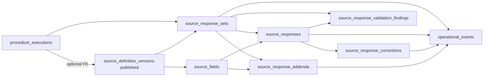

# Phase 4B.1 — Runtime Capture RPC (plan)

**Status:** **Implemented (RPC layer)** — `0034` open/save · `0035` submit · `0036` correction/addendum · `0037` validation finding lifecycle.

### Implementation note (0034)

| Delivered | Deferred |
|-----------|----------|
| `open_source_response_set` with explicit tenant/visit/PE/SDV args | UI / API routes |
| `save_source_draft` batch upsert | UI / API routes |
| Helpers: `phase4b_source_field_belongs_to_sdv`, `phase4b_widget_hint_to_value_type`, `phase4b_parse_draft_response_item` | UI / API routes |
| `scripts/validate-phase4b-runtime.mjs` | |

`comments` on draft payloads are accepted but **not persisted** in 0034 (`COMMENTS_DEFERRED` in save errors array).

### Implementation note (0035)

| Delivered | Deferred |
|-----------|----------|
| `submit_source_response_set` — validates, freezes draft responses, marks set `submitted` | Persisted findings on failed submit (optional bulk insert in submit) |
| Helpers: `phase4b_source_response_set_submit_errors`, `phase4b_current_response_has_value`, `phase4b_response_value_matches_widget` | Persisted `source_response_validation_findings` on failed submit (errors returned in RPC JSON only) |
| `operational_events` row `SOURCE_RESPONSE_SET_SUBMITTED` when `user_can_append_operational_events` | Per-field submit events |
| SECURITY INVOKER; validation failures return `SUBMIT_VALIDATION_FAILED` without DML | |

### Implementation note (0036)

| Delivered | Notes |
|-----------|--------|
| `correct_source_response` | Append-only new row + `source_response_corrections`; never UPDATE prior `value_*` |
| `add_source_addendum` | Post-submit late entry; response uses applied-SDV field (`field_key` match when introduced SDV is newer) |
| `SOURCE_RESPONSE_CORRECTED` / `SOURCE_RESPONSE_ADDENDUM_ADDED` operational events | Required by `0022`/`0023` triggers (`operational_event_id`) |

### Implementation note (0039)

| Delivered | Notes |
|-----------|--------|
| `source_response_sets` attribution CHECKs | `corrected` / `addended` no longer require `reviewed_*` or `signed_*`; review/sign/lock attribution scoped to their statuses only |
| `source_response_sets_locked_attribution` | New CHECK: `locked` requires `locked_by_user_id` + `locked_at` |

Unblocks `correct_source_response` / `add_source_addendum` set status updates after submit without forcing review lane attribution.

### Implementation note (0038)

| Delivered | Notes |
|-----------|--------|
| `source_responses_submit_update` RLS policy | Narrow path: `is_submitted` false→true on current draft rows when set is draft/in_progress, visit not locked |
| `phase4b_guard_submit_update_shape` trigger | Blocks value/provenance mutation during submit freeze; preserves `phase4b.internal_demotion` path |
| `phase4b_source_response_set_allows_submit` helper | Set not archived + `phase4b_srs_is_mutable_status` |

Unblocks `submit_source_response_set` under SECURITY INVOKER without loosening `source_responses_update` draft policy (`WITH CHECK is_submitted = false`).

### Implementation note (0037)

| Delivered | Notes |
|-----------|--------|
| `create_source_validation_finding` | Inserts `open` finding only; `p_rule_reference` → `rule_code` (defaults `MANUAL`); optional `p_source_field_id` validated against bound SDV (not stored on finding row) |
| `acknowledge_source_validation_finding` | `open` → `acknowledged`; `user_has_study_access`; narrow RLS policy |
| `resolve_source_validation_finding` | `open`/`acknowledged` → `resolved`; `phase4b_user_can_resolve_validation_finding` (coordinator/study_admin/monitor/org admin) |
| `waive_source_validation_finding` | `open`/`acknowledged` → `waived`; same permission model as resolve |
| Operational events | `SOURCE_VALIDATION_FINDING_*` when `user_can_append_operational_events` (optional `operational_event_id` in response) |
| No response mutation | Resolve/waive never touch `source_responses` |

**Parents:** [`PHASE4B-ESOURCE-RUNTIME-SCHEMA.md`](./PHASE4B-ESOURCE-RUNTIME-SCHEMA.md) · [`PHASE4C13-PUBLISH-SOURCE-PACKAGE-RPC.md`](./PHASE4C13-PUBLISH-SOURCE-PACKAGE-RPC.md) · [`PHASE4A-VERSIONED-PROTOCOL-BUILDER-SCHEMA.md`](./PHASE4A-VERSIONED-PROTOCOL-BUILDER-SCHEMA.md)

**Baseline (GREEN — do not alter):**

| Layer | Scope |
|-------|--------|
| **Phase 3C** | `complete_procedure_execution`, `complete_visit`, `lock_visit` (`0013`) — bodies and semantics frozen |
| **Phase 4B DDL** | `0020`–`0025` tables, triggers, RLS, helpers — **no column drops**; RPCs must conform |
| **Phase 4C** | Publish pipeline, `publish_source_package` (`0033`), `published_*` snapshots — **read-only** for capture |

**Staging readiness (4C):** Source generation → preview → approval → publish package → `publish_source_package` → **Phase 4A** `source_definition_versions` / `source_fields` (`lifecycle_status = published`). Capture RPCs bind **only** to those 4A rows — never to `published_*`.

---

## A. Purpose

Phase 4B.1 adds the **regulated runtime write path** for versioned dynamic eSource: opening a capture episode, autosaving drafts, submitting immutable facts, and post-submit change control (corrections, addenda, validation findings).

```text
procedure_execution (published SDV bound)
  → open_source_response_set()
  → save_source_draft()           [repeat]
  → submit_source_response_set()
  → (optional) correct_source_response() / add_source_addendum()
  → (optional) create/resolve_source_validation_finding()
```

| Principle | Rule |
|-----------|------|
| **System of record** | `source_response_sets` + `source_responses` + append-only corrections/addenda/findings |
| **Schema authority** | **Phase 4A** `source_definition_versions` + `source_fields` where `lifecycle_status = published` |
| **Audit mirror** | Phase 4C `published_*` — **SELECT for reconstruct/export only**; **no INSERT/UPDATE from capture RPCs** |
| **Actor** | `auth.uid()` required on every RPC; never accept user id from client JSON |
| **Clinical writes** | **Authenticated study roles only** — no `service_role` clinical DML |

Authoring UI, workbook compilers, and publish builders remain **out of band** for runtime facts.

---

## B. Runtime object flow



**Spine:** `Visit` → `Procedure Execution` → `Source Response Set` → `Source Responses` (per `source_field_id`).

**Version bind:** At `open_source_response_set`, resolve `source_definition_version_id` from `procedure_executions.source_definition_version_id` when set; otherwise require explicit `p_source_definition_version_id` that is **published** and study-consistent. First successful open may **write back** PE FK (if null) per `0018` trigger rules — performed inside RPC transaction, not client direct UPDATE on PE.

**Field manifest:** All `source_field_id` values must belong to the set’s bound `source_definition_version_id` (`phase4b_enforce_source_response` triggers in `0021`).

---

## C. RPC list and responsibilities

| # | RPC | Primary responsibility |
|---|-----|------------------------|
| 1 | `open_source_response_set` | Create or return active set for `(procedure_execution_id, source_definition_version_id)`; enforce published SDV, visit not locked (normal path), study access |
| 2 | `save_source_draft` | Upsert **draft** `source_responses` for one or many fields; partial values allowed; set `in_progress` |
| 3 | `submit_source_response_set` | Validate completeness + types; flip `is_submitted`; transition set → `submitted`; emit operational events; run edit checks → findings |
| 4 | `correct_source_response` | Post-submit append-only correction chain for one field; demote prior current row; insert `source_response_corrections` |
| 5 | `add_source_addendum` | Post-lock late-entry field from newer published version with provenance row |
| 6a | `create_source_validation_finding` | Insert server/client DQ finding (submit pipeline or manual query) |
| 6b | `resolve_source_validation_finding` | Transition finding `open`/`acknowledged` → `resolved`/`waived` with reason (no silent value mutation) |

**Out of scope (4B.1):** Review/sign workflows (`reviewed` / `signed` set statuses), PDF export, device ingest adapters, Part 11 signature crypto (Phase 4E).

**Existing DEFINER helpers (reuse, do not duplicate):**

- `phase4b_demote_prior_current_response` — correction chain `is_current` flip (`0021`)
- `phase4b_visit_is_locked`, `phase4b_user_can_correct_source` — gate checks (`0020`)

---

## D. Input/output contracts

All RPCs return `jsonb` with at least:

```json
{
  "ok": true,
  "code": "SUCCESS",
  "data": { },
  "errors": []
}
```

On failure: `ok: false`, stable `code` string, PostgreSQL exception mapped for clients.

### D.1 `open_source_response_set`

```sql
public.open_source_response_set(
  p_procedure_execution_id uuid,
  p_source_definition_version_id uuid default null,
  p_study_version_id uuid default null
) returns jsonb;
```

| Input | Rule |
|-------|------|
| `p_procedure_execution_id` | Required; caller must have study access via RLS path |
| `p_source_definition_version_id` | Required when PE FK null; must be `published` and match study |
| `p_study_version_id` | Optional snapshot on new set; default from active visit context |

| Output `data` | |
|---------------|--|
| `response_set_id` | uuid |
| `status` | `draft` \| existing status |
| `source_definition_version_id` | bound uuid |
| `created` | boolean — true if new insert |
| `field_manifest` | array of `{ source_field_id, field_key, label, value_type, is_required, sort_order }` from 4A |

**Idempotency:** Unique index `source_response_sets_active_execution_version_uidx` — second open returns existing non-`archived` set.

### D.2 `save_source_draft`

```sql
public.save_source_draft(
  p_response_set_id uuid,
  p_fields jsonb
) returns jsonb;
```

`p_fields` array elements:

```json
{
  "source_field_id": "uuid",
  "value_type": "text",
  "value_text": null,
  "value_number": null,
  "value_boolean": null,
  "value_date": null,
  "value_datetime": null,
  "value_json": null,
  "unit": null
}
```

| Rule | |
|------|--|
| Set status | Must be `draft` or `in_progress` |
| Visit | `phase4b_visit_is_locked(visit_id) = false` |
| Row | INSERT draft row or UPDATE current row where `is_submitted = false` and `is_current = true` |
| Validation | `phase4b_response_value_matches_type`; draft may have zero populated slots |

| Output `data` | |
|---------------|--|
| `saved` | count |
| `response_ids` | map field_id → response_id |
| `set_status` | `in_progress` |

### D.3 `submit_source_response_set`

```sql
public.submit_source_response_set(
  p_response_set_id uuid,
  p_acknowledge_warnings boolean default false
) returns jsonb;
```

| Step | Action |
|------|--------|
| 1 | Reject if visit locked (normal submit) |
| 2 | Required fields: every `source_fields.is_required` has current row with exactly one populated slot |
| 3 | Set all current draft rows `is_submitted = true`, `submitted_at = now()` |
| 4 | Set set `status = submitted`, `submitted_by_user_id`, `submitted_at` |
| 5 | Evaluate published validation rules (4A manifest + optional published rule snapshot read-only) → insert findings |
| 6 | Insert `operational_events` (`SOURCE_RESPONSE_SET_SUBMITTED`, per-field `SOURCE_RESPONSE_SUBMITTED` as needed) |

| Output `data` | |
|---------------|--|
| `response_set_id`, `status`, `submitted_at` | |
| `finding_counts` | `{ error, warning, info }` |
| `blocking_errors` | array when submit rejected |

**Hard-stop:** `severity = error` findings block submit unless explicit waiver path (future); v1 may require zero open errors.

### D.4 `correct_source_response`

```sql
public.correct_source_response(
  p_response_set_id uuid,
  p_superseded_response_id uuid,
  p_new_value jsonb,
  p_correction_type text,
  p_correction_reason text,
  p_prior_value_reference text
) returns jsonb;
```

| Rule | |
|------|--|
| Authorization | `phase4b_user_can_correct_source(study_id)` |
| Visit lock | **Allowed** — RLS insert path for responses with `supersedes_response_id` bypasses visit lock |
| Superseded row | Must be `is_submitted = true`, `is_current = true` (or last submitted in chain per trigger) |
| Chain | INSERT new response (`response_sequence + 1`), call `phase4b_demote_prior_current_response`, INSERT `source_response_corrections` |
| Set status | May transition set → `corrected` (metadata only) |

| Output `data` | `new_response_id`, `correction_id`, `operational_event_id` |

### D.5 `add_source_addendum`

```sql
public.add_source_addendum(
  p_response_set_id uuid,
  p_introduced_by_source_definition_version_id uuid,
  p_introduced_source_field_id uuid,
  p_new_value jsonb,
  p_late_entry_reason text
) returns jsonb;
```

| Rule | |
|------|--|
| Authorization | `phase4b_user_can_correct_source` |
| Visit lock | **Allowed** — addenda policy does not check visit lock |
| Provenance | `applied_to_source_definition_version_id` = set’s bound version; introduced version may be newer published SDV |
| Field | `introduced_source_field_id` must belong to introduced version |
| Materialize | INSERT `source_response_addenda` then INSERT/attach `source_responses` row; link `response_id` on addendum |

| Output `data` | `addendum_id`, `response_id` |

### D.6 Validation findings

```sql
public.create_source_validation_finding(
  p_response_set_id uuid,
  p_response_id uuid default null,
  p_finding_type text,
  p_severity text,
  p_rule_code text,
  p_message text
) returns jsonb;

public.resolve_source_validation_finding(
  p_finding_id uuid,
  p_resolution_status text,
  p_resolution_reason text
) returns jsonb;
```

| RPC | Use |
|-----|-----|
| **create** | Submit pipeline (automatic), coordinator manual query, import validators |
| **resolve** | `resolved` or `waived` with `resolution_reason`; does **not** change `source_responses.value_*` |

**Prefer** submit-time bulk creation inside `submit_source_response_set` for rule engine findings; expose **create** only if manual/query workflow needed in v1.

---

## E. Role/security model

| Concern | Model |
|---------|--------|
| **Default** | `SECURITY INVOKER`, `search_path = public` on all new RPCs |
| **Auth** | `auth.uid() is not null` — fail `AUTH_REQUIRED` |
| **Study scope** | Resolve `study_id` from set/PE; require `user_has_study_access` or org admin |
| **Draft capture** | `user_can_manage_subject_enrollment(study_id)` — matches `0020`/`0021` RLS |
| **Correction/addendum** | `phase4b_user_can_correct_source` — `study_admin`, `coordinator`, org admin |
| **DEFINER exceptions** | Only where already approved: `phase4b_demote_prior_current_response`, trigger enforce functions — RPCs **call** these, do not broaden DEFINER surface |
| **service_role** | **No** clinical INSERT/UPDATE grants on `source_response_*` |
| **Grants** | `GRANT EXECUTE … TO authenticated` only; `REVOKE ALL FROM PUBLIC` |

**Attribution columns** (server-set inside RPC, never from client):

- `opened_by_user_id`, `submitted_by_user_id`, `originator_user_id`, `corrected_by_user_id`, `added_by_user_id`, `resolved_by_user_id`
- `originator_role` ← snapshot `study_members.role` at capture time

---

## F. RLS expectations

RPCs must **succeed under RLS** without service role — design DML so invoker policies pass.

| Table | SELECT | INSERT (normal) | INSERT (post-lock) | UPDATE |
|-------|--------|-----------------|--------------------|--------|
| `source_response_sets` | study access | enrollment + **not locked** | N/A | mutable statuses per policy |
| `source_responses` | study access | enrollment + **not locked** | correction chain (`supersedes_response_id` + correct role) | draft only, not locked, `is_submitted = false` |
| `source_response_corrections` | study access | correct role | same | none |
| `source_response_addenda` | study access | correct role | same (no lock check) | none |
| `source_response_validation_findings` | study access | enrollment | enrollment | enrollment |

**RPC obligation:** Even when RLS would allow raw SQL, RPCs enforce **stricter** business rules (published SDV, submit completeness, chain integrity).

**published_* tables:** No policies added for capture roles on INSERT/UPDATE; capture code must not reference them for writes.

---

## G. Draft/save/submit lifecycle

```text
[open]  status: draft
   ↓ save_source_draft (0..n)
[in_progress]
   ↓ submit_source_response_set
[submitted] ──→ responses: is_submitted=true, values frozen
   ↓ (optional review/sign — later phase)
[pending_review | reviewed | signed | locked]
   ↓ correct_source_response
[corrected] + new response rows
   ↓ add_source_addendum
[addended]
```

| Transition | Set status | Response rows |
|------------|------------|---------------|
| Open | `draft` | none required |
| First save | `in_progress` | draft rows, `is_current=true`, `is_submitted=false` |
| Save again | `in_progress` | UPDATE current draft or INSERT if missing |
| Submit | `submitted` | all required fields: exactly one typed slot; `is_submitted=true` |
| After submit | — | **No UPDATE** to `value_*` (trigger `phase4b_assert_submitted_response_immutable`) |

**Visit lock interaction:**

| Action | Visit `locked` |
|--------|----------------|
| open / save / submit | **Blocked** (RLS + RPC check) |
| correct | **Allowed** |
| addendum | **Allowed** |
| resolve finding | **Allowed** (metadata only) |

Align with Phase 3C: `lock_visit` does not mutate 4B tables; 4B RPCs respect `visits.visit_status = locked`.

---

## H. Correction model

**Never UPDATE submitted values.** Corrections are:

1. INSERT new `source_responses` row with `supersedes_response_id`, incremented `response_sequence`, `is_current = true`, new typed values, `is_submitted = true`.
2. `phase4b_demote_prior_current_response` sets prior `is_current = false`.
3. INSERT `source_response_corrections` linking `response_id` (new) ↔ `superseded_response_id` with `correction_type`, `correction_reason`, `prior_value_reference`.
4. INSERT `operational_events` (`SOURCE_RESPONSE_CORRECTED`).

| `correction_type` (0022 CHECK) | `data_entry_error`, `transcription_error`, `new_information`, `query_resolution`, `other` |
|--------------------------------|-------------------------------------------------------------------------------------------|
| `other` | Requires `correction_reason` length ≥ 10 (DB constraint) |

**Export/reconstruct:** Walk chain by `(response_set_id, source_field_id, response_sequence)`; display current = `is_current = true`.

---

## I. Addendum model

For **late-entry** fields after visit/set lock or when a **newer published SDV** introduces fields not in the bound version:

1. Caller supplies `introduced_by_source_definition_version_id` (newer, **published**) and `introduced_source_field_id`.
2. `applied_to_source_definition_version_id` remains the **historic bind** on the set (`phase4b_enforce_source_response_addendum`).
3. INSERT addendum row + response row; set `response_id` on addendum.
4. Operational event `SOURCE_RESPONSE_ADDENDUM_APPLIED`.

**Does not:** mutate Phase 4A published rows, rewrite historic labels, or INSERT into `published_*`.

---

## J. Validation findings model

| Aspect | Rule |
|--------|------|
| Storage | `source_response_validation_findings` |
| vs corrections | Findings flag issues; **resolution does not change captured values** |
| Create | Submit rule engine + optional `create_source_validation_finding` |
| Resolve | `resolve_source_validation_finding` → `resolved` \| `waived` + reason |
| Submit gate | Open `severity = error` findings block submit (configurable `p_acknowledge_warnings` for warnings only) |

**Rule sources (v1 plan):**

1. Field-level `source_fields.validation_rules` (4A jsonb manifest).
2. Future: read-only join to `published_source_validation_rules` for audit-aligned rule codes **without** writing snapshots.

---

## K. Operational/audit event linkage

| Event type (planned) | When |
|----------------------|------|
| `SOURCE_RESPONSE_SET_OPENED` | open |
| `SOURCE_RESPONSE_DRAFT_SAVED` | save (batch or per-field — prefer one event per save call with field count in payload) |
| `SOURCE_RESPONSE_SET_SUBMITTED` | submit |
| `SOURCE_RESPONSE_CORRECTED` | correction |
| `SOURCE_RESPONSE_ADDENDUM_APPLIED` | addendum |
| `SOURCE_VALIDATION_FINDING_CREATED` | finding insert |
| `SOURCE_VALIDATION_FINDING_RESOLVED` | finding resolve |

Use `user_can_append_operational_events(study_id)` pattern from `0010`. Link `operational_event_id` on responses/corrections/addenda when columns exist.

**audit_events:** Optional on correction/addendum for export-sensitive actions; not required for every draft save (avoid noise).

---

## L. Failure modes

| Code | When |
|------|------|
| `AUTH_REQUIRED` | `auth.uid()` null |
| `FORBIDDEN` | Study/role check failed |
| `VISIT_LOCKED` | open/save/submit on locked visit |
| `SDV_NOT_PUBLISHED` | SDV not `lifecycle_status = published` |
| `SDV_MISMATCH` | field or PE version does not match set bind |
| `SET_NOT_MUTABLE` | save on submitted+ set |
| `RESPONSE_NOT_SUBMITTED` | correct target not submitted |
| `REQUIRED_FIELD_MISSING` | submit completeness |
| `VALUE_TYPE_MISMATCH` | typed slot check failed |
| `DUPLICATE_CURRENT` | chain integrity violation |
| `FINDING_BLOCKS_SUBMIT` | open error-severity findings |
| `ADDENDUM_PROVENANCE_INVALID` | introduced/applied version or field mismatch |
| `NOT_FOUND` | PE, set, response, or field missing |

All failures **rollback** single transaction per RPC call.

---

## M. Test plan

### M.1 File-level (no DB)

| Artifact | Purpose |
|----------|---------|
| `scripts/dry-run-capture-payload.mjs` (planned) | Validate `p_fields` JSON shape against manifest before RPC |

### M.2 DB harness (after `0034+`)

| Command | Purpose |
|---------|---------|
| `npm run db:validate-phase4b` (planned) | Catalog RPCs, views `phase4b_violation_*`, RLS smoke |
| Extend `scripts/validate-phase3c.mjs` | Ensure 3C RPCs still pass unchanged |

### M.3 Scenario matrix (staging)

| # | Scenario | Expected |
|---|----------|----------|
| 1 | Open set on PE with published SDV | `draft`, manifest returned |
| 2 | Save partial draft | `in_progress`, incomplete values OK |
| 3 | Submit complete | `submitted`, immutable values |
| 4 | Attempt UPDATE submitted value via SQL | trigger/RLS failure |
| 5 | `lock_visit` then save | `VISIT_LOCKED` |
| 6 | Correct after lock | new row + correction record |
| 7 | Addendum after lock | addendum + response, provenance columns |
| 8 | Idempotent open | same `response_set_id` |
| 9 | Cross-tenant set id | `FORBIDDEN` / RLS empty |
| 10 | Submit with missing required | `REQUIRED_FIELD_MISSING` |

### M.4 Golden data

Use staging study from `db:provision` with published golden-basic package (`pkg_*` from 4C pipeline). Bind PE to published SDV UUIDs from `publish_source_package` summary `phase4a_source_definition_version_ids`.

---

## N. Migration sequence

**Do not modify `0020`–`0025` or `0033`.** Add forward migrations only:

| Migration | Contents |
|-----------|----------|
| **`0034_phase4b1_open_and_save_rpc.sql`** | `open_source_response_set`, `save_source_draft`; small invoker helpers; grants |
| **`0035_phase4b1_submit_rpc.sql`** | `submit_source_response_set`; submit validation helper; optional bulk finding insert |
| **`0036_phase4b1_correction_addendum_rpc.sql`** | `correct_source_response`, `add_source_addendum` |
| **`0037_phase4b1_validation_finding_rpc.sql`** | `create_source_validation_finding`, `acknowledge_source_validation_finding`, `resolve_source_validation_finding`, `waive_source_validation_finding` |
| **`0038_phase4b_submit_source_responses_rls.sql`** | Narrow submit UPDATE RLS + `phase4b_guard_submit_update_shape` on `source_responses` |
| **`0039_phase4b_srs_corrected_addended_attribution_fix.sql`** | Attribution CHECKs: corrected/addended decoupled from review/sign |
| **`0040_phase4b1_validation_views.sql`** (optional) | Extra read-only views for harness only |

Register files in `scripts/apply-migrations.mjs` after `0033`.

**Scripts/package.json (planned):**

- `db:validate-phase4b`
- `dry-run:capture-payload:golden` (optional)

---

## O. Exact next step

**Next step (optional):** `0038` read-only validation views / harness helpers.

**Completed:** `0034` open/save · `0035` submit · `0036` correction/addendum · `0037` validation finding lifecycle.

**Explicitly defer:** UI, Next.js API routes, changes to Phase 3C / 4C / `published_*`.

---

## Appendix — RPC summary table

| RPC | Invoker/DEFINER | Touches 4A | Touches 4C `published_*` | Post-lock |
|-----|-----------------|------------|---------------------------|-----------|
| open_source_response_set | INVOKER | read SDV/fields | no | blocked |
| save_source_draft | INVOKER | read fields | no | blocked |
| submit_source_response_set | INVOKER | read fields/rules | read-only optional | blocked |
| correct_source_response | INVOKER (+ demote DEFINER) | read fields | no | allowed |
| add_source_addendum | INVOKER | read fields/SDV | no | allowed |
| create_source_validation_finding | INVOKER | read fields | no | blocked on archived set |
| acknowledge_source_validation_finding | INVOKER | no | no | allowed (study access) |
| resolve_source_validation_finding | INVOKER | no | no | allowed |
| waive_source_validation_finding | INVOKER | no | no | allowed |
