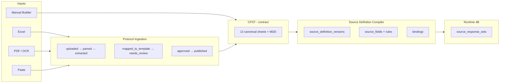

# Phase 4C — Protocol-to-Source Generator (architecture)

**Status:** Planning / documentation only. **No DDL, UI, ingestion parsers, AI pipelines, runtime RPCs, PDF/export, or signature implementation.**

**Design foundation (uploaded references — logical contract):**

| Reference | Role in this document |
|-----------|------------------------|
| **Complex Schedule of Activities (SOA)** | Representative high-complexity trial: Screening, Treatment, **PK Sub-study**, Follow-up, **EOS**, **ET**, visit windows, phone/off-site visits, conditional procedures, relative timepoints (e.g. tied to IP administration), lab-triggered and safety workflows |
| **Workbook Template v2** | Canonical **sheet order**, column keys, and matrix conventions for Manual Builder + Excel import |
| **Master Data Dictionary (MDD)** | Controlled vocabulary, field/procedure/visit definitions, data types, and cross-sheet referential rules |
| **Validations catalog** | Automated checks run before `approved` / `published` (structural + clinical schedule + generation dry-run) |

When binary artifacts are checked into the repo, target paths (planned):  
`vilo-os/templates/cpst-workbook-v2.xlsx`, `vilo-os/templates/cpst-master-data-dictionary.json`, `vilo-os/templates/cpst-validations.json`.

**Core principle:** The **Canonical Protocol Schedule Template (CPST)** is the **source generation contract**. Manual entry, Excel import, searchable PDF, scanned protocol OCR, and copied schedule tables **all populate the same CPST** before the **Source Definition Compiler** runs.

**Governance (state plainly):**

- **AI can propose** mapped CPST rows with confidence and evidence.  
- **Humans must approve** the CPST and the generated source preview.  
- **Published** `source_definition_versions` are **immutable**; amendments create **new** versions. Executed visits stay bound to the version active at execution.

**Baseline (GREEN — do not alter):** Phase **1b**, **2**, **3A**, **3B**, **3C** RPCs. Phase **4A** applied. Phase **4B** migrations `0020`–`0025` — **do not modify**.

**Companion docs:** [`PHASE4A-VERSIONED-PROTOCOL-BUILDER-SCHEMA.md`](./PHASE4A-VERSIONED-PROTOCOL-BUILDER-SCHEMA.md) · [`PHASE4B-ESOURCE-RUNTIME-SCHEMA.md`](./PHASE4B-ESOURCE-RUNTIME-SCHEMA.md) · [`REGULATORY-CORE-BLUEPRINT.md`](./REGULATORY-CORE-BLUEPRINT.md) · [`FDA-ESOURCE-PART11-READINESS.md`](./FDA-ESOURCE-PART11-READINESS.md)

---

## A. Architecture summary

### A.1 End-to-end flow

```text
Manual Builder ──┐
Excel SOE/SOA ───┤
Searchable PDF ──┼──► Protocol Ingestion Layer ──► CPST (draft)
Scanned PDF+OCR ─┤         (status machine)              │
Copied tables ───┘                                      ▼
                                              Human Review / Approval
                                                        │
                                                        ▼
                                              Source Definition Compiler
                                                        │
                                                        ▼
                                              Versioned eSource Runtime (Phase 4B)
```



| Stage | System of record? | Who decides truth? |
|-------|-------------------|-------------------|
| Ingestion artifacts | Storage + checksums | — |
| Extracted proposals | Staging only | AI/heuristics **propose** |
| **CPST approved snapshot** | **Yes — design SoR** | **Human approver** |
| Published SDV | **Yes — instrument SoR** | Publisher + immutability rules |
| `source_responses` | **Yes — capture SoR** | Site staff at execution (**4B**) |

### A.2 Layer responsibilities

| Layer | Responsibility |
|-------|----------------|
| **Protocol Ingestion** | Accept files; parse; extract; map **proposals** into CPST draft |
| **CPST** | Normalized schedule + field intent — **only** approved CPST may compile |
| **Human review** | Accept/edit/reject each extracted object; CPST-level approval |
| **Source Definition Compiler** | Deterministic CPST → Phase **4A** relational model |
| **Versioned eSource Runtime** | Capture under **published** bindings (**4B**) |

---

## B. Canonical Protocol Schedule Template

CPST = **13 design sheets** (+ MDD/Validations as meta). JSON schema (planned **4C.1**) must round-trip Workbook v2.

### B.1 Canonical entities (design input)

| Entity | Purpose |
|--------|---------|
| **Study_Setup** | Protocol number, version, amendment, phases, sponsor, `study_version` binding |
| **Visit_Groups** | Screening, Treatment, PK Sub-study, Follow-up, EOS, ET, Unscheduled |
| **Visit_Templates** | Visit code, label, sequence, onsite/phone/off-site, substudy scope |
| **Procedure_Library** | Procedure code, category, default source type, instrument grouping |
| **Visit_Procedure_Matrix** | Visit × procedure required/optional/conditional markers |
| **Conditional_Rules** | Arm, cohort, lab, safety, IP, region, sex/age rules |
| **Schedule_Windows** | Target day/week/month, window min/max, grace, holiday/weekend policy |
| **External_Source_Map** | External / device / operational-only procedures |
| **Substudy_Map** | PK sub-study and other cohort-specific visit/procedure scope |
| **Roles_Signoff** | Review vs signature expectations by scope |
| **Value_Lists** | Coded lists shared across fields |
| **Field_Definitions** | Logical fields → future `source_fields` |
| **Audit_and_Versioning** | CPST version, authors, approvers, ingestion evidence refs |

**Not canonical design input:**

| Entity | Role |
|--------|------|
| **Visit_Execution_Log** | **Runtime only** — `visits`, `procedure_executions`, `source_response_sets`; never reverse-published into CPST without amendment workflow |

### B.2 Workbook Template v2 — sheet structure (design foundation)

| Sheet order | Sheet name | Primary keys | Notes from reference SOA |
|-------------|------------|--------------|--------------------------|
| 0 | `_README` | — | Instructions; not compiled |
| 1 | `Study_Setup` | `study_id`, `cpst_version` | Protocol #, amendment, phase list |
| 2 | `Visit_Groups` | `visit_group_code` | SCREEN, TREAT, PK_SUB, FU, EOS, ET, UNSCHED |
| 3 | `Visit_Templates` | `visit_code` | V1 Screen, Cycle Day 1, PK sparse visits, Phone FU, ET, EOS |
| 4 | `Procedure_Library` | `procedure_code` | Vitals, labs, IP admin, PK draw, AE/CM review, etc. |
| 5 | `Visit_Procedure_Matrix` | `visit_code` + `procedure_code` | Wide matrix; markers `R`/`O`/`C`/`—` |
| 6 | `Conditional_Rules` | `rule_id` | If ALT elevated → repeat LFT within 72h |
| 7 | `Schedule_Windows` | `visit_code` | Day 1, Week 4 ±3d, relative to IP1 |
| 8 | `External_Source_Map` | `procedure_code` | Central lab, ECG vendor — metadata only |
| 9 | `Substudy_Map` | `substudy_code` | PK cohort visit/procedure subset |
| 10 | `Roles_Signoff` | `scope_key` | CRC review vs PI sign per visit block |
| 11 | `Value_Lists` | `list_code` | YES_NO, SEVERITY, UNITS |
| 12 | `Field_Definitions` | `field_key` | Maps to instruments; MDD types |
| 13 | `Audit_and_Versioning` | `cpst_version` | Approval + ingestion job ids |
| — | `Master_Data_Dictionary` | `entity` + `code` | **Reference** — not a runtime sheet row |
| — | `Validations` | `rule_id` | Rule catalog executed at validate step |

### B.3 Master Data Dictionary (MDD) — key domains

| MDD domain | Examples | Validation role |
|------------|----------|-----------------|
| `visit_group_code` | SCREEN, TREAT, PK_SUB, FU, EOS, ET | Every `visit_code` references a group |
| `visit_code` | V1, C1D1, PK_T2H, FU_W24_PHONE | Unique; regex `^[A-Z0-9_]+$` |
| `procedure_code` | VITALS, CBC, IP_ADMIN, PK_DRAW | Unique per study CPST version |
| `matrix_marker` | R, O, C, X, — | Matrix cell semantics |
| `source_type` | internal, external, operational_confirmation, device_vendor | Drives compiler branch |
| `window_unit` | day, week, month | Schedule_Windows |
| `anchor_event` | ENROLL, RANDOM, IP_FIRST_DOSE, VISIT_X | Relative timepoints |
| `field_data_type` | text, integer, coded, date, table, … | Aligns Phase **4B** `input_type` |
| `reviewer_status` | pending, accepted, edited, rejected | AI extraction rows |

### B.4 CPST invariants

1. Every matrix row references valid `visit_code` + `procedure_code`.  
2. Conditional procedures appear in **both** matrix (`C`) **and** `Conditional_Rules`.  
3. Phone/off-site visits flagged on `Visit_Templates`, not only in free text.  
4. PK Sub-study scope enforced via `Substudy_Map` + conditional rules.  
5. `Audit_and_Versioning.approved_at` required before compiler publish.

---

## C. Dual input paths

### Path A — Manual Builder

| Step | CPST / product action |
|------|------------------------|
| Create from blank | Empty v2 workbook structure in UI |
| Duplicate prior template | Copy CPST snapshot → new `cpst_version` |
| Import workbook | Parse v2 sheets → CPST JSON |
| Visits | Add / edit / reorder / **retire** in `Visit_Templates` |
| Procedures | Maintain `Procedure_Library` |
| Assign to visits | Edit `Visit_Procedure_Matrix` (+ bulk assign) |
| Windows & rules | `Schedule_Windows`, `Conditional_Rules` |
| Roles & source types | `Roles_Signoff`, `External_Source_Map` |
| Preview | Compiler dry-run → instrument preview |
| Validate | Run **Validations** catalog |
| Publish | `approved` CPST → compiler → Phase **4A** `published` |

### Path B — Protocol-Assisted Builder

| Step | Action |
|------|--------|
| Upload | Excel / PDF / scanned PDF / paste |
| Parse | Structure tables, pages, sheets |
| Extract | Objects + **confidence** + evidence |
| Map | Write **proposed** CPST rows (`mapped_to_template`) |
| Review UI | Per-object accept / edit / reject |
| Validate & preview | Same as Path A |
| Approve | Human approver; `reviewer_user_id`, `reviewed_at` |
| Publish | Same compiler as Path A |

**Equivalence:** Path A and Path B must produce **byte-comparable CPST JSON** (modulo audit metadata) when describing the same protocol schedule.

---

## D. Protocol ingestion layer

### D.1 Supported inputs

| Input | Parser | Typical confidence |
|-------|--------|-------------------|
| Excel Schedule of Events / SOA | Column + matrix detector | High |
| Searchable PDF | Text + table extraction | Medium–high |
| Scanned PDF | OCR → tables | Medium (mandatory review) |
| Copied protocol tables | Grid normalizer | Medium |
| Manual entry | Path A (no job) | N/A |

### D.2 Ingestion status machine

| Status | Meaning |
|--------|---------|
| `uploaded` | File stored; checksum recorded |
| `parsed` | Sheets/pages/tables detected |
| `extracted` | Candidate objects with evidence |
| `mapped_to_template` | Proposals written to CPST draft |
| `needs_review` | Default after map; human queue |
| `approved` | CPST approver signed |
| `rejected` | Import abandoned |
| `published` | Compiler finished; SDV `published` |

```text
uploaded → parsed → extracted → mapped_to_template → needs_review
                                              ↓
                                    approved → published
                                              ↘ rejected
```

---

## E. AI extraction layer

### E.1 Extraction targets (from reference SOA)

| Category | Elements |
|----------|----------|
| Identity | Protocol number, version, amendment |
| Design | Study phases, arms, substudies (incl. **PK Sub-study**) |
| Visits | Groups, names/codes, sequence, **unscheduled** |
| Timing | Planned days/weeks/months; **relative timepoints** (e.g. post IP) |
| Windows | Target ± tolerance; grace; weekend/holiday exceptions |
| Procedures | Names, codes, categories |
| Matrix | Required / optional / **conditional** markers |
| Logistics | **Phone** / **off-site** visits |
| External | Central lab, imaging, vendor procedures |
| Workflows | **Lab-triggered**, **safety**, **IP administration/accountability** |
| Termination | **EOS**, **ET** visit requirements |
| Notes | Conditional footnotes linked to `rule_id` |

### E.2 Required fields per extracted object

Every AI/import-proposed object **must** persist:

| Field | Type | Rule |
|-------|------|------|
| `confidence_score` | numeric 0–1 | &lt; threshold → block bulk-approve |
| `source_page` | text/int | PDF page or Excel sheet |
| `source_table` | text | Table id / range (e.g. `SOA_Table1`) |
| `extracted_text_evidence` | text | Verbatim snippet (schedule-only; PHI policy) |
| `reviewer_status` | enum | `pending` \| `accepted` \| `edited` \| `rejected` |
| `reviewer_user_id` | uuid | Set on human action |
| `reviewed_at` | timestamptz UTC | Server-generated on review |

**Guardrails:** No auto-publish; no CPST row without evidence for AI-origin; low confidence forces `needs_review`.

---

## F. Source generation engine (Source Definition Compiler)

Deterministic: **approved CPST snapshot** → Phase **4A** + manifests for **4B**.

### F.1 Compiler outputs

| CPST input | Generated output |
|------------|------------------|
| `Field_Definitions` + `Value_Lists` | `source_definitions`, `source_definition_versions` (draft → publish) |
| Logical sections (MDD `section_code`) | `source_fields.sort_order` + section labels in manifest |
| Field rows | `source_fields` (+ `input_type`, `validation_rules`, `options`) |
| `Visit_Templates` | `visit_definitions` |
| `Procedure_Library` | `procedure_definitions` |
| `Visit_Procedure_Matrix` | `visit_def_procedure_map` (+ `is_required`) |
| Default instruments | `procedure_source_bindings`, optional `visit_source_bindings` |
| `Conditional_Rules` | `validation_rules` + **visible** conditional visibility manifest |
| `Schedule_Windows` | Visit scheduling metadata; seed for Phase **4I** |
| `Roles_Signoff` | Review/signature expectation catalog (**4E**) |
| `External_Source_Map` | Per-procedure source type + metadata field templates |
| Compiler manifest | `source_response_set` **template** expectations (status transitions doc) |

### F.2 Compiler rules

| Rule | Detail |
|------|--------|
| Versioned | Every compile produces new `cpst_version` + new SDV rows |
| Published immutable | Phase **4A** lifecycle; no payload UPDATE after `published` |
| Amendments | New CPST + new SDV; `supersedes_*` links |
| Execution bind | `procedure_executions.source_definition_version_id` set at capture (**4B**) |
| No silent mutation | Historic visits keep original SDV; **4B** addenda for late fields |

### F.3 Procedure ≠ source form

| Concept | Meaning |
|---------|---------|
| **Procedure** | Operational unit (scheduling, execution, billing) — `procedure_definitions` |
| **Source instrument** | What data is captured — `source_definitions` |
| Mapping | One procedure → 0..n instruments; compiler uses `Procedure_Library.default_instrument_code` |

Some procedures generate **full internal source**; some **metadata-only** (external); some **workflow tasks** only (operational confirmation).

---

## G. Source type strategy

| # | Model | Code | Vilo captures | Original SoR |
|---|--------|------|---------------|--------------|
| 1 | **Internal source** | `internal` | Full `source_responses` | Vilo eSource |
| 2 | **External source** | `external` | Date, status, reference id, location — **not** full external clinical duplicate | Named external system |
| 3 | **Operational confirmation** | `operational_confirmation` | Done/not done, actor, timestamp, checklist | Vilo (admin proof) |
| 4 | **Device/vendor source** | `device_vendor` | Device id, vendor, attachment ref, transfer status | Device/integration |

Compiler reads `External_Source_Map` + `Procedure_Library.source_type` to choose field templates and suppress inappropriate internal fields.

---

## H. Clinical schedule complexity support

Must support (validated against reference SOA + MDD):

| Complexity | CPST mechanism |
|------------|----------------|
| Variable visit count | Unbounded `Visit_Templates` rows |
| Visit groups / phases | `Visit_Groups` |
| Screening / Treatment / Follow-up / EOS / ET | Group codes + matrix columns |
| Unscheduled visits | `visit_type = unscheduled`; optional matrix column |
| Phone / off-site visits | `Visit_Templates.delivery_mode` |
| Substudy visits (e.g. PK) | `Substudy_Map` + rules |
| Repeated procedure patterns | Bulk matrix assign + pattern templates |
| Relative timepoints (IP anchor) | `Schedule_Windows.anchor_event` + `offset_value` |
| Lab-triggered procedures | `Conditional_Rules` trigger `lab_result` |
| Country/region rules | `Conditional_Rules` scope `region` |
| Sex / cohort / age rules | `Conditional_Rules` demographics |
| Holiday/weekend/grace | `Schedule_Windows.grace_policy`, `calendar_exception` |

---

## I. Compliance guardrails

| Requirement | CPST / platform mechanism |
|-------------|---------------------------|
| **ALCOA+** | Attributable approve/publish; legible labels; server UTC; original published SDV; accurate validation; complete matrix; consistent compile; enduring immutability; available exports |
| **FDA eSource** | Reconstruct schedule from CPST manifest + **4B** facts |
| **Part 11 readiness** | No auto-publish; reviewer attribution; audit events |
| **Source originator** | **4B** `originator_*`; planned `response_origin_mode` (**4B.1**) |
| **Audit reconstruction** | `Audit_and_Versioning` + ingestion evidence ids |
| **Immutable published defs** | Phase **4A** + CPST snapshot hash |
| **No uncontrolled JSON** | **4B** `value_json` allowlist |
| **No AI auto-publish** | Status machine + policy |
| **No hidden conditionals** | Rules in `Conditional_Rules` + manifest |
| **No relabeling historic data** | Execution-bound SDV + **4B** addendum provenance |

---

## J. Human review workflow

```text
draft CPST
  → automated validation (Validations catalog + MDD)
  → source preview (compiler dry-run)
  → reviewer correction (per extracted object + sheet edits)
  → CPST approval (approver attribution)
  → publish (SDV lifecycle_status = published)
  → lock (immutability triggers)
```

**AI/import:** Retain `protocol_ingestion_evidence` rows (page, table, text, confidence) linked from `Audit_and_Versioning.ingestion_job_id`.

**Review vs signature:** CPST approval = **design** approval; PI/CRC **signatures** at visit level remain runtime (**4E**), aligned with **4B** `reviewed_*` vs `signed_*` on sets.

---

## K. Versioning / amendment model

| Rule | Behavior |
|------|----------|
| Draft CPST | Editable |
| Published CPST | Immutable snapshot |
| Amendments | New `cpst_version`; new SDV rows |
| Retired visits/procedures | `retired_flag`; remain in matrix history |
| Executed visits | Keep `source_definition_version_id` at execution |
| No silent remap | Compiler never UPDATEs published SDV payloads |

---

## L. Runtime linkage

| Component | Relationship |
|-----------|--------------|
| **Phase 4A** | Compiler **output** — `source_definition_versions`, fields, bindings |
| **Phase 4B** | `source_response_sets`, `source_responses`, corrections, addenda, validation_findings |
| **Phase 3C** | `visits`, `procedure_executions`, lock/complete RPCs — **unchanged** |
| **Future PDF (4D)** | CPST labels + **4B** facts |
| **Future signatures (4E)** | `Roles_Signoff` manifest |
| **Monitoring / SDV / queries (4F)** | Read-only over published manifest + responses |

```text
CPST (approved) ──compiler──► Phase 4A published SDV
                                    │
                    procedure_executions.source_definition_version_id
                                    │
                                    ▼
                         Phase 4B capture + corrections
```

---

## M. Anti-patterns

| Prohibited | Reason |
|------------|--------|
| AI-only regulated source generation | No CPST contract |
| Ingestion bypassing CPST | Unreviewable schedule |
| AI auto-publishing | Attribution / Part 11 |
| Hardcoded visit templates | Not versioned per study |
| One-size-fits-all source notes | Hides procedure-specific design |
| Full external content copy | Wrong SoR; PHI risk |
| Uncontrolled JSON form blobs | **4B** forbidden |
| Hidden conditional logic | Not auditable |
| Mutable published definitions | Breaks ALCOA+ Original/Enduring |
| Silent amendment overwrite | Historic visits invalid |
| Developer-only protocol config | Site cannot defend at inspection |
| Reverse-sync execution log → CPST | Confuses design vs facts |

---

## N. Exact next step

**After this document is approved:**

| # | Deliverable | Type |
|---|-------------|------|
| 1 | **Canonical JSON schema** for CPST (all sheets + MDD refs) | `vilo-os/schemas/cpst-v1.schema.json` (planned) |
| 2 | **Workbook Template v2 artifact** | `vilo-os/templates/cpst-workbook-v2.xlsx` aligned to **§B.2** |
| 3 | **Parser / mapping review plan** | Doc: sheet→JSON mapping, PDF table heuristics, review UI requirements |
| 4 | **Database migrations plan** | `protocol_ingestion_*`, `cpst_template_versions` — **after** 1–3 |

**Do not:** ship UI, runtime RPCs, PDF, signatures; modify **4B** migrations or **3C** RPCs.

---

*Regulatory-informed engineering posture only — not legal advice, validation certification, or OCR/AI vendor selection.*
