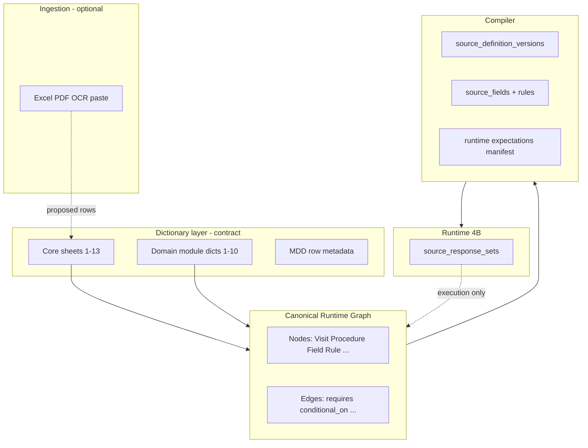

# Phase 4C.1 — Domain Module Registry + Canonical Runtime Graph + Dictionary-Driven Source Generator

**Status:** Planning / documentation only. **No DDL, UI, parsers, runtime RPCs, PDF/export, or migrations.**

**Parent:** [`PHASE4C-PROTOCOL-TO-SOURCE-GENERATOR.md`](./PHASE4C-PROTOCOL-TO-SOURCE-GENERATOR.md)

**Core principle:** The Protocol-to-Source Generator is **not** a form builder. It is a **dictionary-driven compiler** that transforms **approved dictionary rows** into a **Canonical Runtime Graph (CRG)**, then into **versioned source definitions** and **runtime expectations**. Dictionaries are **generator input contracts**, not narrative documentation.

**Governance:**

| Rule | Enforcement |
|------|-------------|
| Dictionaries drive generation | Compiler reads **only** approved dictionary snapshots + attached domain modules |
| AI / protocol parsing **pre-fills** dictionaries | Ingestion writes **proposed rows**; same schema as manual entry |
| Manual builder fills **same** dictionaries | Path equivalence at row level |
| No generation outside approved dictionary model | Compiler aborts if `Audit_and_Versioning.approval_state ≠ approved` |
| AI cannot publish regulated source | Publish step requires human `publisher_user_id`; no model principal |

**Baseline:** GREEN Phase **3C** RPCs unchanged. Phase **4B** migrations `0020`–`0025` unchanged.

**Planned artifacts (post-approval):** `vilo-os/schemas/cpst-core-dictionaries-v1.schema.json`, `vilo-os/schemas/domain-modules-v1.schema.json`, `vilo-os/templates/cpst-workbook-v2.xlsx`.

---

## A. Architecture summary

```text
┌─────────────────────────────────────────────────────────────────────────┐
│ Canonical Protocol Template Dictionaries (core workbook v2 sheets)      │
│ + Domain Module Dictionaries (optional overlays per study template)   │
└───────────────────────────────┬─────────────────────────────────────────┘
                                │
        Manual Builder ─────────┼───────── Protocol/Excel/PDF/OCR ingestion
                                │              (pre-fill proposals only)
                                ▼
                    Dictionary validation + ID resolution
                                ▼
                    Canonical Runtime Graph (CRG)
                                ▼
                    Human Review / Approval (row + graph + preview)
                                ▼
                    Source Definition Compiler
                                ▼
                    Versioned Dynamic eSource Runtime (Phase 4B)
```



| Layer | System of record? |
|-------|-------------------|
| Dictionary rows (draft) | Staging until approval |
| **Approved dictionary snapshot** | **Design SoR** |
| **CRG snapshot** | **Compiled design graph SoR** |
| Published `source_definition_versions` | **Instrument SoR** |
| `source_responses` | **Capture SoR (4B)** |

---

## B. Dictionary-driven generator model

### B.1 Standard dictionary row contract (MDD column model)

Every row in **every** core sheet and domain module dictionary **must** be expressible with these MDD columns (workbook **Master_Data_Dictionary** sheet or JSON sidecar):

| MDD column | Compiler use |
|------------|----------------|
| **Field_Name** | Stable machine key (`field_key` / graph property name) |
| **Data_Type** | Maps to CRG property type + Phase **4B** `input_type` |
| **Required** | Dictionary validation + generated `is_required` |
| **Example** | Preview labels / test fixtures only — not runtime default unless `Default` set |
| **Validation** | JSON rule fragment → `source_fields.validation_rules` |
| **Description** | `label` / investigator instructions |
| **Entity ownership** | Which sheet/node type owns the row |
| **Relationship/FK target** | Graph edge target (`Visit_ID` → `VisitNode`, etc.) |
| **Runtime behavior implication** | CRG edge + Phase **4B** lifecycle hook |
| **Source generation implication** | `source_fields` / section / binding action |
| **Audit/export implication** | Provenance manifest + PDF/CSV column name |

### B.2 Compiler consumption pipeline (metadata → artifacts)

| Dictionary metadata | Generated artifact |
|---------------------|-------------------|
| Field_Name + Data_Type + section | `source_fields` row (`field_key`, `input_type`) |
| Description | `source_fields.label`, `instructions` |
| Validation | `validation_rules` jsonb |
| Required | `is_required` + submit validator |
| Value_Lists FK | `options` / `options_manifest` |
| Conditional visibility expr | `validation_rules.visibility` + CRG `conditional_on` edge |
| Roles_Signoff | `RuntimeExpectationNode` + future `electronic_signatures` meaning codes |
| External_Source_Map | `source_type` strategy + metadata-only field subset |
| Audit row refs | `cpst_row_id`, `dictionary_version` on publish manifest |

**Prohibition:** Module or sheet data **must not** collapse into a single unversioned JSON blob. Each logical field remains a **row** with MDD columns.

---

## C. Canonical core dictionaries

For each sheet: **Role**, **Generator use**, **Key rows (MDD mapping)**, **CRG nodes/edges**, **Source/audit outputs**.

---

### C.1 Study_Setup

**Role:** Study-level protocol metadata and compiler scope root.

**Generator use:** Defines protocol identity, version, population, sponsor/CRO context, effective date, and base configuration scope for all downstream sheets.

| Field_Name | Data_Type | Required | Relationship/FK | Runtime behavior | Source generation | Audit/export |
|------------|-----------|----------|-------------------|------------------|-------------------|--------------|
| `Study_Template_ID` | uuid/text | Y | root | Scopes all graph nodes | `studies.id` / template key | Manifest header |
| `Protocol_Number` | text | Y | — | Display only | Export packet protocol # | PDF header |
| `Protocol_Version` | text | Y | — | Binds `study_versions` | `study_versions.version_label` | Version label on exports |
| `Amendment_ID` | text | N | — | Amendment lineage | New SDV on amend | Amendment trail |
| `Study_Phase` | coded | Y | Value_Lists | Phase filters | Conditional rule scope | — |
| `Population_Summary` | text | N | — | — | Optional setup section field | — |
| `Sponsor_Organization` | text | N | — | — | Metadata | — |
| `CRO_Organization` | text | N | — | — | Metadata | — |
| `Effective_Date` | date | Y | — | Window baseline | `study_versions.effective_date` | — |
| `CPST_Version` | text | Y | Audit_and_Versioning | Snapshot id | Compiler input hash | Full provenance |

**CRG:** `StudyTemplateNode` (root) → `VersionNode` (`effective_date`, `amendment_id`).

---

### C.2 Visit_Groups

**Role:** Groups visits into study phases/stages.

**Generator use:** Creates phase-level schedule graph nodes: Screening, Treatment, PK Sub-study, Follow-up, ET, EOS.

| Field_Name | Data_Type | Required | FK | Runtime | Source gen | Audit |
|------------|-----------|----------|-----|---------|------------|-------|
| `Visit_Group_Code` | coded | Y | Study_Template_ID | Phase partition | `visit_definitions` metadata `visit_group` | Matrix grouping in PDF |
| `Visit_Group_Label` | text | Y | — | UI display | Visit packet section headers | Export section |
| `Sort_Order` | integer | Y | — | Visit sequence band | Sort in UI | — |
| `Active_Flag` | boolean | Y | — | Retired groups hidden for new binds | — | Historic visibility |

**CRG:** `VisitGroupNode` —[`contains`]→ `VisitNode` (via `Visit_Templates.Visit_Group_Code`).

---

### C.3 Visit_Templates

**Role:** Defines visit nodes in the schedule.

**Generator use:** Temporal visit graph nodes: sequence, planned day/week/month, windows, relative events, modality, phone/offsite, repeatability, active status.

| Field_Name | Data_Type | Required | FK | Runtime | Source gen | Audit |
|------------|-----------|----------|-----|---------|------------|-------|
| `Visit_ID` / `Visit_Code` | text | Y | Visit_Group_Code | `visits.visit_definition_id` | `visit_definitions.code` | Visit id on exports |
| `Visit_Label` | text | Y | — | Scheduling UI | `visit_definitions.label` | PDF visit title |
| `Sequence` | integer | Y | Visit_Group | Order in phase | `sort_order` | — |
| `Planned_Day` | integer | N | Schedule_Windows | Scheduling hint | Window seed | — |
| `Planned_Week` | integer | N | Schedule_Windows | — | — | — |
| `Relative_Anchor` | coded | N | Value_Lists | Anchor for relative visits | `Schedule_Windows.anchor_event` | — |
| `Delivery_Mode` | coded | Y | Value_Lists | onsite/phone/offsite | Decentralized module hook | Icon in UI |
| `Repeatable_Flag` | boolean | N | — | Unscheduled repeat | — | — |
| `Active_Flag` | boolean | Y | — | Retire visit template | — | Historic matrix cols remain |

**CRG:** `VisitNode` —[`belongs_to`]→ `VisitGroupNode`; —[`occurs_within`]→ `WindowNode`.

---

### C.4 Procedure_Library

**Role:** Reusable procedure capabilities (operational unit).

**Generator use:** Procedure definitions with category, source type, data type, units, repeatability, detail level, external reference requirement, signature requirement, owner role.

| Field_Name | Data_Type | Required | FK | Runtime | Source gen | Audit |
|------------|-----------|----------|-----|---------|------------|-------|
| `Procedure_ID` / `Procedure_Code` | text | Y | Study_Template_ID | `procedure_executions` def | `procedure_definitions.code` | Procedure block |
| `Procedure_Label` | text | Y | — | — | `procedure_definitions.label` | — |
| `Category` | coded | Y | Value_Lists | Grouping | Section grouping in preview | — |
| `Source_Type` | coded | Y | External_Source_Map | Capture strategy | Compiler branch: internal/external/ops/device | Export metadata-only flag |
| `Default_Instrument_Code` | text | N | Field_Definitions | Default SDV bind | `procedure_source_bindings` | — |
| `Detail_Level` | coded | N | — | Field density | Number of generated fields | — |
| `External_Reference_Required` | boolean | N | External_Source_Map | Metadata fields required | Generates ref id/date/status fields | No full ext duplicate |
| `Signature_Required` | boolean | N | Roles_Signoff | Sign gate | `SignatureRequirementNode` | Sign section in PDF |
| `Owner_Role` | coded | N | Roles_Signoff | Execute permission | RLS expectation manifest | — |
| `Repeatable` | boolean | N | — | Multiple executions | — | — |
| `Units` | text | N | — | Numeric fields | `source_fields.unit` | Export unit col |

**CRG:** `ProcedureNode` —[`generates_source`]→ `FieldNode` (via instruments); —[`sourced_from`]→ `ExternalSourceNode` when external.

**Rule:** Procedure ≠ source form. Library row declares **whether** compiler emits full `Field_Definitions` or metadata-only subset.

---

### C.5 Visit_Procedure_Matrix

**Role:** Binds procedures to visits (schedule of events matrix).

**Generator use:** Visit–procedure edges with order, requiredness, conditional flag, source override, owner override, signature override.

| Field_Name | Data_Type | Required | FK | Runtime | Source gen | Audit |
|------------|-----------|----------|-----|---------|------------|-------|
| `Visit_ID` | text | Y | Visit_Templates | Visit scope | `visit_def_procedure_map` | Matrix reproduction |
| `Procedure_ID` | text | Y | Procedure_Library | Procedure scope | FK to procedure def | — |
| `Matrix_Marker` | coded | Y | Value_Lists | R/O/C/— | `is_required` + conditional | Cell in SOA export |
| `Execution_Order` | integer | N | — | Display order | `sort_order` | — |
| `Conditional_Flag` | boolean | N | Conditional_Rules | If true, rule required | CRG `conditional_on` edge | Rule id in audit |
| `Condition_Rule_ID` | text | C | Conditional_Rules | Required if C | Link to `RuleNode` | — |
| `Source_Type_Override` | coded | N | Procedure_Library | Overrides default | Per-edge capture strategy | — |
| `Owner_Role_Override` | coded | N | Roles_Signoff | Execute role | — | — |
| `Signature_Override` | boolean | N | Roles_Signoff | Visit-proc sign | — | — |

**CRG:** `VisitNode` —[`assigned_to_visit`]→ `ProcedureNode` with edge properties `requiredness`, `order`, `conditional_rule_id`.

**Validation example:** `Conditional_Flag=true` ⇒ `Condition_Rule_ID` NOT NULL.

---

### C.6 Conditional_Rules

**Role:** Auditable rule logic (no hidden code).

**Generator use:** Conditional activation edges; runtime validation/workflow triggers.

| Field_Name | Data_Type | Required | FK | Runtime | Source gen | Audit |
|------------|-----------|----------|-----|---------|------------|-------|
| `Rule_ID` | text | Y | Study_Template_ID | Stable rule key | `validation_rules.rule_code` | Rule cited in PDF |
| `Rule_Type` | coded | Y | Value_Lists | eligibility/lab/safety/IP | Trigger class | — |
| `Expression` | text | Y | — | Evaluated at runtime | `validation_rules` + CRG | Human-readable export |
| `Trigger_Entity` | coded | Y | — | visit/proc/field | CRG attach point | — |
| `Trigger_Visit_ID` | text | C | Visit_Templates | — | — | — |
| `Trigger_Procedure_ID` | text | C | Procedure_Library | — | — | — |
| `Action` | coded | Y | Value_Lists | include/exclude/require/waive | Visibility + requiredness | — |
| `Target_Procedure_ID` | text | N | Procedure_Library | — | New matrix edge or field | — |
| `Workflow_Hook` | coded | N | Domain modules | Opens task/query | `RuntimeExpectationNode` | Event type |

**CRG:** `RuleNode` —[`conditional_on`]→ (`VisitNode`|`ProcedureNode`|`FieldNode`); —[`triggers`]→ `RuntimeExpectationNode`.

---

### C.7 Schedule_Windows

**Role:** Temporal constraints per visit.

**Generator use:** Scheduling constraints, visit window checks, grace/holiday/weekend logic, time restrictions, phone/offsite allowance.

| Field_Name | Data_Type | Required | FK | Runtime | Source gen | Audit |
|------------|-----------|----------|-----|---------|------------|-------|
| `Visit_ID` | text | Y | Visit_Templates | Window scope | `visits` scheduling metadata | Actual vs window in PDF |
| `Anchor_Event` | coded | N | Value_Lists | ENROLL, IP_FIRST_DOSE | Relative baseline | — |
| `Offset_Value` | integer | N | — | Day/week from anchor | — | — |
| `Window_Min` | integer | N | — | Phase 4I engine | Validator on visit complete | OOW flag |
| `Window_Max` | integer | N | — | — | — | — |
| `Window_Unit` | coded | Y | Value_Lists | day/week/month | — | — |
| `Grace_Days` | integer | N | — | Grace policy | `validation_rules` | Deviation reason |
| `Holiday_Weekend_Policy` | coded | N | Value_Lists | Calendar exceptions | — | — |
| `Phone_Offsite_Allowed` | boolean | N | Visit_Templates | Modality check | Cross-check Delivery_Mode | — |

**CRG:** `WindowNode` —[`occurs_within`]→ `VisitNode`; —[`relative_to`]→ anchor event node.

**Validation:** `Window_Min` ≤ `Window_Max`.

---

### C.8 External_Source_Map

**Role:** Original external source systems (not Vilo SoR for clinical facts).

**Generator use:** External capture requirements: metadata fields, references, sync/status, attachments, audit.

| Field_Name | Data_Type | Required | FK | Runtime | Source gen | Audit |
|------------|-----------|----------|-----|---------|------------|-------|
| `External_Source_ID` | text | Y | Study_Template_ID | — | Maps to procedure | Listed in packet |
| `Procedure_ID` | text | Y | Procedure_Library | Execution | Metadata-only fields | No PHI duplicate |
| `System_Name` | text | Y | — | Vendor/lab name | `source_system` default | — |
| `Reference_Required` | boolean | Y | — | ref id required | `value_text` ref fields | — |
| `Status_Required` | boolean | N | — | pending/complete | operational fields | — |
| `Attachment_Allowed` | boolean | N | — | file_reference | `file_reference` fields | Attachment index |
| `Sync_Required` | boolean | N | EDC module | Reconciliation | EDC mapping seeds | Transfer log |

**CRG:** `ExternalSourceNode` —[`sourced_from`]→ `ProcedureNode`.

**Validation:** `Source_Type=external` on procedure ⇒ row exists in External_Source_Map. `External_Reference_Required=true` ⇒ reference fields generated.

---

### C.9 Substudy_Map

**Role:** Substudy membership and restrictions (e.g. PK cohort).

**Generator use:** Substudy graph nodes; conditional edges by cohort, sex, age, region, visit/procedure.

| Field_Name | Data_Type | Required | FK | Runtime | Source gen | Audit |
|------------|-----------|----------|-----|---------|------------|-------|
| `Substudy_Code` | text | Y | Study_Template_ID | Cohort id | `study_subjects` metadata hook | — |
| `Visit_ID` | text | N | Visit_Templates | Visit in substudy | Include visit in subgraph | — |
| `Procedure_ID` | text | N | Procedure_Library | Proc in substudy | Matrix filter | — |
| `Cohort_Criteria` | text | N | Conditional_Rules | Eligibility | `RuleNode` | — |
| `Sex_Restriction` | coded | N | Value_Lists | — | Conditional visibility | — |
| `Age_Min` / `Age_Max` | integer | N | — | — | Validation rule | — |
| `Region_Code` | coded | N | Value_Lists | — | `applies_to_region` edge | — |

**CRG:** `SubstudyNode` —[`applies_to_cohort`]→ (`VisitNode`|`ProcedureNode`); demographic edges `applies_to_age`, `applies_to_region`.

---

### C.10 Roles_Signoff

**Role:** Role permissions and signoff capabilities.

**Generator use:** Workflow permissions: execute, review, sign, reopen; template governance.

| Field_Name | Data_Type | Required | FK | Runtime | Source gen | Audit |
|------------|-----------|----------|-----|---------|------------|-------|
| `Scope_Type` | coded | Y | — | visit/procedure/instrument | CRG attach | — |
| `Scope_ID` | text | Y | respective sheet | — | — | — |
| `Role_Code` | coded | Y | study_members | RBAC | RLS manifest | Signer role on PDF |
| `Can_Execute` | boolean | N | — | Capture | — | — |
| `Can_Review` | boolean | N | — | 4B `reviewed_*` | Review expectation | — |
| `Can_Sign` | boolean | N | — | 4E signatures | `SignatureRequirementNode` | meaning_of_signature |
| `Can_Reopen` | boolean | N | — | Post-lock policy | Rare; audited | — |
| `Signature_Meaning_Code` | coded | N | Value_Lists | — | Phase 4E catalog | PDF sign block |

**CRG:** `RoleNode` —[`reviewed_by`] / [`signed_by`]→ scoped nodes.

**Validation:** `Signature_Required=true` ⇒ at least one `Can_Sign` row for scope.

---

### C.11 Value_Lists

**Role:** Controlled vocabularies.

**Generator use:** Dropdown/radio/checkbox options; blocks uncontrolled free text where coded.

| Field_Name | Data_Type | Required | FK | Runtime | Source gen | Audit |
|------------|-----------|----------|-----|---------|------------|-------|
| `List_Code` | text | Y | Study_Template_ID | — | `options_manifest` key | Export label lookup |
| `Item_Code` | text | Y | List_Code | Stored value | `normalized_value` | — |
| `Item_Label` | text | Y | — | Display | Export human label | PDF coded label |
| `Sort_Order` | integer | N | — | — | Option order | — |
| `Active_Flag` | boolean | Y | — | Retire code | — | Historic codes preserved |

**CRG:** `FieldNode` —[`requires`]→ value list via `List_Code` FK on Field_Definitions.

---

### C.12 Field_Definitions

**Role:** **Primary generator dictionary** — actual eSource field specs.

**Generator use:** Creates `source_fields`: labels, types, required, ranges, options, defaults, validation, visibility, export names.

| Field_Name | Data_Type | Required | FK | Runtime | Source gen | Audit |
|------------|-----------|----------|-----|---------|------------|-------|
| `Field_Key` | text | Y | Procedure/Instructor | `source_field_id` | `source_fields.field_key` | Provenance row id |
| `Section_Code` | text | Y | — | UI section | sort_order band | PDF section |
| `Display_Label` | text | Y | — | — | `label` | Export header |
| `Data_Type` | coded | Y | MDD | 4B `input_type` | `input_type` + value column | Type in export |
| `Required` | boolean | Y | — | Submit check | `is_required` | — |
| `Min_Value` / `Max_Value` | numeric | N | — | Range validator | `validation_rules` | — |
| `Max_Length` | integer | N | — | Length | `validation_rules` | — |
| `Option_List_Code` | text | N | Value_Lists | Coded only | `options` | No free text |
| `Default_Value` | varies | N | — | Draft default | — | — |
| `Conditional_Visibility_Rule_ID` | text | N | Conditional_Rules | Show/hide | visibility manifest | — |
| `Read_Only` | boolean | N | — | Post-calc | calculated fields | — |
| `Repeatable` | boolean | N | — | nested_list/table | `value_json` schema | — |
| `Export_Name` | text | N | — | — | CSV column | Sponsor mapping |
| `Procedure_ID` | text | Y | Procedure_Library | Scope | Instrument packaging | — |
| `Source_Origin_Mode` | coded | N | 4B.1 backlog | manual/imported/... | planned column | Audit differentiation |

**CRG:** `FieldNode` —[`belongs_to`]→ `ProcedureNode`; —[`generates_source`]→ `source_fields` row spec.

---

### C.13 Audit_and_Versioning

**Role:** Template/version governance.

**Generator use:** Version lineage, amendment handling, approval state, effective dates, deprecated/migration flags.

| Field_Name | Data_Type | Required | FK | Runtime | Source gen | Audit |
|------------|-----------|----------|-----|---------|------------|-------|
| `CPST_Version` | text | Y | Study_Template_ID | Snapshot | Compiler input id | All exports |
| `Approval_State` | coded | Y | — | draft/approved/published | Compiler gate | — |
| `Approved_By` | uuid | C | auth.users | — | Publish attribution | — |
| `Approved_At` | timestamptz | C | — | Server UTC | — | — |
| `Supersedes_CPST_Version` | text | N | — | Amendment chain | `supersedes_version_id` | — |
| `Ingestion_Job_ID` | uuid | N | ingestion | AI evidence link | Manifest | Inspection |
| `Deprecated_Flag` | boolean | N | — | Hide new binds | — | Historic read |
| `Migration_Required_Flag` | boolean | N | — | Data migration | Ops alert | — |

**CRG:** `VersionNode` —[`supersedes`]→ prior `VersionNode`.

**Validation:** `Published` versions immutable; compiler refuses UPDATE to approved snapshot.

---

### C.14 Visit_Execution_Log

**Role:** **Runtime support only** — not canonical design input.

**Generator use:** Post-compilation/execution: scheduled/actual dates, performed/reviewed/signed status, completeness, deviations, external flags. Maps to `visits`, `procedure_executions`, `source_response_sets`, `operational_events`.

| Field_Name | Runtime table | Generator use |
|------------|---------------|---------------|
| `Visit_Instance_ID` | `visits` | **None at compile** — runtime only |
| `Actual_Date` | `visits.actual_date` | — |
| `Performed_Status` | `procedure_executions` | — |
| `Source_Complete_Flag` | derived | — |
| `Deviation_Flag` | future deviations | — |

**CRG:** `RuntimeExpectationNode` instances at execution — **not** created from this sheet at compile time.

**Prohibition:** Reverse-sync Execution_Log → dictionaries without amendment workflow.

---

## D. Domain Module Registry

Central registry table (logical; future DDL `domain_module_registry`):

| Registry column | Purpose |
|-----------------|---------|
| `module_key` | Stable id e.g. `oncology_complexity` |
| `module_name` | Display |
| `module_category` | clinical / operational / integration / regulatory |
| `applies_to_study_template_id` | Study scope |
| `applies_to_visit_id` | Optional visit filter |
| `applies_to_procedure_id` | Optional procedure filter |
| `required_core_links` | FKs that must exist (e.g. `Visit_ID`, `Procedure_ID`) |
| `dictionary_fields` | Pointer to module dictionary schema version |
| `runtime_capabilities` | List: window_eval, query_open, block_proc |
| `validation_hooks` | Pre-submit rule ids |
| `workflow_hooks` | operational_events types |
| `temporal_hooks` | DLT window, ePRO window, imaging acquisition |
| `signature_hooks` | Extra sign meanings |
| `export_hooks` | Extra PDF sections |
| `reconciliation_hooks` | EDC mapping |
| `source_capture_strategy` | internal / external / hybrid |
| `active_flag` | Toggle module |
| `version_id` | Module dictionary version |

**Attachment rule:** Compiler **merges** active modules into CRG after core graph build. Module rows **append** `FieldNode`s and edges — never replace core sheets silently.

---

## E. Domain module dictionaries as generator inputs

Each module: dictionary fields → **CRG nodes/edges** → **source fields** → **validation** → **workflow** → **export/audit**.

---

### E.1 Oncology Complexity

| Field_Name | Generator: CRG | Generator: source | Validation/workflow | Audit/export |
|------------|----------------|-------------------|----------------------|--------------|
| `Oncology_Module_ID` | `DomainModuleNode` | — | — | Module id in manifest |
| `Study_Template_ID` | link StudyTemplate | scope | required | — |
| `Visit_ID` | link VisitNode | visit-scoped sections | FK valid | — |
| `Regimen_Line` | property on VisitNode | coded field | Value_Lists | export code |
| `Cycle_Number` | `DomainModuleNode` cycle | integer field | required on treat visits | — |
| `Cycle_Day` | temporal child | integer field | range 1–28 | — |
| `Tumor_Response` | — | section + coded field | RECIST list | PDF tumor section |
| `RECIST_Status` | — | coded field | required if imaging proc | — |
| `AE_Grade` | — | links safety RuleNode | CTCAE list | AE workflow |
| `Hematologic_Toxicity` | — | coded field | conditional on labs | — |
| `NonHematologic_Toxicity` | — | coded field | — | — |
| `Disease_Progression_Flag` | triggers edge | boolean | triggers follow-up Rule | event |
| `Survival_Followup_Required` | RuntimeExpectation | visit template add | required FU visit | — |
| `Notes` | — | textarea (minimize) | — | — |

**Behavior:** Creates oncology cycle/day subgraph; progression triggers survival FU requirements; AE grade links to safety workflows.

---

### E.2 Dose Escalation

| Field_Name | CRG | Source | Validation/workflow | Audit |
|------------|-----|--------|---------------------|-------|
| `Dose_Escalation_ID` | DomainModuleNode | — | — | — |
| `Cohort` | SubstudyNode link | coded field | — | — |
| `Dose_Level` | node property | integer/coded | — | — |
| `Sentinel_Subject_Flag` | edge to subject | boolean | blocks cohort advance | — |
| `DLT_Window_Start` / `End` | WindowNode | dates | end ≥ start | temporal hook |
| `Escalation_Decision` | — | coded + review field | PI review required | sign |
| `Safety_Review_Required` | RuntimeExpectation | — | blocks escalation | workflow |
| `Stop_And_Hold_Flag` | blocks edge | boolean | blocks IP proc | audit event |
| `Replacement_Subject_Allowed` | — | boolean | operational field | — |

---

### E.3 Crossover Design

| Field_Name | CRG | Source | Validation/workflow | Audit |
|------------|-----|--------|---------------------|-------|
| `Crossover_ID` | DomainModuleNode | — | — | — |
| `Sequence` | period ordering | — | — | — |
| `Period_Number` | PeriodNode | section per period | — | PDF period |
| `Treatment_Arm` | property | coded | arm list | — |
| `Washout_Period` | WindowNode | days field | washout rule | — |
| `Carryover_Check` | RuleNode | boolean field | conditional | — |
| `Period_Eligibility` | RuleNode | eligibility fields | gates visits | — |
| `Period_Specific_Visit_ID` | VisitNode FK | links visits to period | — | — |

---

### E.4 Adaptive Designs

| Field_Name | CRG | Source | Validation/workflow | Audit |
|------------|-----|--------|---------------------|-------|
| `Adaptive_Rule_ID` | RuleNode | — | — | — |
| `Trigger_Type` | trigger class | coded | — | — |
| `Interim_Timepoint` | WindowNode | date field | — | — |
| `Analysis_Committee` | RoleNode | review only | committee role | — |
| `Decision_Type` | — | coded field | — | — |
| `Modification_Action` | — | coded | version required | Version_Control |
| `Reestimate_Sample_Size` | RuntimeExpectation | numeric field | — | — |
| `Drop_Arm_Flag` / `Enrichment_Flag` | graph mutation flag | boolean | **blocks publish** until new CPST | amendment |

**Behavior:** Interim triggers, committee review, arm changes require **new CPST version** before runtime schedule mutation.

---

### E.5 Decentralized Trial Workflows

| Field_Name | CRG | Source | Validation/workflow | Audit |
|------------|-----|--------|---------------------|-------|
| `Decentralized_Workflow_ID` | DomainModuleNode | — | — | — |
| `Visit_ID` | VisitNode | modality rules | matches Delivery_Mode | — |
| `Visit_Mode` | property | coded | home/tele/on-site | — |
| `Home_Health_Required` | RuntimeExpectation | operational_confirmation | task workflow | — |
| `Telehealth_Allowed` | — | boolean | — | — |
| `IP_Direct_Ship_Flag` | — | metadata fields | IP accountability | — |
| `Remote_ID_Verification` | — | boolean + ref | required before capture | audit |
| `Courier_Collection_Required` | RuntimeExpectation | operational task | — | — |
| `Remote_Source_Type` | ExternalSourceNode | external metadata | — | — |
| `Vendor_Managed_Flag` | — | device_vendor | vendor fields | — |

---

### E.6 Imaging Heavy Protocols

| Field_Name | CRG | Source | Validation/workflow | Audit |
|------------|-----|--------|---------------------|-------|
| `Imaging_ID` | DomainModuleNode | imaging section | — | PDF imaging |
| `Visit_ID` | VisitNode | per-visit imaging | — | — |
| `Modality` | — | coded | CT/MRI/PET | — |
| `Body_Region` | — | coded/text | — | — |
| `Acquisition_Window` | WindowNode | dates | within visit window | — |
| `Local_Read_Required` | SignatureRequirement | boolean | local read sign | — |
| `Central_Read_Required` | SignatureRequirement | boolean | **requires reviewer role** | — |
| `QC_Status` | — | coded | validation finding | — |
| `Transfer_Method` | — | coded | DICOM metadata fields | transfer event |
| `Repeat_Allowed` | — | boolean | repeat workflow Rule | — |
| `Image_Reviewer` | RoleNode | reviewer | — | — |

---

### E.7 Device Trials

| Field_Name | CRG | Source | Validation/workflow | Audit |
|------------|-----|--------|---------------------|-------|
| `Device_Module_ID` | DomainModuleNode | accountability section | — | — |
| `Device_ID` | — | text/coded | — | — |
| `Serial_Number` | — | text | required if impl | — |
| `Implant_Use_Date` | — | date | — | — |
| `Calibration_Required` | RuntimeExpectation | boolean + date | blocks use if overdue | — |
| `Software_Version` | — | text | provenance | audit |
| `Wear_Time_Required` | — | numeric + unit | compliance threshold | — |
| `Malfunction_Flag` | RuleNode | boolean | **triggers workflow** | safety event |
| `Retrieval_Required` | — | boolean | closeout fields | — |
| `Accountability_Status` | — | coded | operational_confirmation | — |

---

### E.8 EDC Reconciliation

| Field_Name | CRG | Source | Validation/workflow | Audit |
|------------|-----|--------|---------------------|-------|
| `Reconciliation_ID` | DomainModuleNode | mapping manifest | — | — |
| `Source_Record_ID` | FieldNode FK | links `field_key` | — | — |
| `ECRF_Field` | export mapping | `Export_Name` bind | — | sponsor map |
| `Mapping_Status` | — | coded | reconciliation status | Phase 4H |
| `Discrepancy_Type` | — | coded | opens query workflow | QUERY_OPENED |
| `Query_Status` | — | coded | query lifecycle | 4F |
| `Resolution_Owner` | RoleNode | role | — | — |
| `Locked_Flag` | — | boolean | blocks edit | — |
| `Reconciliation_Date` | — | date | — | — |
| `Closeout_Status` | — | coded | closeout validation | — |

**Behavior:** Creates `edc_field_identifier` expectations per Field_Definitions row; does not duplicate eCRF clinical payload.

---

### E.9 ePRO Heavy Studies

| Field_Name | CRG | Source | Validation/workflow | Audit |
|------------|-----|--------|---------------------|-------|
| `ePRO_ID` | DomainModuleNode | instrument metadata | — | — |
| `Instrument_Name` | ExternalSourceNode | external unless Vilo ePRO | — | — |
| `Schedule_Cadence` | WindowNode | cron-like rules | — | — |
| `Device_App` | — | text | — | — |
| `Completion_Window_Start` / `End` | WindowNode | datetimes | end after start | — |
| `Reminder_Flag` | RuntimeExpectation | operational | reminder task | — |
| `Missing_Response_Flag` | RuleNode | triggers rescue | missingness workflow | — |
| `Compliance_Threshold` | — | percent | validation finding | — |
| `Rescue_Workflow_Required` | — | boolean | CRC contact task | — |

---

### E.10 Pediatric Consent / Assent

| Field_Name | CRG | Source | Validation/workflow | Audit |
|------------|-----|--------|---------------------|-------|
| `Pediatric_ID` | DomainModuleNode | consent section | — | — |
| `Age_Range` | RuleNode | applies_to_age edge | — | — |
| `Parent_Consent_Required` | SignatureRequirement | parent sign | ordered chain | PDF |
| `Child_Assent_Required` | SignatureRequirement | assent sign | age-dependent | — |
| `Reassent_Trigger` | RuleNode | event on birthday/amend | reassent task | — |
| `LAR_Required` | — | boolean | LAR workflow | — |
| `Consent_Version` / `Assent_Version` | VersionNode | version fields | mismatch blocks proc | provenance |
| `Signature_Order` | ordered edges | sequence 1..n | **must resolve valid roles** | — |
| `Notes` | — | textarea | — | — |

**Behavior:** Blocks procedure execution until consent/assent state satisfied (runtime gate in 4B.1).

---

## F. Canonical Runtime Graph (CRG)

### F.1 Node types

| Node type | Origin dictionary |
|-----------|-------------------|
| `StudyTemplateNode` | Study_Setup |
| `VersionNode` | Audit_and_Versioning |
| `VisitGroupNode` | Visit_Groups |
| `VisitNode` | Visit_Templates |
| `ProcedureNode` | Procedure_Library |
| `FieldNode` | Field_Definitions |
| `RuleNode` | Conditional_Rules + module rules |
| `WindowNode` | Schedule_Windows + module windows |
| `ExternalSourceNode` | External_Source_Map |
| `SubstudyNode` | Substudy_Map |
| `RoleNode` | Roles_Signoff |
| `DomainModuleNode` | Domain module registry rows |
| `SignatureRequirementNode` | Roles_Signoff + module signature_hooks |
| `ValidationRuleNode` | Compiled from Validation + Field rules |
| `RuntimeExpectationNode` | Matrix + modules (execute/review/sign/complete) |

### F.2 Edge types

| Edge | Semantics |
|------|-----------|
| `belongs_to` | Child scope (field→procedure, visit→group) |
| `contains` | Group contains visits |
| `assigned_to_visit` | Matrix binding |
| `requires` | Required procedure/field |
| `optional_for` | Optional matrix marker |
| `conditional_on` | Rule activation |
| `triggers` | Rule→workflow/runtime |
| `blocks` | Stop/hold/consent gate |
| `occurs_within` | Visit in window |
| `relative_to` | Anchor timing |
| `sourced_from` | External/device origin |
| `reviewed_by` | Review role |
| `signed_by` | Sign role |
| `applies_to_cohort` | Substudy |
| `applies_to_region` | Region rule |
| `applies_to_age` | Pediatric/demographic |
| `supersedes` | Version/amendment |
| `generates_source` | Procedure→instrument fields |
| `generates_workflow` | Rule→operational expectation |
| `exports_as` | Field→export column name |

**Compiler rule:** Dictionaries compile to CRG **first**; CRG compiles to Phase **4A** + manifests — never skip CRG.

---

## G. Runtime compiler pipeline

| Step | Action |
|------|--------|
| 1 | Load core + module dictionary snapshots (approved version only for publish) |
| 2 | Validate dictionary schema (JSON Schema / MDD) |
| 3 | Resolve IDs and FK relationships |
| 4 | Normalize values against Value_Lists |
| 5 | Build Canonical Runtime Graph |
| 6 | Attach domain modules (registry merge) |
| 7 | Evaluate temporal/window constraints on graph |
| 8 | Evaluate conditional rules (static analysis) |
| 9 | Generate source sections + `source_fields` |
| 10 | Generate validation_rules + ValidationRuleNodes |
| 11 | Generate workflow/signature requirements |
| 12 | Generate runtime procedure expectations manifest |
| 13 | Produce human-readable preview |
| 14 | Human approval (CPST + CRG hash) |
| 15 | Publish immutable `source_definition_versions` |

---

## H. Source generation rules

| Input dictionary | Determines |
|------------------|------------|
| Procedure_Library + Visit_Procedure_Matrix | **What** source is expected per visit |
| Field_Definitions | **Actual** capture fields |
| Conditional_Rules | Activation, visibility, requiredness |
| External_Source_Map | Metadata-only vs full internal capture |
| Schedule_Windows | Timing validation / OOW |
| Domain modules | Specialized fields, workflows, constraints |
| Roles_Signoff | Execute / review / sign permissions |
| Audit_and_Versioning | Publish lineage, amendment, ingestion evidence |

---

## I. Validation model

| Level | Scope |
|-------|--------|
| Dictionary schema | Required columns, types, enums |
| Relationship | FK integrity across sheets |
| Controlled vocabulary | Value_Lists membership |
| Graph consistency | No orphan nodes; single current version |
| Source generation | Dry-run compile, field coverage |
| Compliance | No auto-publish, provenance present |
| Runtime pre-publish | Simulator: consent blocks, DLT windows |

**Examples (must implement in validation catalog):**

- `Conditional_Flag=true` ⇒ `Condition_Rule_ID` present  
- `External_Reference_Required=true` ⇒ External_Source_Map row  
- `Source_Type=external` ⇒ metadata/reference capture profile  
- `Signature_Required=true` ⇒ signoff role in Roles_Signoff  
- `Window_Min` ≤ `Window_Max`  
- Published dictionary snapshots immutable  
- Domain modules require `Study_Template_ID`; visit/procedure FKs when scoped  
- Pediatric `Signature_Order` resolves to valid roles  
- Dose escalation `DLT_Window_End` ≥ `DLT_Window_Start`  
- ePRO completion end \> start  
- Imaging central read ⇒ reviewer + workflow  
- Device `Malfunction_Flag` ⇒ workflow hook  
- EDC discrepancy ⇒ query workflow definition  

---

## J. Compliance and audit guardrails

- AI cannot bypass dictionary model or auto-publish.  
- Every generated field traces to dictionary row id + `CPST_Version` + optional `module_version_id`.  
- Every source section has provenance in publish manifest.  
- External SoR: no full clinical duplicate in Vilo.  
- No uncontrolled JSON form blobs (**4B** allowlist).  
- No hidden conditions — all in Conditional_Rules or module rules with `Rule_ID`.  
- No silent amendment overwrites.  
- Historic executions bound to original SDV.  
- Dictionary or module changes require new version ids.  
- Exports show version/provenance labels from Audit_and_Versioning + Field `Export_Name`.

---

## K. Output expectations (deliverable index)

This artifact provides: **A** architecture, **B** dictionary-driven model, **C** core dictionaries (§C.1–C.14), **D** module registry, **E** domain modules (§E.1–E.10), **F** CRG, **G** pipeline, **H** rules, **I** validation, **J** compliance.

---

## L. Exact next step

| # | Deliverable | Output path (planned) |
|---|-------------|------------------------|
| 1 | Canonical JSON Schema — core dictionaries (13 sheets) | `vilo-os/schemas/cpst-core-dictionaries-v1.schema.json` |
| 2 | Canonical JSON Schema — domain modules (10 modules) | `vilo-os/schemas/domain-modules-v1.schema.json` |
| 3 | Workbook template v2/v3 from schemas | `vilo-os/templates/cpst-workbook-v3.xlsx` |
| 4 | Parser mapping review plan | `vilo-os/docs/PHASE4C2-PARSER-MAPPING-PLAN.md` |
| 5 | Database migrations plan | **Only after** 1–4 approved |

**Hard rules:** No migrations, UI, RPCs, PDF; no Phase **3C** / **4B** changes; dictionaries remain row-structured contracts, not example prose.

---

*Regulatory-informed engineering posture only.*
