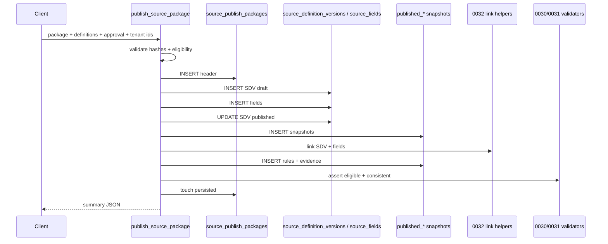

# Phase 4C.12 — `publish_source_package` RPC (plan)

**Status:** Planning only. **No RPC, migrations, UI, or API routes in this phase.**

**Parents:** [`PHASE4C8-SOURCE-PUBLISH-PACKAGE.md`](./PHASE4C8-SOURCE-PUBLISH-PACKAGE.md) · [`PHASE4C9-SOURCE-PUBLISH-PERSISTENCE-PLAN.md`](./PHASE4C9-SOURCE-PUBLISH-PERSISTENCE-PLAN.md) · [`PHASE4C10-STAGING-VALIDATION-PLAN.md`](./PHASE4C10-STAGING-VALIDATION-PLAN.md) · [`PHASE4C11-BIOSPECIMEN-COLLECTION-MODULE.md`](./PHASE4C11-BIOSPECIMEN-COLLECTION-MODULE.md)

**Baseline (GREEN — do not alter):** Phase **3C** RPCs and validation. Phase **4B** migrations **`0020`–`0025`**. Existing publish DDL **`0026`–`0032`** (amend only via **`0033`** for the RPC and tightly scoped grants).

**Core principle:** `publish_source_package` is the **single atomic transaction** that converts an approved, file-based publish package into (1) **Phase 4A** runtime-authoritative rows (`source_definition_versions`, `source_fields`) and (2) **Phase 4C** immutable audit mirrors (`published_*`, `source_publish_approval_evidence`), then marks the package persisted.

---

## A. Purpose

```text
publish_package.json + source-definitions.json + approval.json
  →  publish_source_package()  [0033]
  →  source_publish_packages (persisted)
  →  Phase 4A: source_definition_versions (lifecycle_status = published)
  →  Phase 4A: source_fields (active manifest per SDV)
  →  Phase 4C: published_* snapshots (immutable)
  →  phase4a_* link columns on published SDV/fields (0032 helpers only)
  →  capture-ready FK targets for Phase 4B
```

| Layer | Role after RPC |
|-------|----------------|
| **File package (4C.8)** | Pre-DB handoff; hashes and `publish_ready` gate |
| **`source_publish_packages`** | Durable header; `persisted_at` set only on success |
| **Phase 4A** | **Runtime FK target** — `source_response_sets.source_definition_version_id`, `source_responses.source_field_id` |
| **Phase 4C `published_*`** | **Immutable audit snapshot** — regulatory reconstruct; not the capture FK |
| **Phase 4B** | Unchanged schema; capture allowed only when 4A rows are `published` and 4C consistency passes |

Phase 4A remains the **runtime FK target**. Phase 4C remains **insert-only** generated content except the one-time `phase4a_*` link backfill permitted by `phase4c_published_snapshot_before_write` (0032).

---

## B. Inputs

### RPC signature (planning)

```sql
-- Migration 0033 (planning name only)
public.publish_source_package(
  p_organization_id   uuid,
  p_study_id            uuid,
  p_study_version_id    uuid,
  p_publish_package     jsonb,
  p_source_definitions  jsonb,
  p_approval            jsonb
) returns jsonb;
```

### Caller context

| Input | Source | Notes |
|-------|--------|-------|
| `p_organization_id` | Client (must match session tenant) | Validated against `studies.organization_id` |
| `p_study_id` | Client | Must match package + all child rows |
| `p_study_version_id` | Client | FK to `study_versions`; protocol window for this publish |
| `p_publish_package` | `source-publish-package.json` body | Header: `package_id`, hashes, `publish_ready`, counts, `graph_id`, `input_hash`, … |
| `p_source_definitions` | Full `source-definitions.json` | **Required payload** — not optional paths-only |
| `p_approval` | `source-preview-approval.json` body | `decision`, `publish_eligible`, hashes, `approval_id`, reviewer metadata |
| **Actor** | `auth.uid()` | **Required**; never accepted from JSON |

### Pre-RPC file pipeline (unchanged)

```bash
npm run build:publish-package:golden
# or golden-biospecimen equivalents after compile/approve
```

### JSON field requirements (minimum)

**`p_publish_package`**

- `package_id` (text, deterministic `pkg_*`)
- `publish_ready` (boolean, must be `true`)
- `graph_id`, `input_hash`, `compiler_output_id`, `compiler_version`
- `approval_id`
- `source_definitions_hash`, `preview_hash`, `approval_hash`
- `validation_snapshot.errors` (array, must be empty)
- `counts` (SDV, sections, fields, rules, …)

**`p_source_definitions`**

- Top-level arrays: `source_definition_versions`, `source_sections`, `source_fields`, `validation_rules`, `conditional_rules`, `workflow_requirements`, `signature_requirements`, `external_source_requirements`, `runtime_expectations`
- `validation_report.passed === true` (or `validation_status` in `valid`|`warning` with zero errors)
- `graph_id` / `input_hash` aligned with package

**`p_approval`**

- `decision === 'approved'`
- `publish_eligible === true`
- `approval_id` matches package
- Recorded hashes match recomputation from provided JSON bodies

### `package_hash` (header)

Compute at RPC entry (canonical stable JSON or byte manifest):

```text
package_hash = sha256( canonical_json({
  package_id, graph_id, input_hash,
  source_definitions_hash, preview_hash, approval_hash,
  counts
}) )
```

Store on `source_publish_packages.package_hash` for idempotency comparison.

---

## C. Eligibility checks

All checks run **inside** the transaction. Fail fast before any insert when possible.

| # | Check | Failure code (planning) |
|---|--------|-------------------------|
| 1 | `auth.uid()` is not null | `AUTH_REQUIRED` |
| 2 | `phase4c_user_can_publish_source_package(org, study)` | `UNAUTHORIZED_PUBLISH` |
| 3 | Study exists; `study.organization_id = p_organization_id` | `STUDY_TENANT_MISMATCH` |
| 4 | `study_version_id` belongs to study | `STUDY_VERSION_MISMATCH` |
| 5 | `p_publish_package.publish_ready === true` | `PACKAGE_NOT_READY` |
| 6 | `p_approval.decision === 'approved'` | `APPROVAL_NOT_APPROVED` |
| 7 | `p_approval.publish_eligible === true` | `APPROVAL_NOT_ELIGIBLE` |
| 8 | `validation_snapshot.errors` empty (package + live `p_source_definitions`) | `VALIDATION_ERRORS_PRESENT` |
| 9 | Recomputed SHA-256 of `p_source_definitions` = `source_definitions_hash` | `SOURCE_HASH_MISMATCH` |
| 10 | Approval-recorded hashes = package hashes = recomputed (preview/approval bytes if passed) | `HASH_MISMATCH` |
| 11 | `graph_id` / `input_hash` / `compiler_output_id` consistent across package, definitions, approval | `GRAPH_METADATA_MISMATCH` |
| 12 | `package_id` matches builder formula (re-derive; warn or fail on drift) | `PACKAGE_ID_MISMATCH` |
| 13 | Package idempotency (see §E) | `PACKAGE_HASH_CONFLICT` / allow replay |
| 14 | Deterministic child IDs unique within payload | `DUPLICATE_COMPILER_ID` |
| 15 | Referential integrity within compiler output (section→SDV, field→section) | `COMPILER_GRAPH_INTEGRITY` |

**Not sufficient alone:** client-supplied `publish_ready` without server-side recomputation of hashes and validation replay.

---

## D. Transaction order

Single PostgreSQL transaction (`BEGIN` … `COMMIT`). Any failure → full `ROLLBACK` (no partial publish).

**Important Phase 4A constraint (0015/0016):** `source_fields` may only be inserted while parent `source_definition_versions.lifecycle_status` is `draft` or `in_review`. Therefore Phase 4A work is **draft insert → field insert → publish transition**, not insert-directly-as-published.

### Strict step order

| Step | Action | Notes |
|------|--------|-------|
| **1** | **Validate package + hashes** | §C checks; build in-memory maps keyed by compiler IDs (`sdv_*`, `sec_*`, `fld_*`) |
| **2** | **Insert `source_publish_packages` header** | `publish_ready`, hashes, `validation_status`, `persisted_at = NULL` |
| **3** | **Insert Phase 4A `source_definition_versions` (draft)** | One per compiler SDV; resolve/create parent `source_definitions` row per visit/instrument (`instrument_code` / visit_code) |
| **4** | **Insert Phase 4A `source_fields` (draft parent)** | Map compiler field → 4A row; `field_key`, `label`, `instructions`, `widget_hint`, `validation_rules`, `sort_order` |
| **3b** | **Publish Phase 4A SDVs** | `UPDATE lifecycle_status = 'published'` (trigger sets `published_at`, `published_by_user_id = auth.uid()`) |
| **5** | **Insert `published_source_definition_versions`** | Snapshot from compiler SDV + `provenance_json`; `phase4a_source_definition_version_id` NULL |
| **6** | **Insert `published_source_sections`** | From `source_sections[]`; FK package + compiler SDV id |
| **7** | **Insert `published_source_fields`** | From `source_fields[]`; `phase4a_source_field_id` NULL |
| **8** | **Link published SDVs → Phase 4A** | `phase4c_link_published_sdv_to_phase4a(org, package_id, compiler_sdv_id, phase4a_uuid)` per SDV |
| **9** | **Link published fields → Phase 4A** | `phase4c_link_published_field_to_phase4a(org, package_id, compiler_field_id, phase4a_uuid)` per field |
| **10** | **Insert rules / requirements / expectations** | `published_source_validation_rules`, `published_source_conditional_rules`, `published_source_workflow_requirements`, `published_source_signature_requirements`, `published_source_external_requirements`, `published_source_runtime_expectations` |
| **11** | **Insert `source_publish_approval_evidence`** | Frozen approval; hashes must match header |
| **12** | **`PERFORM phase4c_assert_publish_package_eligible(org, package_id)`** | 0030 — header + evidence |
| **13** | **`SELECT phase4c_publish_package_is_consistent(org, package_id)`** | 0031 — must be true |
| **14** | **`phase4c_touch_persisted_package(header.id)`** | 0030 SECURITY DEFINER — sets `persisted_at`, `persisted_by_user_id` |
| **15** | **Return publish summary** | JSONB per §J |

### Phase 4A `source_definitions` resolution

Compiler output is visit-scoped SDVs, not necessarily pre-seeded 4A instruments. RPC must:

1. For each SDV, derive stable `source_definitions.code` (e.g. `instrument_code` or `visit_code` from compiler payload).
2. `INSERT … ON CONFLICT (study_id, code) DO NOTHING` or `SELECT` existing id.
3. Attach `source_definition_version` to that `source_definition_id`.

Store mapping `compiler_sdv_id → phase4a_sdv_uuid` in a temp table or PL/pgSQL record array for steps 4–9.

### Phase 4A field mapping (compiler → 4A)

| Compiler (`source_fields`) | Phase 4A (`source_fields`) |
|----------------------------|----------------------------|
| `field_key` | `field_key` |
| `display_label` / `label` | `label` |
| `display_label` or export note | `instructions` (non-blank required) |
| `data_type` / `input_type` | `widget_hint` (normalized enum) |
| `validation_rule` + rules array | `validation_rules` jsonb |
| `option_list_code` | `options` jsonb |
| section order / field order | `sort_order` |
| `is_required` | `is_required` |

Sections remain **Phase 4C-only** (`published_source_sections`); Phase 4A has no `source_sections` table. Runtime capture uses flat field manifests per SDV.

### Link helpers (0032 only)

- **`phase4c_link_published_sdv_to_phase4a`** — sets `published_source_definition_versions.phase4a_source_definition_version_id` once; verifies 4A row is `published`.
- **`phase4c_link_published_field_to_phase4a`** — sets `published_source_fields.phase4a_source_field_id` once; verifies parent SDV link exists.

No broad `UPDATE` policies on `published_*`. No direct client updates to `phase4a_*` columns.

---

## E. Idempotency

**Unique key:** `(organization_id, package_id)` on `source_publish_packages`.

| Scenario | Behavior |
|----------|----------|
| **Same `package_id` + same hashes + `persisted_at` set** | **Safe no-op:** return existing summary (`idempotent_replay: true`); no duplicate child rows |
| **Same `package_id` + different hashes** | **Hard fail:** `PACKAGE_HASH_CONFLICT` — amendments require new `package_id` / new publish |
| **Same `package_id`, header exists, `persisted_at` NULL** | **Hard fail:** `PACKAGE_PUBLISH_INCOMPLETE` — prior transaction rolled back or crashed; manual ops review |
| **Duplicate deterministic child IDs in payload** | Fail unless retry is exact same package (same content) |
| **Partial publish** | Prevented by single transaction; ROLLBACK on any exception |

### Idempotent replay algorithm

```text
SELECT * FROM source_publish_packages
 WHERE organization_id = p_organization_id AND package_id = pkg.package_id;

IF FOUND AND persisted_at IS NOT NULL THEN
  IF all hash columns match incoming THEN
    RETURN cached summary;
  ELSE
    RAISE PACKAGE_HASH_CONFLICT;
  END IF;
END IF;

IF FOUND AND persisted_at IS NULL THEN
  RAISE PACKAGE_PUBLISH_INCOMPLETE;
END IF;

-- else proceed with full insert pipeline
```

Child tables use unique constraints per `(organization_id, package_id, <compiler_id>)` so a accidental retry without idempotency guard fails on duplicate, not silent double-publish.

---

## F. RLS / security

| Topic | Design |
|-------|--------|
| **RPC security** | `SECURITY DEFINER` recommended for atomic multi-table publish; **`SET search_path = public`** only |
| **Actor** | `auth.uid()` required; `persisted_by_user_id := auth.uid()` via `phase4c_touch_persisted_package` |
| **Authorization** | `phase4c_user_can_publish_source_package(org, study)` — study_admin, coordinator, org_admin; **monitors excluded** (0026) |
| **Service role** | **Not assumed** — authenticated publish path only |
| **Tenant** | Every insert sets `organization_id`; align triggers (`phase4c_published_row_align_org`) |
| **Header mutation** | Only `persisted_at` / `persisted_by_user_id` via `phase4c_touch_persisted_package` (0030 policy) |
| **`published_*` mutation** | Deny by default (`phase4c_published_snapshot_deny_mutation`); SDV/field rows allow **only** `phase4a_*` link via 0032 trigger + link RPCs |
| **Grants** | `REVOKE ALL ON FUNCTION … FROM PUBLIC`; `GRANT EXECUTE TO authenticated` |
| **Secrets** | No `service_role` in client; no hash bypass flags |

### Why SECURITY DEFINER

RLS on `published_*` INSERT policies require publish role, but Phase 4A transitions and link helpers must run atomically with consistent `auth.uid()` attribution. A single definer function with explicit guardrails avoids split invoker/definer deadlocks while keeping RLS on direct table access for non-RPC clients.

---

## G. Phase 4A mapping

| Compiler artifact | Phase 4A table | Persistence notes |
|-------------------|----------------|-------------------|
| `source_definition_versions[]` | `source_definition_versions` | Draft → published; `version_label` from `version_label` / `cpst_version`; `meta` stores `graph_id`, compiler ids |
| `source_fields[]` | `source_fields` | Insert while parent draft; unique `(source_definition_version_id, field_key)` |
| `source_sections[]` | *(none)* | Snapshot only in `published_source_sections` |
| Rules / workflows / signatures / external / runtime | *(none in 4A today)* | Snapshot in `published_*` rule tables (0028) |

### Link columns (4C → 4A)

| Published table | Column | Points to |
|-----------------|--------|-----------|
| `published_source_definition_versions` | `phase4a_source_definition_version_id` | `source_definition_versions.id` |
| `published_source_fields` | `phase4a_source_field_id` | `source_fields.id` |

Capture and audit queries join **compiler id** in `published_*` to **UUID** in Phase 4A via these columns.

---

## H. Phase 4B runtime readiness

After successful RPC:

| Runtime object | FK target |
|----------------|-----------|
| `source_response_sets.source_definition_version_id` | Phase 4A `source_definition_versions.id` (must be `lifecycle_status = 'published'`) |
| `source_responses.source_field_id` | Phase 4A `source_fields.id` |

### Post-publish guards (existing 0031 views)

- `phase4c_violation_persisted_missing_phase4a_sdv_link`
- `phase4c_violation_persisted_missing_phase4a_field_link`
- `phase4c_violation_capture_unpublished_sdv_binding`
- `phase4c_violation_runtime_expectation_orphan`

**Capture policy:** Site/runtime code (future 4B RPCs) should refuse new draft capture when `phase4c_publish_package_is_consistent` is false for the active package, or when target SDV is not `published`. Phase 4B schema (**0020–0025**) is unchanged; this phase only enables binding.

---

## I. Failure modes

| Failure | When | Transaction |
|---------|------|-------------|
| `AUTH_REQUIRED` | `auth.uid()` null | Rollback |
| `UNAUTHORIZED_PUBLISH` | Role check fails | Rollback |
| `STUDY_TENANT_MISMATCH` | org/study invalid | Rollback |
| `PACKAGE_NOT_READY` | `publish_ready !== true` | Rollback |
| `APPROVAL_NOT_APPROVED` | decision / eligible | Rollback |
| `VALIDATION_ERRORS_PRESENT` | errors array non-empty | Rollback |
| `HASH_MISMATCH` | definitions/preview/approval hash | Rollback |
| `PACKAGE_HASH_CONFLICT` | same `package_id`, different content | Rollback |
| `PACKAGE_PUBLISH_INCOMPLETE` | orphan header row | No auto-retry |
| `DUPLICATE_COMPILER_ID` | duplicate `sdv_*` / `fld_*` in payload | Rollback |
| `PHASE4A_SDV_INSERT_FAILED` | trigger / FK on 4A SDV | Rollback |
| `PHASE4A_FIELD_INSERT_FAILED` | authoring gate (parent not draft) | Rollback |
| `PHASE4A_PUBLISH_TRANSITION_FAILED` | illegal lifecycle transition | Rollback |
| `PUBLISHED_SNAPSHOT_INSERT_FAILED` | FK to package header | Rollback |
| `LINK_HELPER_FAILED` | 0032 helper raises (wrong org, already linked, 4A not published) | Rollback |
| `ASSERT_ELIGIBLE_FAILED` | `phase4c_assert_publish_package_eligible` | Rollback |
| `CONSISTENCY_CHECK_FAILED` | `phase4c_publish_package_is_consistent` false | Rollback |
| `RUNTIME_FK_READINESS` | consistency views still report violations | Rollback (do not call touch) |

All exceptions should include `package_id` and `organization_id` in the message for support; return structured code in JSON when using `RAISE EXCEPTION` with `ERRCODE` or map to jsonb `error_code`.

---

## J. Return shape

```json
{
  "package_id": "pkg_…",
  "organization_id": "uuid",
  "study_id": "uuid",
  "study_version_id": "uuid",
  "source_publish_package_row_id": "uuid",
  "persisted_at": "2026-05-16T…",
  "persisted_by_user_id": "uuid",
  "idempotent_replay": false,
  "validation_status": "valid",
  "warnings": [],
  "phase4a_source_definition_version_ids": {
    "sdv_CRG-…_abc": "uuid",
    "…": "uuid"
  },
  "phase4a_source_field_ids": {
    "fld_CRG-…_xyz": "uuid",
    "…": "uuid"
  },
  "published_snapshot_counts": {
    "source_definition_versions": 1,
    "source_sections": 8,
    "source_fields": 48,
    "validation_rules": 37,
    "conditional_rules": 4,
    "workflow_requirements": 3,
    "signature_requirements": 1,
    "external_source_requirements": 0,
    "runtime_expectations": 8,
    "approval_evidence": 1
  },
  "consistency_check_passed": true
}
```

| Field | Meaning |
|-------|---------|
| `idempotent_replay` | `true` when returning existing persisted package without writes |
| `phase4a_*_ids` | Maps **compiler deterministic id** → **Phase 4A UUID** for clients and dry-run diff |
| `published_snapshot_counts` | Rows inserted in this transaction (zero on replay) |
| `consistency_check_passed` | Result of step 13 |

---

## K. Exact next step

After this plan is approved:

1. **Implement RPC in migration `0033` only** — function `publish_source_package`, grants, comments; no changes to 0020–0025 or 0032 behavior except documented call order.
2. **Build dry-run JS validator** — `scripts/dry-run-publish-source-package.mjs`: load package + definitions + approval; run same checks as §C without DB writes; output diff report.
3. **Test golden-basic** — `tmp/publish/source-publish-package.golden-basic.json` + compiled artifacts against staging DB.
4. **Test golden-biospecimen** — biospecimen package path (48 fields, 8 sections).
5. **Only then** add API route / server action / UI publish button (out of scope for 4C.12).

### Suggested `0033` contents (outline)

- `CREATE OR REPLACE FUNCTION publish_source_package(…) RETURNS jsonb`
- Private helper: `phase4c_compute_package_hash(jsonb)`
- Private helper: `phase4c_publish_resolve_source_definition(...)`
- `GRANT EXECUTE … TO authenticated`
- Comment referencing Phase 4C.12 plan doc

### Out of scope (4C.12)

- UI publish wizard
- Supabase Storage upload of artifacts
- Retire/supersede prior published SDVs on same visit
- Cryptographic signing of packages
- Changes to Phase 3C GREEN paths

---

## Appendix — Transaction diagram


