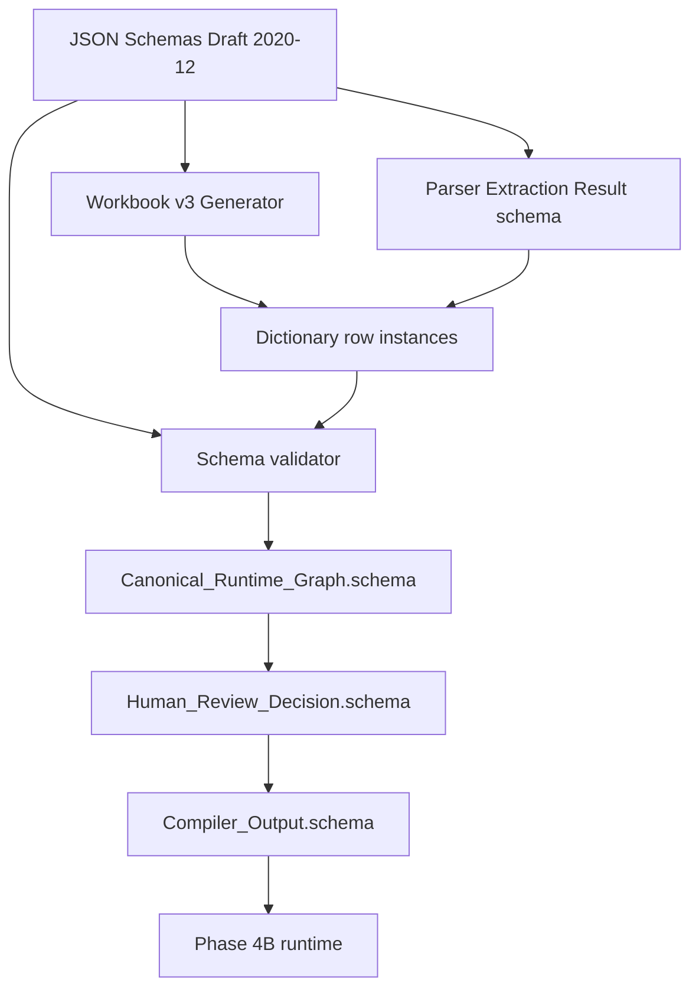

# Phase 4C.2 — Canonical JSON Schemas (architecture)

**Status:** **Schemas implemented** (`vilo-os/schemas/**`, version `1.0.0`). Workbook v3, migrations, UI, parsers, and runtime RPCs remain out of scope.

**Implementation (2026-05-16):** 31 JSON Schema Draft 2020-12 files. Syntax validation: `node scripts/validate-schemas.mjs`. Full AJV compile validation deferred until `ajv` + `ajv-formats` are approved as devDependencies (`node scripts/validate-schemas.mjs --ajv`).

**Parents:**  
[`PHASE4C-PROTOCOL-TO-SOURCE-GENERATOR.md`](./PHASE4C-PROTOCOL-TO-SOURCE-GENERATOR.md) · [`PHASE4C1-DOMAIN-MODULE-REGISTRY-RUNTIME-GRAPH.md`](./PHASE4C1-DOMAIN-MODULE-REGISTRY-RUNTIME-GRAPH.md)

**Core principle:** **Canonical JSON Schemas** are the **machine-readable source generation contract**. They drive workbook v3 generation, parser mapping, dictionary validation, Canonical Runtime Graph (CRG) construction, Source Definition Compiler behavior, and audit/export provenance. Workbooks and UI are **interfaces** generated from schema — not the source of truth.

**Governance:**

| Rule | Meaning |
|------|---------|
| Schemas are **versioned** | Semantic versioning per family; breaking = major bump |
| Schemas are **deterministic** | Same schema version + same validated rows ⇒ same CRG hash |
| AI extraction **only** populates schema-compliant objects | `Parser_Extraction_Result` → row proposals |
| **No generation** outside schema contract | Compiler rejects `additionalProperties`, unknown enums, orphan FKs |
| Workbook v3 is **generated from** schema | Not authoritative over JSON |

**Baseline:** GREEN Phase **3C** unchanged. Phase **4B** migrations `0020`–`0025` unchanged.

---

## A. Architecture summary

```text
Canonical JSON Schemas (versioned)
        │
        ├──────────────────────────────┐
        ▼                              ▼
 Workbook v3 Generator          Parser Mapping Spec
 (sheets, validations)          (Excel / PDF / OCR)
        │                              │
        └──────────┬───────────────────┘
                   ▼
           Dictionary Rows (validated instances)
                   ▼
        Canonical Runtime Graph (CRG)
                   ▼
        Human Review / Approval
                   ▼
        Source Definition Compiler
                   ▼
        Versioned eSource Runtime (Phase 4B)
```



| Stage | Contract artifact |
|-------|-------------------|
| Authoring | `CPST_Workbook.schema.json` bundles core + domain refs |
| Ingestion | `Parser_Extraction_Result.schema.json` |
| Validation | Per-sheet core schemas + cross-sheet rules |
| Graph | `Canonical_Runtime_Graph.schema.json` |
| Compile | `Compiler_Output.schema.json` |
| Publish | `Compiler_Output` + `Audit_and_Versioning` + Phase **4A** DDL |

---

## B. Schema families

### B.1 Core dictionary schemas (`vilo-os/schemas/core/`)

| File | Entity | Design input? |
|------|--------|---------------|
| `Study_Setup.schema.json` | Study-level metadata | **Yes** |
| `Visit_Groups.schema.json` | Phase/stage groups | **Yes** |
| `Visit_Templates.schema.json` | Visit nodes | **Yes** |
| `Procedure_Library.schema.json` | Procedure capabilities | **Yes** |
| `Visit_Procedure_Matrix.schema.json` | Visit×procedure matrix | **Yes** |
| `Conditional_Rules.schema.json` | Auditable rules | **Yes** |
| `Schedule_Windows.schema.json` | Temporal constraints | **Yes** |
| `External_Source_Map.schema.json` | External SoR map | **Yes** |
| `Substudy_Map.schema.json` | Cohort/substudy scope | **Yes** |
| `Roles_Signoff.schema.json` | RBAC + signoff | **Yes** |
| `Value_Lists.schema.json` | Controlled vocabularies | **Yes** |
| `Field_Definitions.schema.json` | eSource field specs | **Yes** |
| `Audit_and_Versioning.schema.json` | Governance | **Yes** |

### B.2 Runtime support schema

| File | Role |
|------|------|
| `Visit_Execution_Log.schema.json` | **Runtime only** — maps to `visits`, `procedure_executions`, `source_response_sets`. **Not** compiler design input. May be emitted by runtime exporters; **must not** reverse-feed CPST without amendment workflow. |

### B.3 Domain module schemas (`vilo-os/schemas/domain/`)

| File | Module |
|------|--------|
| `Oncology_Module.schema.json` | Oncology Complexity |
| `Dose_Escalation.schema.json` | Dose Escalation |
| `Crossover_Design.schema.json` | Crossover Design |
| `Adaptive_Design_Rules.schema.json` | Adaptive Designs |
| `Decentralized_Workflows.schema.json` | Decentralized Trial Workflows |
| `Imaging_Matrix.schema.json` | Imaging Heavy Protocols |
| `Device_Trial_Controls.schema.json` | Device Trials |
| `EDC_Reconciliation.schema.json` | EDC Reconciliation |
| `ePRO_Workflows.schema.json` | ePRO Heavy Studies |
| `Pediatric_Consent_Assent.schema.json` | Pediatric Consent / Assent |

Each domain schema declares `compatible_core_schema_version` (semver range).

### B.4 Meta schemas (`vilo-os/schemas/meta/`)

| File | Purpose |
|------|---------|
| `CPST_Workbook.schema.json` | Bundle: core row arrays + domain attachments + schema versions |
| `Domain_Module_Registry.schema.json` | Active modules per `Study_Template_ID` |
| `Canonical_Runtime_Graph.schema.json` | CRG nodes + edges |
| `Compiler_Output.schema.json` | Compiler artifact before Phase 4A persist |
| `Parser_Extraction_Result.schema.json` | AI/OCR/Excel extraction proposals |
| `Human_Review_Decision.schema.json` | Per-row / per-object review decisions |

### B.5 Compiler contracts (`vilo-os/compiler/contracts/`)

Symlinks or copies of meta schemas used by compiler CI + provenance hashing (same JSON, stable `$id` URLs).

---

## C. JSON Schema standard

| Requirement | Value |
|-------------|--------|
| Draft | **JSON Schema Draft 2020-12** |
| `$schema` | `https://json-schema.org/draft/2020-12/schema` |
| `$id` | `https://vilo.os/schemas/{family}/{name}/{version}` (stable URI) |
| `title` | Human name per sheet/module |
| `description` | Investigator + engineer semantics |
| `version` | Custom extension: `"x-vilo-schema-version": "1.0.0"` |
| Objects | `"type": "object"`, `"additionalProperties": false` |
| Reuse | `$defs` in `common.schema.json`; `$ref` across files |
| Strings | `pattern`, `minLength`, `maxLength`, `format` (`date`, `date-time`, `uuid`) |
| Numbers | `minimum`, `maximum`, `multipleOf` where applicable |
| Enums | Closed sets — no open strings for regulated codes |

**Repository layout (implemented):**

```text
vilo-os/schemas/
  common/common.schema.json
  core/*.schema.json            # 13 design + Visit_Execution_Log
  domain/*.schema.json          # 10 modules
  meta/*.schema.json            # 6 meta contracts
vilo-os/scripts/
  validate-schemas.mjs          # syntax (+ optional --ajv)
  generate-phase4c2-schemas.mjs # regen helper (dev only)
```

### Implementation assumptions

| Topic | Decision |
|-------|----------|
| JSON property keys | `snake_case` (workbook column mapping is a generator concern) |
| `Field_Definitions.Required` | Schema property `is_required` (avoids JSON Schema `required` keyword clash) |
| `x_vilo_provenance` | Optional on all dictionary rows when AI/parser-filled |
| Cross-row rules | `window_min` ≤ `window_max`, DLT/ePRO date ordering enforced in compiler catalog; partial `if`/`then` in schema only |
| `Compiler_Output` sub-objects | `validation_rules`, `workflow_requirements`, etc. use `additionalProperties: false` empty shells until compiler emits typed sub-schemas |
| ID patterns | `ST-###`, `V-###`, `P-###`, `M-####`, `R-###`, `W-###`, `X-###`, `SS-###`, `ROL-###`, `VER-###`, `F-###`, module-specific prefixes (`ONC-`, `DE-`, …) |

---

## D. Shared definitions (`common.schema.json` `$defs`)

| Def name | JSON Schema shape | Usage |
|----------|-------------------|--------|
| `TechnicalID` | `string`, pattern `^[a-zA-Z][a-zA-Z0-9_-]{2,63}$` | Internal stable keys |
| `StudyTemplateID` | `$ref` TechnicalID | Root scope |
| `VisitID` | `$ref` TechnicalID | Visit_Templates |
| `ProcedureID` | `$ref` TechnicalID | Procedure_Library |
| `RuleID` | `$ref` TechnicalID | Conditional_Rules |
| `ModuleID` | `$ref` TechnicalID | Domain modules |
| `VersionID` | `string`, pattern `^v[0-9]+(\.[0-9]+)*$` | CPST / schema version |
| `ISODate` | `string`, `format: date` | |
| `ISODateTime` | `string`, `format: date-time` | UTC Zulu preferred |
| `BooleanFlag` | `boolean` | |
| `ControlledListName` | `string`, pattern `^[A-Z][A-Z0-9_]*$` | Value_Lists |
| `ControlledValueCode` | `string`, pattern `^[A-Z0-9][A-Z0-9_]*$` | List items |
| `RoleName` | enum aligned `study_members` | coordinator, study_admin, … |
| `SourceType` | enum | `internal`, `external`, `operational_confirmation`, `device_vendor` |
| `RequirementStatus` | enum | `required`, `optional`, `conditional`, `not_applicable` |
| `VisitType` | enum | `scheduled`, `unscheduled`, `eos`, `et` |
| `VisitMode` | enum | `onsite`, `phone`, `offsite`, `hybrid` |
| `DataType` | enum | maps Phase **4B** `input_type` |
| `FieldName` | `string`, pattern `^[a-z][a-z0-9_]*$` | snake_case field_key |
| `ExportName` | `string`, pattern `^[A-Za-z][A-Za-z0-9_]*$` | sponsor CSV |
| `ValidationExpression` | `string`, maxLength 4096 | server-evaluated |
| `ConditionalExpression` | `string`, maxLength 4096 | human-readable + machine id |
| `ProvenanceReference` | object | see below |

**`ProvenanceReference` object:**

```json
{
  "source_dictionary": "Field_Definitions",
  "source_row_id": "string",
  "source_field": "FieldName",
  "schema_version": "1.0.0",
  "cpst_version": "v3.0.0",
  "ingestion_job_id": "uuid|null",
  "extraction_evidence_id": "uuid|null"
}
```

---

## E. Core schema requirements

Each core schema: **array of row objects** at workbook import, or **single Study_Setup object** where noted. All rows include optional `x-vilo-provenance` (ProvenanceReference) when AI-filled.

### E.1 Study_Setup.schema.json

| Required | Validation | FK / relations | Compiler | Audit |
|----------|------------|----------------|----------|-------|
| `study_template_id`, `protocol_number`, `protocol_version`, `effective_date`, `cpst_version` | `effective_date` ISO date | Root | Creates `StudyTemplateNode`, `VersionNode` | Header on all exports |
| Optional: `amendment_id`, `sponsor`, `cro`, `study_phase` | `study_phase` → Value_Lists | — | `study_versions` row | Amendment trail |

### E.2 Visit_Groups.schema.json

| Required | Validation | Relations | Compiler |
|----------|------------|-----------|----------|
| `visit_group_code`, `visit_group_label`, `sort_order`, `active_flag` | Unique `visit_group_code` per template | `study_template_id` | `VisitGroupNode` |

### E.3 Visit_Templates.schema.json

| Required | Validation | Relations | Compiler |
|----------|------------|-----------|----------|
| `visit_id`, `visit_label`, `visit_group_code`, `sequence`, `delivery_mode`, `active_flag` | `visit_id` unique; `delivery_mode` enum VisitMode | FK `visit_group_code` | `VisitNode` + `visit_definitions` |

Optional: `planned_day`, `planned_week`, `relative_anchor`, `visit_type`.

### E.4 Procedure_Library.schema.json

| Required | Validation | Relations | Compiler |
|----------|------------|-----------|----------|
| `procedure_id`, `procedure_label`, `category`, `source_type`, `active_flag` | `source_type` enum | `study_template_id` | `ProcedureNode` |

Optional: `default_instrument_code`, `signature_required`, `owner_role`, `external_reference_required`, `detail_level`.

### E.5 Visit_Procedure_Matrix.schema.json

| Required | Validation | Relations | Compiler |
|----------|------------|-----------|----------|
| `visit_id`, `procedure_id`, `matrix_marker` | If marker=`conditional` ⇒ `condition_rule_id` required | FK both ids | Edge `assigned_to_visit` + requiredness |

`matrix_marker` enum: `required`, `optional`, `conditional`, `not_applicable`.

### E.6 Conditional_Rules.schema.json

| Required | Validation | Relations | Compiler |
|----------|------------|-----------|----------|
| `rule_id`, `rule_type`, `expression`, `action` | `expression` non-empty | Optional trigger FKs | `RuleNode` + edges |

### E.7 Schedule_Windows.schema.json

| Required | Validation | Relations | Compiler |
|----------|------------|-----------|----------|
| `visit_id`, `window_unit` | `window_min` ≤ `window_max` when both set | FK `visit_id` | `WindowNode` |

Optional: `anchor_event`, `offset_value`, `grace_days`, `holiday_weekend_policy`.

### E.8 External_Source_Map.schema.json

| Required | Validation | Relations | Compiler |
|----------|------------|-----------|----------|
| `external_source_id`, `procedure_id`, `system_name` | If procedure `source_type=external` ⇒ row required | FK procedure | `ExternalSourceNode` |

### E.9 Substudy_Map.schema.json

| Required | Validation | Relations | Compiler |
|----------|------------|-----------|----------|
| `substudy_code`, `study_template_id` | At least one of visit/procedure scope optional | Demographic edges | `SubstudyNode` |

### E.10 Roles_Signoff.schema.json

| Required | Validation | Relations | Compiler |
|----------|------------|-----------|----------|
| `scope_type`, `scope_id`, `role_code` | At least one of `can_execute`, `can_review`, `can_sign` | FK scope | `RoleNode`, `SignatureRequirementNode` |

### E.11 Value_Lists.schema.json

| Required | Validation | Relations | Compiler |
|----------|------------|-----------|----------|
| `list_code`, `item_code`, `item_label`, `active_flag` | Unique (`list_code`,`item_code`) | — | `options_manifest` |

### E.12 Field_Definitions.schema.json

| Required | Validation | Relations | Compiler |
|----------|------------|-----------|----------|
| `field_key`, `procedure_id`, `display_label`, `data_type`, `required` | Coded types require `option_list_code` | FK procedure | `FieldNode` → `source_fields` |

Optional: `section_code`, `validation_expression`, `conditional_visibility_rule_id`, `export_name`, `read_only`, `repeatable`, `default_value`, `unit`.

**Compiler metadata extension:** `x-vilo-compiler: { "section_sort": 100, "manifest_hash_input": true }`.

### E.13 Audit_and_Versioning.schema.json

| Required | Validation | Relations | Compiler |
|----------|------------|-----------|----------|
| `cpst_version`, `approval_state`, `schema_version` | `approval_state` enum: draft, needs_review, approved, published, rejected | — | Publish gate |

When `approval_state=approved`: require `approved_by`, `approved_at`. When published: require `published_at`, `input_hash`, `crg_hash`.

---

## F. Domain schema requirements

Each domain schema: **array of rows** with:

| Common required | Purpose |
|-----------------|---------|
| `module_row_id` | TechnicalID |
| `study_template_id` | StudyTemplateID |
| `module_id` | ModuleID (registry key) |
| `compatible_core_schema_version` | Semver range e.g. `^1.0.0` |
| `active_flag` | BooleanFlag |

Optional scoping: `visit_id`, `procedure_id` (when row is visit/proc specific).

### F.1 Oncology_Module.schema.json

| Fields (required unless noted) | Controlled lists | Compiler / hooks |
|-------------------------------|------------------|-------------------|
| `regimen_line`, `cycle_number`, `cycle_day` | oncology enums | Cycle subgraph nodes |
| `tumor_response`, `recist_status` | RECIST | Field definitions + validation |
| `ae_grade`, `hematologic_toxicity`, `nonhematologic_toxicity` | CTCAE | Safety workflow_hooks |
| `disease_progression_flag` | — | triggers FU requirement |
| `survival_followup_required` | — | RuntimeExpectation |
| `notes` | optional text | min length 0 |

### F.2 Dose_Escalation.schema.json

| Fields | Validation | Hooks |
|--------|------------|-------|
| `cohort`, `dose_level`, `dlt_window_start`, `dlt_window_end` | end ≥ start | temporal_hooks |
| `sentinel_subject_flag`, `stop_and_hold_flag` | — | blocks edges |
| `escalation_decision`, `safety_review_required` | — | signature_hooks, workflow_hooks |
| `replacement_subject_allowed` | — | operational |

### F.3 Crossover_Design.schema.json

| Fields | Relations | Hooks |
|--------|-----------|-------|
| `sequence`, `period_number`, `treatment_arm`, `washout_period` | `period_specific_visit_id` | temporal_hooks |
| `carryover_check`, `period_eligibility` | RuleID refs | validation_hooks |

### F.4 Adaptive_Design_Rules.schema.json

| Fields | Validation | Hooks |
|--------|------------|-------|
| `trigger_type`, `interim_timepoint`, `analysis_committee`, `decision_type` | — | workflow_hooks |
| `modification_action`, `drop_arm_flag`, `enrichment_flag` | version_control_required=true | blocks publish until new CPST |
| `reestimate_sample_size` | — | export_hooks |

### F.5 Decentralized_Workflows.schema.json

| Fields | Relations | Hooks |
|--------|-----------|-------|
| `visit_id`, `visit_mode` | FK Visit | matches VisitMode |
| `home_health_required`, `telehealth_allowed`, `ip_direct_ship_flag` | — | workflow_hooks |
| `remote_id_verification`, `courier_collection_required` | — | operational_confirmation fields |
| `remote_source_type`, `vendor_managed_flag` | SourceType | external/device |

### F.6 Imaging_Matrix.schema.json

| Fields | Validation | Hooks |
|--------|------------|-------|
| `visit_id`, `modality`, `body_region`, `acquisition_window` | window within Schedule_Windows | temporal_hooks |
| `local_read_required`, `central_read_required` | central ⇒ reviewer role | signature_hooks |
| `qc_status`, `transfer_method`, `repeat_allowed`, `image_reviewer` | — | export_hooks |

### F.7 Device_Trial_Controls.schema.json

| Fields | Hooks |
|--------|-------|
| `device_id`, `serial_number`, `implant_use_date` | accountability fields |
| `calibration_required`, `software_version`, `wear_time_required` | validation_hooks |
| `malfunction_flag` | triggers workflow |
| `retrieval_required`, `accountability_status` | closeout |

### F.8 EDC_Reconciliation.schema.json

| Fields | Hooks |
|--------|-------|
| `source_record_id` (FieldName), `ecrf_field`, `mapping_status` | reconciliation_hooks |
| `discrepancy_type`, `query_status`, `resolution_owner` | query workflow |
| `locked_flag`, `reconciliation_date`, `closeout_status` | export_hooks |

### F.9 ePRO_Workflows.schema.json

| Fields | Validation | Hooks |
|--------|------------|-------|
| `instrument_name`, `schedule_cadence`, `device_app` | — | external source default |
| `completion_window_start`, `completion_window_end` | end > start | temporal_hooks |
| `reminder_flag`, `missing_response_flag`, `compliance_threshold` | 0–100 | validation_hooks |
| `rescue_workflow_required` | — | workflow_hooks |

### F.10 Pediatric_Consent_Assent.schema.json

| Fields | Validation | Hooks |
|--------|------------|-------|
| `age_range`, `parent_consent_required`, `child_assent_required` | — | signature_hooks |
| `reassent_trigger`, `lar_required` | — | temporal_hooks |
| `consent_version`, `assent_version` | — | version mismatch blocks proc |
| `signature_order` | array of RoleName | ordered sign chain |

---

## G. Workbook generation contract

**Direction:** `JSON Schema` → **Workbook v3** (`vilo-os/templates/cpst-workbook-v3.xlsx`).

| Generator rule | Source in schema |
|----------------|------------------|
| One sheet per core schema `title` | `core/*.schema.json` |
| Column headers = property names | `properties` keys |
| Required columns marked `*` | `required` array |
| Dropdowns | `enum` or `$ref` → Value_Lists |
| Date/number validation | `format`, `minimum`, `maximum` |
| Protected ID columns | `readOnly` extension on TechnicalID fields |
| Comments/tooltips | `description` per property |
| Version row on Audit sheet | `x-vilo-schema-version` |
| Domain module sheets | optional tabs from registry |
| Matrix sheet | Visit_Procedure_Matrix columns = visit_ids (dynamic column gen from Visit_Templates rows) |

**Import/export compatibility:**

- Export: workbook → JSON must validate against `CPST_Workbook.schema.json`.
- Import: invalid rows rejected with sheet/row/column pointer — no silent coercion.

**Rule:** Workbook is an **interface**, not SoR. SoR = validated JSON instance + hashes in `Audit_and_Versioning`.

---

## H. Parser mapping contract

**Direction:** PDF / OCR / Excel / paste → **`Parser_Extraction_Result.schema.json`** → schema-compliant dictionary rows.

### H.1 Extraction result object (required fields)

| Field | Type | Rule |
|-------|------|------|
| `extracted_value` | any (typed per target) | Raw parser output |
| `normalized_value` | matches target schema | Coerced enum/date/number |
| `target_schema` | string | e.g. `Visit_Templates.schema.json` |
| `target_field` | FieldName | Must exist in target schema `properties` |
| `confidence_score` | number 0–1 | &lt; threshold → review queue |
| `source_page` | string/int | PDF page or sheet name |
| `source_table` | string | Table id |
| `source_text_evidence` | string | Verbatim excerpt |
| `extraction_method` | enum | `excel`, `pdf_text`, `ocr`, `paste`, `manual` |
| `reviewer_status` | enum | `pending`, `accepted`, `edited`, `rejected` |

Optional: `proposed_row_id`, `study_template_id`, `ingestion_job_id`.

### H.2 Parser rules

1. **Cannot write outside schema** — no extra properties on row proposals.  
2. **Unknown content** → `reviewer_status=pending`, `target_schema=null`, human queue — **not** arbitrary fields.  
3. **Accepted** proposals merge into dictionary arrays only after `Human_Review_Decision`.  
4. Parser records `parser_mapping_schema_version` on each job.

---

## I. Deterministic compiler requirements

| # | Requirement |
|---|-------------|
| 1 | Same `schema_version` + canonicalized input rows ⇒ **identical** CRG canonical JSON (byte-stable after normalization) |
| 2 | Node IDs: `deterministic_id = hash(study_template_id + node_type + natural_key)` (document algorithm in compiler) |
| 3 | Compiler logs: `schema_version`, `cpst_version`, `input_hash` (SHA-256 of normalized CPST JSON) |
| 4 | `Compiler_Output.provenance_map`: every `source_field` → ProvenanceReference |
| 5 | Reject invalid rows — fail compile with `validation_report.errors[]` |
| 6 | **No silent inference** when `confidence_score < threshold` — row stays out of graph |
| 7 | Emit `validation_report` (errors, warnings, info) — **must pass** before publish |
| 8 | Tie-break order: sort arrays by stable keys before graph build |

---

## J. Canonical Runtime Graph schema

`Canonical_Runtime_Graph.schema.json` structure:

```json
{
  "schema_version": "1.0.0",
  "cpst_version": "v3.0.0",
  "study_template_id": "...",
  "generated_from_schema_version": "1.0.0",
  "input_hash": "sha256:...",
  "validation_status": "valid|invalid",
  "nodes": [ { ... } ],
  "edges": [ { ... } ]
}
```

### J.1 Node object

| Property | Required | Notes |
|----------|----------|-------|
| `node_id` | Y | Deterministic |
| `node_type` | Y | enum below |
| `natural_key` | Y | visit_id, field_key, etc. |
| `properties` | Y | object, additionalProperties: false |
| `source_dictionary` | Y | schema file name |
| `source_row_id` | Y | row identifier |
| `source_field_refs` | N | array of FieldName |
| `provenance` | Y | ProvenanceReference |
| `validation_status` | Y | valid, warning, error |

**Node types (enum):**  
`StudyTemplateNode`, `VersionNode`, `VisitGroupNode`, `VisitNode`, `ProcedureNode`, `FieldNode`, `RuleNode`, `WindowNode`, `ExternalSourceNode`, `SubstudyNode`, `RoleNode`, `DomainModuleNode`, `SignatureRequirementNode`, `ValidationRuleNode`, `RuntimeExpectationNode`.

### J.2 Edge object

| Property | Required |
|----------|----------|
| `edge_id` | Y |
| `edge_type` | Y |
| `from_node_id` | Y |
| `to_node_id` | Y |
| `properties` | N |
| `provenance` | Y |

**Edge types (enum):**  
`belongs_to`, `contains`, `assigned_to_visit`, `requires`, `optional_for`, `conditional_on`, `triggers`, `blocks`, `occurs_within`, `relative_to`, `sourced_from`, `reviewed_by`, `signed_by`, `applies_to_cohort`, `applies_to_region`, `applies_to_age`, `supersedes`, `generates_source`, `generates_workflow`, `exports_as`.

---

## K. Compiler output schema

`Compiler_Output.schema.json` top-level:

| Section | Contents |
|---------|----------|
| `compiler_version` | Tool semver |
| `schema_version` | Core + domain compatibility |
| `cpst_version` | Template version |
| `input_hash`, `crg_hash` | Integrity |
| `source_definition_versions` | Array: instrument versions to persist (Phase 4A shape) |
| `source_sections` | `section_code`, `label`, `sort_order`, `procedure_id` |
| `source_fields` | Full field specs ready for `source_fields` DDL |
| `validation_rules` | Compiled rules |
| `conditional_rules` | Resolved rule manifest |
| `workflow_requirements` | operational_events types + gates |
| `signature_requirements` | meaning codes + scopes |
| `runtime_expectations` | Procedure×visit expectations |
| `external_source_requirements` | Metadata field templates |
| `provenance_map` | Map field_key → ProvenanceReference |
| `validation_report` | errors, warnings, passed boolean |

Publish allowed only when `validation_report.passed === true` and `Audit_and_Versioning.approval_state === approved`.

---

## L. Versioning strategy

| Artifact | Version field | Breaking change policy |
|----------|---------------|-------------------------|
| Core schemas | `x-vilo-schema-version` semver | Major: rename/remove required field, change enum |
| Domain schemas | independent semver + `compatible_core_schema_version` | Major: new required module field |
| CPST instance | `cpst_version` | New row on any design change |
| CRG | `generated_from_schema_version` | Stored with graph |
| Compiler output | `schema_version` + `compiler_version` | Reproducibility |
| Workbook v3 | tab `SchemaVersions` | Lists all `$id` + versions |
| Parser mapping | `parser_mapping_schema_version` | Per extraction job |

**Compatibility rule:** Compiler rejects domain modules where `compatible_core_schema_version` does not satisfy core `x-vilo-schema-version`.

---

## M. Compliance guardrails

| Guardrail | Schema enforcement |
|-----------|-------------------|
| No uncontrolled JSON blobs | `additionalProperties: false`; Field `data_type` enum; table shapes in sub-schemas |
| No AI auto-publish | No `approval_state=published` without human fields in Audit schema |
| Traceability | `ProvenanceReference` on CRG nodes and Compiler_Output map |
| No hidden conditionals | Rules only via `Conditional_Rules.schema.json` |
| Schema changes versioned | Semver + changelog file per family |
| Dictionary changes versioned | `cpst_version` |
| Published SDV immutable | Out of schema scope — Phase **4A** DDL + compiler publish gate |
| Historic execution bind | `Compiler_Output` records `source_definition_version_id` per binding — runtime **4B** |

---

## N. Planned file paths

```text
vilo-os/schemas/
  common.schema.json
  core/
    Study_Setup.schema.json
    Visit_Groups.schema.json
    Visit_Templates.schema.json
    Procedure_Library.schema.json
    Visit_Procedure_Matrix.schema.json
    Conditional_Rules.schema.json
    Schedule_Windows.schema.json
    External_Source_Map.schema.json
    Substudy_Map.schema.json
    Roles_Signoff.schema.json
    Value_Lists.schema.json
    Field_Definitions.schema.json
    Audit_and_Versioning.schema.json
    Visit_Execution_Log.schema.json      # runtime support
  domain/
    Oncology_Module.schema.json
    Dose_Escalation.schema.json
    Crossover_Design.schema.json
    Adaptive_Design_Rules.schema.json
    Decentralized_Workflows.schema.json
    Imaging_Matrix.schema.json
    Device_Trial_Controls.schema.json
    EDC_Reconciliation.schema.json
    ePRO_Workflows.schema.json
    Pediatric_Consent_Assent.schema.json
  meta/
    CPST_Workbook.schema.json
    Domain_Module_Registry.schema.json
    Canonical_Runtime_Graph.schema.json
    Compiler_Output.schema.json
    Parser_Extraction_Result.schema.json
    Human_Review_Decision.schema.json
vilo-os/templates/
  cpst-workbook-v3.xlsx                 # generated from schemas
vilo-os/compiler/contracts/             # stable $id copies for CI
```

---

## O. Exact next step

| # | Deliverable | Status |
|---|-------------|--------|
| 1 | **`common.schema.json`** + 13 **core** schemas | **Done** |
| 2 | **10 domain** schemas | **Done** |
| 3 | **6 meta** schemas | **Done** |
| 4 | **`scripts/validate-schemas.mjs`** | **Done** (syntax); AJV `--ajv` after dep approval |
| 5 | Generate **workbook v3** from schemas | Next |
| 6 | **`PHASE4C3-PARSER-MAPPING-PLAN.md`** | Next |

**Hard rules (unchanged):** No migrations, UI, RPCs; no Phase **3C** / **4B** changes; no workbook in schema PR.

---

*Regulatory-informed engineering posture only.*
