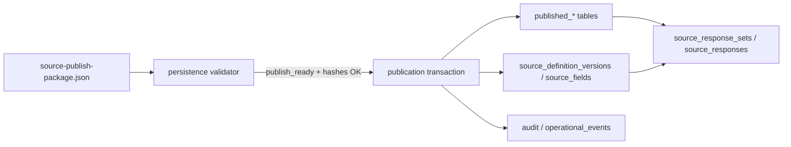

# Phase 4C.9 — Source Publish Persistence (plan)

**Status:** Planning artifact only. **No DDL, UI, RPCs, or database writes in this phase.**

**Parents:** [`PHASE4C8-SOURCE-PUBLISH-PACKAGE.md`](./PHASE4C8-SOURCE-PUBLISH-PACKAGE.md) · [`PHASE4B-ESOURCE-RUNTIME-SCHEMA.md`](./PHASE4B-ESOURCE-RUNTIME-SCHEMA.md) · [`PHASE4A-VERSIONED-PROTOCOL-BUILDER-SCHEMA.md`](./PHASE4A-VERSIONED-PROTOCOL-BUILDER-SCHEMA.md)

**Core principle:** Only publish packages with `publish_ready: true` may be persisted. Persistence must preserve hashes, approval evidence, provenance, and the full generated structure (versions, sections, fields, rules, runtime expectations, external requirements, validation snapshot).

**Baseline (GREEN — do not alter):** Phase **3C** RPCs. Phase **4B** migrations **`0020`–`0025`**. Phase **4A** applied schema remains the runtime FK target for capture.

**Golden handoff today:** `tmp/publish/source-publish-package.golden-basic.json` (+ referenced compiler output, preview, approval files).

---

## A. Architecture summary

End-to-end flow from CPST design through regulated capture:

```text
CPST workbook/import → CRG → compiler output → preview → human approval
  → publish package (4C.8) → [4C.9] persistence validator → publication transaction
  → published_* tables + Phase 4A published rows → Phase 4B runtime execution
```



| Layer | Role |
|-------|------|
| **Publish package (4C.8)** | Immutable file handoff: metadata, hashes, counts, `publish_checks`, artifact paths |
| **Persistence validator (4C.9)** | Re-verify eligibility + load full `source-definitions.json` payload; dry-run before DB |
| **Publication transaction** | Single atomic INSERT of package header, published rows, approval evidence, Phase 4A bind rows |
| **Published registry (`published_*`)** | Immutable publish snapshot keyed by `package_id` + compiler deterministic IDs |
| **Phase 4A canonical** | `source_definition_versions` / `source_fields` in **`published`** lifecycle for runtime FKs |
| **Phase 4B runtime** | Capture binds **only** to published `source_definition_version_id` (UUID) at execution time |

**Rule:** Runtime capture must reference **published** source definitions only — never draft compiler output or unpublished packages.

---

## B. Persistence eligibility

Persistence may proceed only when **all** conditions hold (re-checked at persist time; package file alone is insufficient):

| Check | Source |
|-------|--------|
| `publish_ready === true` | Publish package |
| `approval_decision === approved` | Package + approval evidence row |
| `validation_snapshot.errors` empty | Package snapshot + live source-definitions reload |
| `source_definitions_hash` matches | Recomputed file hash == package + approval |
| `preview_hash` matches | Recomputed file hash == package + approval |
| `graph_id` / `input_hash` consistent | Package == reloaded source-definitions == approval |
| `package_id` deterministic | Matches builder formula; used as idempotency key |
| Package not previously persisted | Unless idempotent retry (same hashes, same `package_id`) |
| Tenant context resolved | `organization_id`, `study_id`, `study_version_id` from authenticated session + study setup |
| Actor authorized | Role allowed to publish (not monitor/read-only) |
| Warnings only | Allowed if approval `publish_eligible` was true with acknowledged warnings |

**Blocked:**

- `publish_ready: false`
- Hash mismatch between package, approval, or on-disk artifacts
- Validation errors in reloaded compiler output
- Missing approval evidence
- Partial prior persist (transaction must not leave orphan rows)

---

## C. Proposed DB objects

Planning names only — **no SQL in this artifact**. All tenant tables include `organization_id`. Prefer `organization_id` (not `tenant_id`) per project convention.

### Relationship to Phase 4A

| Concept | Phase 4A (existing) | Phase 4C.9 (`published_*`) |
|---------|---------------------|----------------------------|
| Purpose | Canonical instrument + runtime FK | Immutable publish snapshot + package audit trail |
| IDs | UUID `id` (DB) | UUID `id` + compiler string IDs (`source_definition_version_id`, etc.) |
| Lifecycle | `draft` → `in_review` → **`published`** | Insert-only at publish; no updates to generated content |
| Runtime FK | `source_response_sets.source_definition_version_id` → **4A UUID** | `published_*` links via `canonical_source_definition_version_id` (FK to 4A) |

On successful persist: create **both** `published_*` row and matching Phase 4A `source_definition_versions` / `source_fields` row(s) in **`published`** status, linked by FK.

---

### 1. `source_publish_packages`

Package-level metadata and persist state.

| Column | Notes |
|--------|--------|
| `id` | UUID PK |
| `organization_id` | RLS partition |
| `study_id` | FK `studies` |
| `study_version_id` | FK `study_versions` (protocol window) |
| `package_id` | Unique; deterministic from 4C.8 (`pkg_*`) |
| `graph_id` | e.g. `CRG-94F1` |
| `input_hash` | CPST/compiler input |
| `compiler_output_id` | |
| `approval_id` | `spa_*` |
| `publish_ready` | Snapshot at persist time |
| `source_definitions_hash` | |
| `preview_hash` | |
| `approval_hash` | |
| `package_hash` | SHA-256 of canonical package JSON (or manifest of three artifacts) |
| `validation_status` | `valid` \| `warning` \| `invalid` |
| `persist_status` | `pending` \| `persisted` \| `failed` |
| `persisted_by_user_id` | Auth user |
| `persisted_at` | TIMESTAMPTZ |
| `created_at` | TIMESTAMPTZ |

**Unique:** `(organization_id, package_id)`

---

### 2. `published_source_definition_versions`

One row per compiler `source_definition_version` (visit instrument).

| Column | Notes |
|--------|--------|
| `id` | UUID PK |
| `organization_id` | |
| `study_id` | |
| `study_version_id` | |
| `package_id` | FK logical → `source_publish_packages.package_id` |
| `source_publish_package_id` | UUID FK |
| `source_definition_version_id` | Compiler deterministic ID (`sdv_*`) |
| `canonical_source_definition_version_id` | UUID FK → Phase 4A `source_definition_versions.id` |
| `visit_node_id` | CRG node id |
| `visit_code` | |
| `visit_name` | |
| `source_status` | `draft_generated` at compile; stored as published snapshot |
| `compiler_version` | |
| `input_hash` | |
| `provenance_json` | JSONB |
| `created_at` | |

**Unique:** `(organization_id, study_id, source_definition_version_id)` — idempotency for same compiler version id per study.

---

### 3. `published_source_sections`

| Column | Notes |
|--------|--------|
| `id` | UUID PK |
| `organization_id` | |
| `published_source_definition_version_id` | UUID FK |
| `source_section_id` | Compiler `sec_*` |
| `procedure_node_id` | |
| `procedure_id` | Dictionary id e.g. `P-003` |
| `section_name` | |
| `section_order` | |
| `source_type` | |
| `required_status` | |
| `detailed_capture_required` | |
| `external_reference_required` | |
| `owner_role` | |
| `signature_required` | |
| `provenance_json` | JSONB |
| `created_at` | |

**Unique:** `(organization_id, source_section_id)` within package scope (or globally per study if section ids are globally unique in compiler).

---

### 4. `published_source_fields`

| Column | Notes |
|--------|--------|
| `id` | UUID PK |
| `organization_id` | |
| `published_source_section_id` | UUID FK |
| `source_field_id` | Compiler `fld_*` |
| `canonical_source_field_id` | UUID FK → Phase 4A `source_fields.id` |
| `field_name` | |
| `display_label` | |
| `data_type` | |
| `required` | |
| `validation_rule` | Reference id or inline key |
| `conditional_visibility` | |
| `allowed_list_name` | |
| `export_name` | |
| `source_origin_mode` | |
| `provenance_json` | JSONB |
| `created_at` | |

**Unique:** `(organization_id, source_field_id)` per package/study policy.

---

### 5. `published_source_validation_rules`

| Column | Notes |
|--------|--------|
| `id` | UUID PK |
| `organization_id` | |
| `source_publish_package_id` | UUID FK |
| `validation_rule_id` | Compiler `vr_*` |
| `scope` | `field` \| `section` \| `visit` \| `study` |
| `scope_id` | Compiler id |
| `rule_type` | `required` \| `expression` \| … |
| `rule_payload_json` | JSONB (expression, min/max, etc.) |
| `provenance_json` | JSONB |
| `created_at` | |

---

### 6. `published_source_conditional_rules`

| Column | Notes |
|--------|--------|
| `id` | UUID PK |
| `organization_id` | |
| `source_publish_package_id` | UUID FK |
| `conditional_rule_id` | `cr_*` |
| `rule_id` | Dictionary `R-*` |
| `trigger_type` | |
| `trigger_field` | |
| `operator` | |
| `trigger_value` | |
| `then_action` | |
| `applies_to` | |
| `applies_to_id` | |
| `hard_stop` | |
| `requires_review` | |
| `provenance_json` | JSONB |
| `created_at` | |

---

### 7. `published_source_workflow_requirements`

| Column | Notes |
|--------|--------|
| `id` | UUID PK |
| `organization_id` | |
| `source_publish_package_id` | UUID FK |
| `workflow_requirement_id` | `wf_*` |
| `workflow_type` | |
| `trigger` | Expression or hook name |
| `action` | |
| `required_role` | Nullable |
| `provenance_json` | JSONB |
| `created_at` | |

---

### 8. `published_source_signature_requirements`

| Column | Notes |
|--------|--------|
| `id` | UUID PK |
| `organization_id` | |
| `source_publish_package_id` | UUID FK |
| `signature_requirement_id` | `sig_*` |
| `published_source_definition_version_id` | Nullable FK |
| `published_source_section_id` | Nullable FK |
| `required_role` | |
| `signature_order` | INT |
| `signature_meaning_code` | From compiler |
| `provenance_json` | JSONB |
| `created_at` | |

---

### 9. `published_source_external_requirements`

| Column | Notes |
|--------|--------|
| `id` | UUID PK |
| `organization_id` | |
| `source_publish_package_id` | UUID FK |
| `external_source_requirement_id` | `ext_*` |
| `published_source_definition_version_id` | FK |
| `published_source_section_id` | FK |
| `external_source_name` | |
| `external_system_type` | |
| `ref_id_field` | |
| `status_field` | |
| `attachment_allowed` | |
| `audit_requirement` | |
| `capture_strategy` | e.g. `metadata_reference_only` |
| `provenance_json` | JSONB |
| `created_at` | |

---

### 10. `published_source_runtime_expectations`

| Column | Notes |
|--------|--------|
| `id` | UUID PK |
| `organization_id` | |
| `source_publish_package_id` | UUID FK |
| `runtime_expectation_id` | `rex_*` |
| `visit_node_id` | |
| `procedure_node_id` | |
| `visit_id` | Dictionary |
| `procedure_id` | Dictionary |
| `required_status` | |
| `procedure_order` | |
| `source_type` | |
| `conditionality` | JSONB |
| `provenance_json` | JSONB |
| `created_at` | |

---

### 11. `source_publish_approval_evidence`

Immutable copy of human approval at persist time.

| Column | Notes |
|--------|--------|
| `id` | UUID PK |
| `organization_id` | |
| `source_publish_package_id` | UUID FK |
| `approval_id` | `spa_*` |
| `reviewer_user_id` | |
| `reviewer_role` | |
| `decision` | |
| `reason` | |
| `comments` | |
| `reviewed_at` | |
| `source_definitions_hash` | |
| `preview_hash` | |
| `approval_hash` | |
| `validation_snapshot_json` | JSONB |
| `created_at` | |

---

## D. Transaction strategy

Single **SERIALIZABLE** (or equivalent) transaction per `package_id`:

1. **Begin** transaction.
2. **Validate** — reload artifacts; run persistence eligibility (Section B); resolve study/tenant; dry-run row counts vs package `counts`.
3. **Idempotency check** — if `source_publish_packages` row exists for `package_id` with same hashes → return success (no duplicate inserts).
4. **Insert** `source_publish_packages` (`persist_status = pending`).
5. **Insert** `source_publish_approval_evidence`.
6. **For each** `source_definition_version` in compiler payload:
   - Insert Phase 4A `source_definition_versions` (`lifecycle_status = published`) + `source_fields`.
   - Insert `published_source_definition_versions` (+ link `canonical_source_definition_version_id`).
   - Insert `published_source_sections` / `published_source_fields`.
7. **Insert** study-scoped rules: validation, conditional, workflow, signature, external, runtime expectations.
8. **Insert** `operational_events` / `audit_events` (package published, counts, actor).
9. **Update** `source_publish_packages` → `persist_status = persisted`, `persisted_at`, `persisted_by_user_id`.
10. **Commit**.

**On any failure:** full **ROLLBACK** — no partial package, no orphan published rows.

**Ordering:** Parent before child (package → SDV → sections → fields → rules). Defer FK to Phase 4B capture tables (no writes to `source_responses` in this transaction).

---

## E. Idempotency

| Key | Behavior |
|-----|----------|
| `package_id` | Unique per organization; same package + same hashes → success without duplicate children |
| `source_definition_version_id` | Unique per `(organization_id, study_id)`; retry must not create second published row |
| Hash mismatch on retry | **Fail** — indicates tampering or artifact drift |
| Partial persist | **Forbidden** — transaction boundary prevents |
| Concurrent double-publish | Second transaction hits unique constraint → map to idempotent success if hashes match |

**Idempotent retry allowed when:** same `package_id`, all three artifact hashes match stored record, `persist_status = persisted`.

**Idempotent retry blocked when:** any hash differs, or prior attempt `failed` with different payload.

---

## F. RLS strategy

| Rule | Implementation plan |
|------|---------------------|
| Tenant isolation | `organization_id` on every table; RLS `USING (organization_id = auth_org())` |
| Study membership | Join `study_members` / role claims for `study_id` |
| Persist permission | Roles: `protocol_builder_publish`, `principal_investigator`, `study_director` (exact names TBD in role matrix) |
| Deny persist | `monitor`, `read_only`, `auditor` (read package OK if granted, no INSERT) |
| No public access | `anon` denied all |
| Service role | No routine `service_role` bypass for publish; ops migrations only |
| User-facing persist | **SECURITY INVOKER** RPC `publish_source_package(...)` |
| Internal atomicity | **SECURITY DEFINER** helper only if needed for multi-table insert; must assert `organization_id` + role inside function body |

**Read paths:** study team reads published definitions for execution UI; cross-org denied.

---

## G. Linkage to Phase 4B

Published content feeds runtime capture **only** through Phase 4A canonical UUIDs:

| Phase 4B object | Bind |
|---------------|------|
| `procedure_executions` | `source_definition_version_id` → 4A UUID set at activation/capture |
| `source_response_sets` | Same `source_definition_version_id` + `procedure_execution_id` |
| `source_responses` | `source_field_id` → 4A `source_fields.id` (mapped from `published_source_fields.canonical_source_field_id`) |
| `source_response_validation_findings` | Rule linkage via published `validation_rule_id` / expression registry |
| `source_response_corrections` | Provenance references response + field; schema version from bound SDV |
| `source_response_addenda` | `introduced_by_source_definition_version_id` / `applied_to_source_definition_version_id` for amendments |

```text
source_publish_package
  → published_source_definition_versions
      → canonical_source_definition_version_id
          → source_response_sets.source_definition_version_id
          → source_responses.source_field_id
```

**Rule:** `source_response_sets` must not reference compiler-only string IDs or unpublished drafts. Validator rejects capture start if SDV lifecycle ≠ `published` or package `persist_status` ≠ `persisted`.

**Runtime expectations:** `published_source_runtime_expectations` drive scheduling/UI hints; execution completeness still validated via existing 4B helpers (`0025`).

---

## H. Immutability

| Rule | Detail |
|------|--------|
| Published content | No `UPDATE` on sections/fields/rules payload columns |
| Amendments | New CPST compile → new approval → **new** `package_id` → new published rows |
| Supersedes | Phase 4A `source_definition_versions.supersedes_version_id` links versions; old remains queryable |
| Retire/archive | Status transition table or `lifecycle_status` on 4A only — not mutation of `provenance_json` or field definitions |
| Package record | `persist_status` may move `pending` → `persisted` \| `failed`; hashes immutable after `persisted` |

---

## I. Audit / ALCOA+

| Principle | Persistence mapping |
|-----------|---------------------|
| **Attributable** | `reviewer_user_id`, `persisted_by_user_id`, `reviewer_role` |
| **Legible** | `preview_hash` + structured `published_*` + optional stored preview blob reference |
| **Contemporaneous** | `reviewed_at`, `persisted_at` (server TIMESTAMPTZ) |
| **Original** | `package_hash`, `source_definitions_hash`, `provenance_json` per row |
| **Accurate** | `validation_snapshot_json`, `publish_checks` echo, eligibility re-validation |
| **Complete** | Full compiler arrays persisted; `counts` match inserted rows |
| **Consistent** | Deterministic compiler IDs + input_hash/graph_id |
| **Enduring** | Append-only published tables; no destructive updates |
| **Available** | RLS-scoped SELECT; export RPC future phase |

Emit `operational_events` / `audit_events` on successful publish with `package_id`, hashes, study scope.

---

## J. Validation plan

Future automated tests (file dry-run + DB integration):

| # | Test |
|---|------|
| 1 | Cannot persist when `publish_ready = false` |
| 2 | Cannot persist when source/preview hash ≠ approval |
| 3 | Cannot persist when `validation_snapshot.errors` non-empty |
| 4 | Cannot persist without approval evidence row |
| 5 | Duplicate `package_id` + same hashes → idempotent success, row count unchanged |
| 6 | Simulated mid-transaction failure → zero published rows |
| 7 | Non-study member → RLS deny |
| 8 | Monitor role → deny persist |
| 9 | Org A cannot read Org B package |
| 10 | `source_response_set` cannot bind unpublished `source_definition_version_id` |
| 11 | `UPDATE` on `published_source_fields` blocked by policy/trigger |
| 12 | Amendment creates new `package_id` + new SDV rows; prior package unchanged |

**Dry-run validator (pre-DB):** `scripts/validate-source-publish-persist.mjs` — loads package + artifacts, runs Section B checks, outputs persist plan JSON (counts, FK map) without connecting to Supabase.

---

## K. Migration sequence plan

Planned filenames only (**0026+**; do not modify **0020–0025**):

| Migration | Scope |
|-----------|--------|
| `0026_source_publish_packages.sql` | `source_publish_packages` + RLS + unique `(organization_id, package_id)` |
| `0027_published_source_definitions.sql` | `published_source_definition_versions`, `published_source_sections`, `published_source_fields` + FKs to 4A |
| `0028_published_source_rules_requirements.sql` | validation, conditional, workflow, signature, external, runtime_expectations |
| `0029_source_publish_approval_evidence.sql` | `source_publish_approval_evidence` |
| `0030_source_publish_persistence_helpers.sql` | Idempotency helpers, persist status transitions, immutability triggers |
| `0031_phase4c_publish_validation_helpers.sql` | SQL helpers: assert published SDV, block capture on unpublished, hash guard functions |

Apply order: staging → verify RLS → production. No migration in this planning phase.

---

## L. Exact next step

After plan approval:

1. **Generate DDL migrations `0026`–`0031` only** (no UI, no capture RPC changes).
2. **QA RLS + idempotency** — integration tests per Section J.
3. **Apply staging** — verify against golden package paths.
4. **Create file-based persistence dry-run validator** (`validate-source-publish-persist.mjs`) — must pass before any DB write path is enabled.
5. **Then** implement controlled **`publish_source_package`** RPC (SECURITY INVOKER, strict role checks, single transaction).

Until step 5 is complete, production publish remains **file package only**; Phase 4B continues to use manually seeded or existing Phase 4A published rows.

---

## Deliverable summary (Phase 4C.9 planning)

### A. File created

`vilo-os/docs/PHASE4C9-SOURCE-PUBLISH-PERSISTENCE-PLAN.md` (this document)

### B. DB object summary

11 planned table groups: 1 package header, 1 approval evidence, 8 published structure/rule tables, linking to existing Phase 4A `source_definition_versions` / `source_fields` for runtime FKs.

### C. Transaction strategy

Single atomic transaction: validate → idempotency → package header → approval evidence → 4A published rows → published_* mirror → audit events → mark persisted; rollback on any failure.

### D. RLS strategy

`organization_id` everywhere; study membership; publish-capable roles only; no public/service_role routine writes; INVOKER RPC preferred.

### E. Phase 4B linkage

Capture references **canonical 4A UUIDs** mapped from published registry; validation findings and addenda/corrections carry version provenance; unpublished SDV blocked at capture.

### F. Validation plan

12 integration tests + file dry-run validator before DB writes.

### G. Migration sequence

`0026` → `0031` as listed above; **0020–0025** untouched.

### H. Exact next step

DDL migrations → RLS QA → staging → dry-run validator → `publish_source_package` RPC.

---

*Regulatory-informed engineering posture only.*
