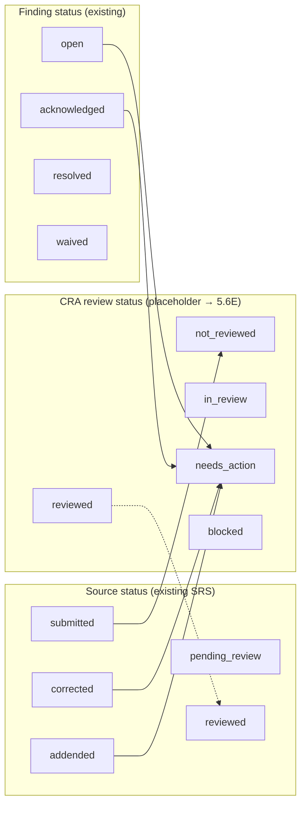

# Phase 5.6B — Inspection Readiness Review Workflow Shell (Planning)

> **Terminology (site-first):** Former framing “CRA Review Workflow” → **Inspection Readiness Review**. External monitor/CRA access is **controlled external review** — site-gated, derived from submitted source, operationally justified. Not a CRA-first surveillance surface.

**Status:** Planning / architecture only  
**Parents:** Phase 5.6A post-submit writes regression · Phase 5.2B canonical read layer · Phase 5.5A/B findings actions  
**Baseline (GREEN):** Capture flow · canonical read APIs · post-submit writes (correction, addendum, findings) · combined `db:validate-phase56a-post-submit-writes-e2e:live`

**This artifact does not implement code, migrations, UI, signatures, exports, or RPC/route changes.**

---

## 1. Scope

### In scope (minimal CRA review shell)

CRA (Clinical Research Associate / monitor) review of **post-capture** source data for a bound procedure execution, using **existing canonical read APIs** as the sole source of truth for display.

| Capability | Description |
|------------|-------------|
| **Submitted / corrected / addended sets** | Review sets in `submitted`, `corrected`, `addended`, and future `pending_review` / `reviewed` lanes (see §5). Manifest `is_submitted` and status label drive SDV-ready visual state. |
| **SDV-ready visual state** | Read-only presentation of bound source definition version (SDV), field values, completeness, and lineage badges — **not** field-level SDV verification workflow (placeholder only). |
| **Finding review** | List, filter, and lifecycle actions (acknowledge / resolve / waive) on existing findings APIs; active findings surface as “needs action.” |
| **Correction / addendum visibility** | Corrections and addenda cards, per-field history, and timeline events must remain visible to CRA; no hiding post-submit writes. |
| **Review notes placeholder** | UI slot for free-text CRA notes **without** persisting to source tables in 5.6B–5.6E (local/session or future `cra_review_notes` table — see §8). |
| **Verification state placeholder** | Non-interactive badges for SDV verification and field attestation (`placeholders.sdv`, `placeholders.verification` from read RPC) — display `not_implemented` honestly. |

### Product mapping

| Product term | Implementation today |
|--------------|----------------------|
| CRC | `study_members.role = coordinator` (capture shell) |
| CRA | `study_members.role = monitor` (resolve/waive + intended review actor) |
| PI / signatory | Out of scope (§2) |

### Existing assets to reuse (no rewrite)

| Asset | Path / contract |
|-------|-----------------|
| Response set review page | `app/(ops)/source/response-set/[id]/page.tsx` |
| Read bundle loader | `lib/source/read-contract/load-bundle.ts` |
| Panels | `ManifestSummaryPanel`, `ResponseSetDetail`, `HistoryTimeline`, `FindingsPanel`, `FindingRowActions` |
| GET APIs | `GET /api/source/response-set/[id]`, `/manifest`, `/history`, `/findings` |
| Finding writes | `POST /api/source/findings/{create,acknowledge,resolve,waive}` |
| CRC writes (visible, not CRA-primary) | correction / addendum panels + POST routes |

Entry today: visit page or capture shell → `/source/response-set/{id}?organization_id=…`. Phase 5.6C adds a **CRA worklist** so monitors do not rely on visit drill-down alone.

---

## 2. Non-goals

Explicitly **excluded** from 5.6B through 5.6F and called out in release messaging:

| Non-goal | Rationale |
|----------|-----------|
| e-signatures | `signed_by_*` columns exist; no sign RPC/UI |
| Final PI signature | Distinct from CRA “reviewed” lane |
| EDC export | Phase 6 / export architecture |
| Automated deviation adjudication | No rules engine on findings |
| AI review / protocol intelligence | Out of regulatory-core minimal path |
| Phase 6 longitudinal intelligence | Cross-visit analytics deferred |
| Part 11 “compliant” claims | Placeholders only; no audit-trail signing |
| New backend unless gap proven | Prefer read composition + thin review-status write (§4, §8) |

Aligned with `docs/PHASE5.6A-POST-SUBMIT-WRITES-REGRESSION.md` non-goals.

---

## 3. Required UI surfaces

### 3.1 CRA review landing / list (new — 5.6C)

**Route (proposed):** `/source/review` or `/studies/[studyId]/source-review`

| Column / filter | Source (initial) |
|-----------------|------------------|
| Response set id (link) | List query or study-scoped SQL view |
| Subject / visit / procedure | Join via PE → visit → subject |
| Source status | `response_set.status` |
| CRA review status (placeholder) | §5 — until 5.6E, derive UI-only from findings + `reviewed_at` |
| Active findings count | Manifest or findings summary |
| Last activity | `history` max `occurred_at` or manifest timestamps |
| Submitted / corrected / addended badge | `status` + manifest |

**Default filters:** post-submit lane (`submitted`, `corrected`, `addended`, later `pending_review`); optional `active_only` findings.

**Gap:** No list RPC today — 5.6C may use a **read-only** server query or minimal `list_source_response_sets_for_review` RPC (planned in 5.6D, not 5.6B).

### 3.2 Response set review view (reuse + CRA mode)

**Existing:** `/source/response-set/[id]` — keep as canonical detail shell.

**CRA mode adjustments (5.6C–5.6E):**

| Region | CRA behavior |
|--------|----------------|
| Manifest | Emphasize status, completeness, correction/addendum/finding counts, `reviewed_at` when present |
| Detail | Read-only field grid; highlight corrected/addendum badges |
| History | Full chronology; finding / correction / addendum events |
| Findings | Worklist within set; filters (`active_only`, `status`, `severity`) |
| Correction / addendum panels | **Hidden or read-only** for `monitor` role (CRC-only writes) |
| Finding actions | Shown per eligibility; create finding optional later |
| Review notes | Collapsible placeholder (“Notes not saved — Phase 5.6E+”) |
| SDV / verification | Placeholder strip from `placeholders` in detail payload |

### 3.3 Findings worklist

Within review page (existing `FindingsPanel` + `FindingsFilterBar`):

- **Needs action:** `active_only=true` or status ∈ {`open`, `acknowledged`}
- **Reviewed (finding-level):** `resolved` | `waived`
- Row actions: existing `FindingRowActions` (no optimistic updates; refresh after POST)

Optional cross-set worklist on landing: “Sets with active findings” via manifest/findings aggregate (5.6C read-only).

### 3.4 Reviewed / needs action / blocked states (UI vocabulary)

Map **UI buckets** to data (until dedicated CRA review status exists):

| UI bucket | Derivation (5.6C read-only) | After 5.6E |
|-----------|----------------------------|------------|
| **Needs action** | Any active finding OR CRA status `needs_action` OR source status `corrected`/`addended` since last review | Persisted CRA status |
| **In review** | Session flag or CRA status `in_review` | Persisted |
| **Reviewed** | `reviewed_at` set OR CRA status `reviewed` | Persisted + attribution |
| **Blocked** | Source `locked` OR visit/procedure blocked OR CRA status `blocked` | Persisted + reason |
| **Not reviewed** | Post-submit, no `reviewed_at`, no active session | Default queue |

**Blocked** must not imply signature or export hold — copy: “Review blocked (data frozen or policy)” not “Signed.”

### 3.5 SDV status placeholders

Display read contract placeholders (no fake “verified”):

```json
"placeholders": {
  "sdv": { "status": "not_implemented", "message": "SDV lane reserved for Phase 4E+" },
  "verification": { "status": "not_implemented", "message": "Field verification reserved for future release" },
  "reviews": null,
  "signatures": null
}
```

UI: muted banner + tooltip — **SDV-ready** means “submitted source available for monitor review,” not “SDV complete.”

---

## 4. Required backend contracts

### 4.1 Use existing GET (no changes in 5.6B)

| Method | Route | RPC | CRA use |
|--------|-------|-----|---------|
| GET | `/api/source/response-set/[id]` | `get_source_response_set` | Fields, corrections, addenda, placeholders, lineage |
| GET | `.../[id]/manifest` | `get_source_response_set_manifest` | Status, counts, `is_submitted`, timestamps |
| GET | `.../[id]/history` | `get_source_response_set_history` | Audit chronology |
| GET | `.../[id]/findings` | `list_source_response_set_findings` | Finding worklist + lifecycle_events |

**Query params (findings):** `organization_id` (required), `active_only`, `status`, `severity`.

**Server loader:** `loadResponseSetReviewBundle()` — parallel fetch + normalize; CRA pages must not reconstruct lineage client-side.

### 4.2 Use existing write APIs (findings only for CRA-primary)

| Method | Route | CRA |
|--------|-------|-----|
| POST | `/api/source/findings/acknowledge` | Yes (any study access) |
| POST | `/api/source/findings/resolve` | Yes (`monitor` or correction-eligible) |
| POST | `/api/source/findings/waive` | Yes (same) |
| POST | `/api/source/findings/create` | Optional later (manual DQ) |
| POST | `/api/source/response/correct` | CRC — visible, not CRA-primary |
| POST | `/api/source/response-set/addendum` | CRC — visible, not CRA-primary |

### 4.3 Correction / addendum visibility (read-only contract)

Already returned on detail + manifest + history:

- `corrections[]`, `addenda[]`, field `history[]`, badges `Corrected` / `Addendum`
- Manifest counts: `corrections`, `addenda`, findings totals
- History event kinds for correction, addendum, finding lifecycle

**CRA rule:** Never filter out corrections/addenda in normalize layer for monitor role.

### 4.4 Identified gaps (new backend only if needed)

| Gap | Severity | Proposed phase |
|-----|----------|----------------|
| No **review queue** list endpoint | High | 5.6D list RPC or study-scoped query plan |
| No **mark reviewed** RPC | High | 5.6D/E `review_source_response_set` |
| Submit sets `submitted`, not `pending_review` | Medium | 5.6E align submit → `pending_review` (product decision) |
| `reviewed_by_*` in RPC but not in UI metadata | Low | 5.6C normalize surfacing |
| No `GET .../integrity` | Low | Defer; manifest + history sufficient for shell |
| API auth = org member only; study role not returned to UI | Medium | 5.6C server-side role resolution for gating |
| `placeholders.reviews` always null | Expected | 5.6E populate from CRA review table |

**5.6B does not authorize new routes** — gaps are recorded for 5.6D/E only.

---

## 5. Proposed review states

### 5.1 CRA workflow states (planning placeholders)

These are **CRA review workflow** states, distinct from `source_response_sets.status`:

| State | Meaning |
|-------|---------|
| `not_reviewed` | Post-submit; CRA has not opened or completed review |
| `in_review` | CRA actively reviewing (session or lock-lite) |
| `needs_action` | Active findings, new correction/addendum since last review, or policy flag |
| `reviewed` | CRA completed review for current source revision |
| `blocked` | Cannot proceed (locked source, missing access, hold) |

> **Placeholder:** Not backed by a dedicated table or RPC in production today. UI in 5.6C may **derive** buckets from `reviewed_at`, findings counts, and source status until 5.6E.

### 5.2 Source response set statuses (existing — `0020`)

`draft` | `in_progress` | `submitted` | `pending_review` | `reviewed` | `signed` | `locked` | `corrected` | `addended` | `archived`

| Status | Today | CRA relevance |
|--------|-------|---------------|
| `submitted` | Set by submit RPC | Primary review queue |
| `corrected` | After correction RPC | Re-review required |
| `addended` | After addendum RPC | Re-review required |
| `pending_review` | Schema only; submit does not set | Target for submit alignment (5.6E) |
| `reviewed` | Requires `reviewed_by_*` (CHECK) | Do not conflate with CRA placeholder until RPC sets it |
| `signed` / `locked` | Out of scope | Show as blocked/read-only |

### 5.3 Finding statuses (existing — append-only lifecycle)

`open` → `acknowledged` → `resolved` | `waived`

Finding status drives **finding-level** needs action, not source-level `reviewed`.

### 5.4 Relationship diagram



**Rule:** CRA `reviewed` must not auto-set `source_response_sets.status = reviewed` until an explicit, attributed RPC exists (5.6E).

---

## 6. Role / permission assumptions

### 6.1 Study roles (`study_members`)

| Role | Capture | Correct / addendum | Findings ack | Findings resolve/waive | CRA review shell |
|------|---------|-------------------|--------------|----------------------|------------------|
| `coordinator` (CRC) | Yes | Yes | Yes | Yes (correction path) | Can open review; not primary persona |
| `monitor` (CRA) | No (default) | No (hide write panels) | Yes | Yes | Primary persona |
| `study_admin` | Yes | Yes | Yes | Yes | Admin review |
| `viewer` | No | No | Read-only | No | Read-only review |
| Org `admin` / `owner` | Bypass via org admin checks in RPCs | Yes | Yes | Yes | Yes |

### 6.2 Enforcement layers

1. **RLS + RPC** — authority for mutations (existing).
2. **API** — `requireOrganizationMember` + `organization_id` on all routes (existing).
3. **UI (new)** — server-resolved `studyRole` on review pages to hide CRC write panels from `monitor` (5.6C); never rely on UI alone for security.

### 6.3 Tenant isolation

- Every read/write includes `organization_id`; server resolves org on protected pages.
- Cross-tenant probes remain forbidden (403) — same as 5.3B–5.5B E2E patterns.
- CRA worklist must scope by `organization_id` and study membership.

### 6.4 PI / signature

- `signed_by_*`, `locked_by_*` — display-only if present; no sign actions in CRA shell.
- Marketing/copy: **“Reviewed” ≠ “Signed”**.

---

## 7. Data integrity rules

| Rule | Enforcement |
|------|-------------|
| CRA review must not mutate source values | No CRA RPC edits `source_responses` payload; findings/corrections/addenda use existing dedicated RPCs |
| CRA review must not rewrite history | History is append-only via `operational_events`; review status updates emit new events only (5.6E) |
| Review status separate from source data | Prefer `cra_review_assignments` or dedicated columns — not overwriting `source_responses` |
| Findings lifecycle append-only | Terminal states `resolved`/`waived`; `FINDING_TERMINAL` on invalid transition |
| Corrections / addenda remain visible | Read normalize must always surface lineage; CRA cannot “accept” by hiding prior values |
| Re-review after correction/addendum | New correction/addendum resets CRA bucket to `needs_action` / clears `reviewed_at` only via explicit policy (5.6E decision) |
| No client-side lineage reconstruction | `loadResponseSetReviewBundle` + canonical GET only |
| No optimistic lifecycle | Match 5.5A pattern: POST → `revalidatePath` / `router.refresh()` |

---

## 8. Implementation sequence proposal

| Phase | Deliverable | Backend | UI |
|-------|-------------|---------|-----|
| **5.6B** | This plan | — | — |
| **5.6C** | Read-only CRA worklist + review page CRA mode | Optional thin list query; no mutations | Landing list, role-gated hide correction/addendum, surface `reviewed_at`, placeholders |
| **5.6D** | Review status **data model + RPC plan** | `list_*_for_review`, `start_review`, `complete_review`, `block_review` spec; event kinds | — |
| **5.6E** | Minimal review status implementation | Migrations + RPCs + `POST /api/source/response-set/review` (thin) | Persist notes placeholder table optional; set `reviewed_by_*` with attribution |
| **5.6F** | Review E2E harness | HTTP + read assertions | No Playwright unless necessary |
| **Later** | Signatures, field SDV verification, integrity GET, exports | Phase 4E+ / Phase 6 | Separate modules |

### 5.6C acceptance (preview)

- Monitor can open worklist and drill into existing review page.
- CRC write panels hidden for `monitor`.
- Findings actions still work for monitor.
- Manifest/detail show correction/addendum counts and badges.
- SDV/verification placeholders visible with `not_implemented` messaging.

### 5.6D/E design questions (for next doc)

1. Submit → `pending_review` vs stay `submitted` with CRA queue filter?
2. Does `complete_review` set `source_response_sets.status = reviewed` or only CRA sidecar?
3. Re-review: clear `reviewed_at` on correction/addendum automatically?
4. Notes: `cra_review_notes` table vs operational_event payload?

---

## 9. Risks

| Risk | Impact | Mitigation |
|------|--------|------------|
| Mixing CRA review status with source status | Wrong queue, accidental lock | Separate enums; explicit RPC; UI labels |
| Hiding corrections/addenda from CRA | Audit failure | Read-only visibility; never filter normalize |
| Duplicating SDV logic in frontend | Drift from RPC | Use manifest/detail/history only; placeholders honest |
| Treating “reviewed” as signed | Regulatory misstatement | Copy + no sign RPC; distinct columns |
| Premature Part 11 claims | Compliance risk | Placeholders; disclaimers in UI |
| Submit vs `pending_review` mismatch | Empty CRA queue | 5.6C filter `submitted`+`; 5.6E align submit |
| Role gating UI-only | CRC actions exposed to monitor | Server resolve `study_members.role` on page |
| `reviewed_at` without RPC | Stale attribution | No manual DB updates; 5.6E only |
| Worklist N+1 reads | Perf | List endpoint returns summary counts |
| Finding resolve param bugs (5.5B lesson) | 422 RPC_ERROR | E2E in 5.6F; API param audit checklist |

---

## Appendix A — File created

| File | Purpose |
|------|---------|
| `docs/PHASE5.6B-CRA-REVIEW-WORKFLOW-PLAN.md` | This document |

---

## Appendix B — Sections included

1. Scope  
2. Non-goals  
3. Required UI surfaces  
4. Required backend contracts  
5. Proposed review states  
6. Role / permission assumptions  
7. Data integrity rules  
8. Implementation sequence (5.6C–5.6F + later)  
9. Risks  
Appendices A–E (delivery checklist)

---

## Appendix C — Gaps found

| # | Gap | Blocks CRA shell? |
|---|-----|-------------------|
| G1 | No study/org review worklist API | Yes — 5.6C needs list plan |
| G2 | No mark-reviewed / complete-review RPC | Yes — 5.6E |
| G3 | `pending_review` not set on submit | Partial — queue can use `submitted` |
| G4 | `reviewed_by_*` not shown in UI metadata | No — 5.6C normalize |
| G5 | Study role not passed to review page | Partial — 5.6C server helper |
| G6 | `placeholders.sdv` / `verification` not implemented | No — show placeholder |
| G7 | No create-finding UI on review page | No — optional |
| G8 | No `GET /integrity` | No — defer |
| G9 | API layer org-only auth vs study role | Medium — pair UI + RPC |

---

## Appendix D — Recommended next implementation step

**Phase 5.6C — Read-only CRA worklist shell**

1. Add `/source/review` (or study-scoped variant) with post-submit filter and links to existing `/source/response-set/[id]`.
2. Server-resolve `monitor` vs `coordinator` and hide correction/addendum write panels for monitors.
3. Surface `reviewed_at` / `reviewed_by_user_id` in manifest metadata normalize.
4. Add derived UI buckets (§3.4) without new tables.
5. Document list-query approach for 5.6D (minimal SQL view vs new RPC).

Do **not** start 5.6D migrations until 5.6C UX is validated with monitors on staging.

---

## Appendix E — Architectural risks (summary)

- **Status conflation** (CRA reviewed vs SRS `reviewed` vs signed) — highest regulatory risk.  
- **Visibility** — corrections/addenda must remain on CRA path.  
- **SDV naming** — `source_definition_version` abbreviated SDV in code ≠ monitored SDV completion.  
- **Auth depth** — org membership insufficient for product gating; study role required on server.  
- **Queue drift** — submit lifecycle vs documented `pending_review` flow.

---

*End of Phase 5.6B planning document.*
