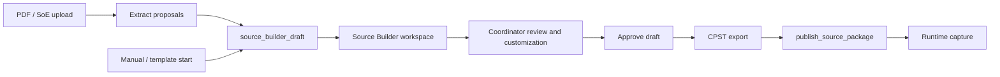
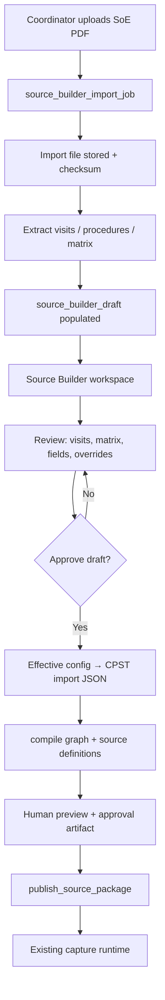
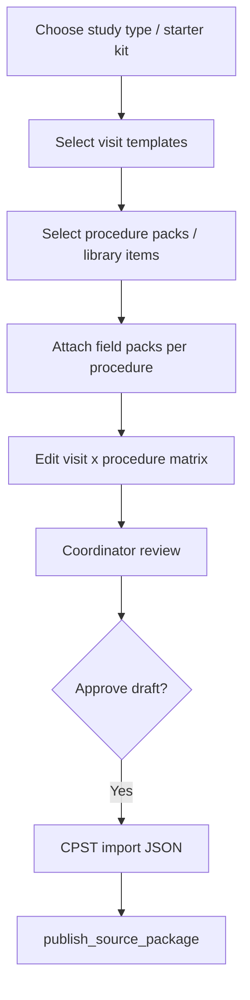

# Phase 6A — Coordinator Source Builder (Planning)

**Status:** Planning / architecture only  
**Product direction:** **Site-first.** Primary operator = **clinical research coordinator** (`study_members.role = coordinator`).  
**Explicitly deferred:** CRA/CRO/sponsor workflow expansion (`docs/PHASE5.6B-CRA-REVIEW-WORKFLOW-PLAN.md` remains planning-only).

**Baseline (GREEN — do not break):** Phase 4C CPST compile chain · `publish_source_package` · Phase 4A source definitions · Phase 4B/5 capture + read runtime.

**This artifact does not implement code, migrations, UI, PDF parsers, or auto-publish.**

> **Canonical workspace spec:** [`PHASE6A-SOURCE-BUILDER-WORKSPACE.md`](./PHASE6A-SOURCE-BUILDER-WORKSPACE.md) — mandatory single workspace for library, customization, visits, matrix, PDF review, and publish prep.

---

## 1. Product goal

| Goal | How the builder serves it |
|------|---------------------------|
| **Reduce coordinator workload** | Propose visit/procedure/matrix drafts instead of blank workbook entry |
| **Speed up study setup** | Reuse visit templates, procedure libraries, and field packs |
| **Minimize source creation errors** | Schema-validated CPST rows; validation before compile/publish |
| **Convert SoE/PDF or templates into operational drafts** | Map extraction → `source_builder_draft_*` → CPST import shape → existing publish pipeline |

**Human-in-the-loop is mandatory:** The system **proposes**; the coordinator **reviews, edits, and approves** before anything reaches `publish_source_package` or live capture.

**Success metric (operational):** Time from “new study version” to first published source definition for a representative visit matrix — measured with fixture **GENERIC_PHASE3_OA Schedule of Events** (6A.7), not with production PHI.

**Customization principle:** The global procedure profile library ([`PHASE6A.3-PROCEDURE-PROFILE-LIBRARY.md`](./PHASE6A.3-PROCEDURE-PROFILE-LIBRARY.md)) is the **starting point**, not a rigid cage. Coordinators adapt fields and procedures per study **without engineering**.

---

## 2. Source Document Builder workspace

> Full requirement checklist, planning tables, and PDF rules: **[`PHASE6A-SOURCE-BUILDER-WORKSPACE.md`](./PHASE6A-SOURCE-BUILDER-WORKSPACE.md)**

All coordinator authoring lives in one operational workspace — the **Source Document Builder / Source Authoring** section. This is the system of record **before publish**.

| In scope (single workspace) | Out of scope |
|-----------------------------|--------------|
| Procedure profile library browse/attach | CRA review |
| Field add/edit/disable per study | Sponsor portal |
| Visit builder (Visit 1, Visit 2, …) | SDV engine |
| Visit × procedure matrix | Auto-publish from PDF/AI |
| PDF/SoE import **review** (same UI as manual) | Enterprise protocol management |
| Draft save, version history, publish | Developer-oriented config |

### 2.1 Workspace capabilities

The coordinator can:

1. **Create visits manually** — Visit 1, Visit 2, Follow-up, EOS, Phone visit, Unscheduled visit, etc.
2. **Attach reusable procedures** — from the global profile library (`PROC_*`).
3. **Auto-generate minimal fields** — from selected procedure documentation profiles.
4. **Add / edit / remove fields** — sponsor notes, vendor timestamps, local workflow fields, custom comments (no engineering).
5. **Add / edit / remove procedures** — including fully custom procedures per study.
6. **Customize the visit × procedure matrix** — required/optional/conditional, timing notes, operational notes, window notes.
7. **Save reusable study templates** — clone for future studies at the same site or org.

### 2.2 PDF ingestion = accelerator only



**Critical rule:** PDF extraction **never** publishes directly to runtime templates.

```text
PDF → Extract → Source Builder Draft → Coordinator Review → Publish
```

Extracted content (visits, procedures, matrix, suggested fields) appears **inside the same workspace** as manual builds. The coordinator can:

- Accept or reject extraction rows  
- Rename visits; add/remove visits  
- Add missing procedures; remove spurious ones  
- Edit generated fields; add custom fields  
- Reorder procedures; edit timing/windows  
- Mark conditional procedures; add operational notes  

### 2.3 Proposed route (planning)

| Surface | Path (proposed) |
|---------|-----------------|
| Builder home | `/studies/[studyId]/source-builder` |
| Draft editor | `/studies/[studyId]/source-builder/drafts/[draftId]` |
| Library panel | In-draft sidebar: procedures, fields, templates |
| Import review | In-draft tab: `Import` when `source_builder_import_job` exists |

Parent doc: [`PHASE6A.3-PROCEDURE-PROFILE-LIBRARY.md`](./PHASE6A.3-PROCEDURE-PROFILE-LIBRARY.md) (library + customization tables).

---

## 3. Main flows

### Flow A — PDF Schedule of Events ingestion



| Step | Actor | Output |
|------|-------|--------|
| 1. Upload PDF | Coordinator | `source_builder_import_job` + stored file |
| 2. Extract | System (heuristics / table OCR — future) | Populates draft visits, procedures, matrix, field proposals; `source_builder_import_warnings` |
| 3. Open in Source Builder | Coordinator | **Same workspace** as manual flow — not a separate review app |
| 4. Review / customize | Coordinator | Visits, matrix, fields, procedure overrides, custom procedures |
| 5. Reject low-confidence rows | Coordinator | Warnings on import job; row-level reject |
| 6. Approve draft | Coordinator | `draft.status=approved`, approver attribution |
| 7. Export to CPST | System | Valid `*.import.json` matching workbook schemas |
| 8. Compile + preview | Existing scripts / server actions | CRG + `source-definitions.json` + preview MD |
| 9. Publish | Coordinator (authorized) | `publish_source_package` → Phase 4A + `published_*` |

**Never:** auto-publish from extraction. **Always:** preserve PDF blob reference + extraction provenance on draft rows.

### Flow B — Manual / template-assisted builder



| Step | Actor | Output |
|------|-------|--------|
| 1. Choose template | Coordinator | `source_builder_draft` from library (`template_id`, `study_template_id`) |
| 2. Select visits | Coordinator | `source_builder_draft_visit` rows (from visit template library) |
| 3. Select procedures | Coordinator | `source_builder_draft_procedure` + categories |
| 4. Field packs | Coordinator | Links to `Field_Definitions` / section codes (not a separate DB table today) |
| 5. Matrix editor | Coordinator | `source_builder_draft_matrix_row` — checkbox grid + notes |
| 6. Approve + publish | Coordinator | Same compile/publish path as Flow A steps 7–9 |

**When no PDF:** Flow B is the **default first implementation** (6A.2) — lower risk, reuses golden CPST fixtures.

---

## 4. Draft data model concepts (planning only)

No migrations in 6A. All builder state lives in **draft + override** tables; published output maps to existing runtime only.

### 4.1 Source Builder core (system of record before publish)

| Object | Purpose | Key fields (conceptual) |
|--------|---------|-------------------------|
| `source_builder_drafts` | Working study source package | `id`, `organization_id`, `study_id`, `study_version_id`, `study_template_id`, `origin` (`manual`/`pdf`/`cloned_template`), `import_job_id?`, `status`, `version`, `approved_by`, `approved_at`, `created_by`, `created_at` |
| `source_builder_draft_visits` | Visits in draft | `draft_id`, `visit_id`, `visit_label`, `visit_group`, `planned_day`, `window_start`, `window_end`, `delivery_mode`, `sort_order`, `notes`, `import_row_status?` |
| `source_builder_draft_procedures` | Procedures in draft (library or custom) | `draft_id`, `draft_procedure_id`, `base_profile_code?`, `custom_template_id?`, `display_name`, `category`, `documentation_style`, `clone_of?`, `sort_order`, `operational_notes` |
| `source_builder_draft_fields` | **Effective** fields per draft procedure | `draft_id`, `draft_procedure_id`, `field_id`, `base_field_key?`, `field_key`, `display_label`, `data_type`, `required`, `hidden`, `display_order`, `helper_text`, `conditional_rule_summary?`, `source_override_type` |
| `source_builder_draft_matrix_rows` | Visit × procedure matrix | `draft_id`, `visit_id`, `draft_procedure_id`, `matrix_marker`, `conditional_flag`, `condition_summary`, `timing_notes`, `window_notes`, `execution_order`, `row_status` |

**Draft statuses:** `editing` → `ready_for_review` → `approved` → `exported` → `published` | `archived`

### 4.2 PDF / import lane (feeds draft only)

| Object | Purpose | Key fields |
|--------|---------|------------|
| `source_builder_import_jobs` | Upload + extract session | `id`, `draft_id`, `file_storage_path`, `sha256`, `filename`, `status`, `created_by`, `extracted_at` |
| `source_builder_import_warnings` | Extraction issues | `job_id`, `severity`, `code`, `message`, `entity_type`, `entity_ref`, `page?` |

**Job statuses:** `uploaded` → `extracting` → `draft_populated` | `failed`  
On `draft_populated`, coordinator works **only** in Source Builder workspace.

### 4.3 Publish versioning

| Object | Purpose | Key fields |
|--------|---------|------------|
| `source_builder_publish_versions` | Audit of publish attempts | `id`, `draft_id`, `draft_version`, `publish_package_id?`, `published_by`, `published_at`, `cpst_export_hash`, `status` |

### 4.4 Coordinator customization (study-level overrides)

See §5 and [`PHASE6A.3`](./PHASE6A.3-PROCEDURE-PROFILE-LIBRARY.md) §J.

| Object | Purpose |
|--------|---------|
| `study_procedure_template_overrides` | Clone/rename procedure for study |
| `study_procedure_field_overrides` | Add/edit/disable fields |
| `custom_procedure_templates` | Net-new coordinator procedures |
| `custom_procedure_fields` | Fields on custom procedures |
| `source_builder_template_versions` | Who changed what, from which base (lineage) |

**Effective field resolution (export time):**

```text
global procedure_documentation_fields
  + study_procedure_field_overrides (add | edit | disable)
  + source_builder_draft_fields (draft-specific edits)
  = Field_Definitions rows for CPST export
```

### 4.5 Mapping to CPST (existing contract)

Approved draft exports rows compatible with:

| CPST schema | Draft source |
|-------------|--------------|
| `Visit_Templates` | `source_builder_draft_visit` |
| `Procedure_Library` | `source_builder_draft_procedure` |
| `Visit_Procedure_Matrix` | `source_builder_draft_matrix_row` |
| `Field_Definitions` | Field pack selection (manual flow) |
| `Study_Setup` | Study metadata + `study_template_id` |

Schemas: `schemas/core/Visit_Templates.schema.json`, `Procedure_Library.schema.json`, `Visit_Procedure_Matrix.schema.json`, `Field_Definitions.schema.json`.

---

## 5. Coordinator review requirements

All extraction and template fills land in an **editable review surface** before approve.

| Requirement | UI / data behavior |
|-------------|-------------------|
| Editable visit names | Inline edit on `draft_visit.visit_name` |
| Editable study days / windows | Text fields; validate against `Schedule_Windows` rules at export |
| Editable procedure names | Inline edit; dedupe warnings |
| Checkbox matrix visit × procedure | Grid bound to `draft_matrix_row.matrix_marker` |
| Notes column | Per-matrix-row `notes`; optional visit-level notes |
| Confidence flags | Show `confidence` (0–1 or high/medium/low) on extracted rows |
| Unresolved extraction warnings | Banner + row-level `warnings[]`; block approve if critical |
| Approve / reject rows | `row_status=rejected` excludes row from CPST export |
| Approve draft | Sets `approved_by` / `approved_at`; required before compile |
| Preview before publish | Existing `render-source-preview` output (MD) |

**Approve draft ≠ publish:** Approval locks the draft snapshot; publish is a separate explicit action calling `publish_source_package`.

All review actions occur in the **Source Builder workspace** (§2), whether the draft originated from PDF or manual entry.

---

## 6. Coordinator customization requirements

The procedure profile library is **not rigid**. Coordinators customize per study/protocol **without engineering**.

### 6.1 Capabilities (no-code)

| # | Capability | Examples |
|---|------------|----------|
| 1 | **Add new fields** | Sponsor-specific notes, vendor timestamps, local workflow fields, extra result fields, custom comments |
| 2 | **Edit existing fields** | Rename labels; required/optional; display order; helper text; visibility; conditional summary text |
| 3 | **Disable fields** | Hide base library fields without deleting global definition |
| 4 | **Add custom procedures** | Custom name, documentation style, field list, operational notes |
| 5 | **Clone / edit templates** | `PROC_VITAL_SIGNS` → “Pre-dose Vitals”, “Post-dose Vitals”, “Supine Vitals” |
| 6 | **Study-specific variations** | Overrides on labels, required rules, order, notes, visibility |
| 7 | **Preserve lineage** | Who modified, when, base template, version history |
| 8 | **Human-first UX** | Simple, operational, low-code — not developer JSON editing |

### 6.2 Architectural rule

```text
Global library (read-mostly seed)
  → Study/draft overrides (coordinator writable)
  → Effective draft (Source Builder workspace)
  → CPST export → publish → runtime capture
```

- **Do not** require engineering per study.  
- **Do not** hardcode procedure structures in application code.  
- **Do not** make global templates immutable.  
- **Do not** build enterprise protocol-management complexity.

### 6.3 Planning tables (customization)

#### `study_procedure_template_overrides`

| Column | Type | Notes |
|--------|------|-------|
| `override_id` | uuid | PK |
| `study_template_id` | text | CPST / builder study template key |
| `draft_id` | uuid nullable | Scoped to active draft |
| `base_procedure_template_id` | text | `procedure_profile_code` e.g. `PROC_VITAL_SIGNS` |
| `custom_name` | text | e.g. “Pre-dose Vitals” |
| `documentation_style` | text nullable | Override style if needed |
| `created_by` | uuid | |
| `created_at` | timestamptz | |
| `clone_lineage_id` | uuid nullable | Points to source override/version |

#### `study_procedure_field_overrides`

| Column | Type | Notes |
|--------|------|-------|
| `override_field_id` | uuid | PK |
| `study_template_id` | text | |
| `draft_id` | uuid nullable | |
| `draft_procedure_id` | uuid | FK logical |
| `base_field_id` | uuid nullable | Null = net-new field |
| `base_field_key` | text nullable | Library `field_key` |
| `custom_field_code` | text | Stable export key |
| `display_label` | text | |
| `data_type` | text | string, number, boolean, datetime, date |
| `required` | boolean | |
| `hidden` | boolean | Disable without delete |
| `display_order` | int | |
| `helper_text` | text nullable | |
| `conditional_rule` | text nullable | Human-readable; not auto-executed |
| `source_override_type` | text | `add` \| `edit` \| `disable` |

#### `custom_procedure_templates`

| Column | Type | Notes |
|--------|------|-------|
| `custom_template_id` | uuid | PK |
| `study_template_id` | text | |
| `draft_id` | uuid | |
| `custom_name` | text | |
| `category` | text | `CAT_*` |
| `documentation_style` | text | `STYLE_*` |
| `operational_notes` | text nullable | |
| `created_by` | uuid | |
| `created_at` | timestamptz | |

#### `custom_procedure_fields`

| Column | Type | Notes |
|--------|------|-------|
| `custom_field_id` | uuid | PK |
| `custom_template_id` | uuid | FK |
| `field_code` | text | |
| `display_label` | text | |
| `data_type` | text | |
| `required` | boolean | |
| `display_order` | int | |
| `helper_text` | text nullable | |

#### `source_builder_template_versions` (lineage / audit)

| Column | Type | Notes |
|--------|------|-------|
| `version_id` | uuid | PK |
| `draft_id` | uuid | |
| `entity_type` | text | `procedure` \| `field` \| `visit` \| `matrix_row` |
| `entity_id` | uuid | |
| `action` | text | `create` \| `update` \| `clone` \| `disable` \| `reject_import` |
| `base_template_ref` | text nullable | e.g. `PROC_VITAL_SIGNS` |
| `snapshot_json` | jsonb | Before/after or full row |
| `modified_by` | uuid | |
| `modified_at` | timestamptz | |

---

## 7. Template library requirements

Logical library (6A.2+); may start as **versioned JSON fixtures** before DB tables.

| Library type | Contents | Coordinator action |
|--------------|----------|-------------------|
| **Visit templates** | Screening, Day 1, Week 4, EOS, ET, phone visit, … | Insert into draft |
| **Procedure templates** | Vitals, labs, PK draw, consent, AE review, … | Insert into draft |
| **Field packs** | Grouped `Field_Definitions` by `section_code` + procedure | Attach to procedure |
| **Common study templates** | Osteoarthritis, biospecimen-only, basic interventional starter | Clone full draft |
| **Procedure categories** | Labs, imaging, assessments, admin, safety | Filter library |
| **Search** | By name, category, therapeutic area tag | Quick add |

**Seed fixtures (existing):**

- `fixtures/cpst/golden-basic/`
- `fixtures/cpst/golden-biospecimen/`
- `templates/cpst-workbook-v3.xlsx` + `templates/cpst-workbook-v3.manifest.json`

**v1 library storage:** Git-managed JSON under `fixtures/source-builder/` (proposed) — no new framework.

---

## 8. Integration with existing runtime

### 8.1 Design-time pipeline (reuse, do not fork)

```text
source_builder_draft (approved)
  → export CPST import JSON
  → import-cpst-workbook-v3.mjs (validate) OR direct JSON
  → compile-cpst-runtime-graph.mjs
  → compile-source-definitions.mjs
  → render-source-preview.mjs
  → approve-source-preview.mjs
  → build-source-publish-package.mjs
  → publish_source_package (RPC)
```

| Integration point | Path / name |
|-------------------|-------------|
| Workbook import validator | `scripts/import-cpst-workbook-v3.mjs` |
| Graph compiler | `scripts/compile-cpst-runtime-graph.mjs` |
| Source compiler | `scripts/compile-source-definitions.mjs` |
| Preview + approval | `scripts/render-source-preview.mjs`, `approve-source-preview.mjs` |
| Publish bundle | `scripts/build-source-publish-package.mjs` |
| Publish RPC | `publish_source_package` — `supabase/migrations/0033_publish_source_package_rpc.sql` |
| Coordinator publish permission | `phase4c_user_can_publish_source_package` — roles include `coordinator` |

### 8.2 Operational Postgres (optional sync — later)

| CPST / draft concept | Runtime table | Notes |
|---------------------|---------------|-------|
| Visit templates | `visit_definitions` | `0006_visit_and_procedure_definitions.sql` |
| Procedure library | `procedure_definitions` | same |
| SoE matrix | `visit_def_procedure_map` | same |
| Published instrument | `source_definition_versions`, `source_fields` | Phase 4A |
| Audit snapshots | `published_*` | Phase 4C |
| Capture | `open_source_response_set`, save/submit RPCs | Phase 4B/5 |

**Gap (documented, not 6A scope):** `publish_source_package` does **not** auto-sync `visit_definitions` or `procedure_source_bindings`. Builder UI should either:

- run a follow-on sync step (future RPC), or  
- document that coordinators maintain operational visit map separately until automated.

### 8.3 Capture runtime (read-only for builder)

After publish, coordinators use existing:

- `app/(ops)/source/capture/[procedureExecutionId]/page.tsx`
- `lib/source/capture/load-capture-shell.ts`
- Write APIs: open / save-draft / submit

Builder must **not** modify `source_response_*` tables.

### 8.4 `study_template_id` vs `studies.id`

CPST uses string template IDs (`ST-001`). Publish requires real UUIDs:

- `organization_id`, `study_id`, `study_version_id` on `publish_source_package`.

Builder UI must bind draft to a **selected study version** before publish.

---

## 9. Safety rules

| Rule | Rationale |
|------|-----------|
| **Never auto-publish PDF extraction** | Prevent unreviewed protocol drift |
| **Extraction confidence visible** | Coordinator judges low-confidence rows |
| **Coordinator approval required** | `approved_at` + `approved_by` on draft before export |
| **Preserve original PDF reference** | `soe_import_file` immutable after upload |
| **Preserve extraction provenance** | `x_vilo_provenance` / page+bbox on extracted and draft rows |
| **Audit who approved the template** | Draft approval + `source_publish_approval_evidence` at publish |
| **Allow correction before publish** | Draft stays `editing` until explicit approve |
| **Published SDV immutable** | New publish = new version; no in-place edit |
| **No PHI in extraction logs** | SoE PDFs may contain identifiers — storage + logging per `projects/vilo-os/10_DECISIONS/phi-boundaries.md` |
| **Validate before compile** | Reuse `import-cpst-workbook-v3` validation errors in UI |

---

## 10. Non-goals

| Non-goal | Notes |
|----------|-------|
| CRA / monitor review workflow | `PHASE5.6B` deferred |
| Sponsor portal | Site-first |
| SDV engine | Field verification out of scope |
| e-signatures | No sign RPC in builder |
| EDC / longitudinal exports | Phase 6+ export architecture |
| Longitudinal intelligence | Cross-study analytics |
| Automatic protocol adjudication | No medical inference |
| AI diagnosis / medical decision logic | Extraction may use AI to **propose cells**, not diagnose |
| Auto-publish extracted PDF | §7 |
| Modify regulatory runtime unless required | Prefer staging tables + existing publish RPC |

---

## 11. Implementation sequence

| Phase | Deliverable | Notes |
|-------|-------------|-------|
| **6A.1** | Coordinator source builder plan | This doc |
| **6A.2** | Procedure profile library | [`PHASE6A.3-PROCEDURE-PROFILE-LIBRARY.md`](./PHASE6A.3-PROCEDURE-PROFILE-LIBRARY.md) |
| **6A.3** | **Source Builder workspace (manual)** | Visits, attach profiles, auto-fields, field/procedure customization, matrix, export |
| **6A.4** | Customization + clone + versioning | Overrides tables; clone “Vitals” variants; `source_builder_template_versions` |
| **6A.5** | PDF import into **same workspace** | `source_builder_import_jobs`; populate draft; warnings — no separate review app |
| **6A.6** | Publish + `source_builder_publish_versions` | Approve → CPST → `publish_source_package` |
| **6A.7** | E2E fixture | Complex SoE PDF → draft → customize → publish → capture |
| **6B.1** | Pathology / medical history lookup library design | [`PHASE6B.1-PATHOLOGY-LIBRARY-DESIGN.md`](./PHASE6B.1-PATHOLOGY-LIBRARY-DESIGN.md) |

**Recommended order rationale:** Source Builder workspace + customization first; PDF import feeds the **same** draft editor; publish last. Pathology lookup library (6B.1) supports medical history capture without a billing ICD engine.

### 6A.7 E2E fixture note

**GENERIC_PHASE3_OA** is the target golden SoE PDF for regression (visit windows, conditional procedures, categories). It is **not** checked into the repo at planning time. For 6A.7:

1. Add redacted or synthetic copy under `fixtures/source-builder/generic-phase3-oa/` (license permitting).  
2. Harness: upload → draft approve → `npm run` compile chain → `publish_source_package` → `open_source_response_set` on one matrix cell.  
3. Report: `tmp/runtime-e2e/phase6a-source-builder-e2e-report.json` (planned).

---

## Appendix A — File created

| File | Purpose |
|------|---------|
| `docs/PHASE6A-COORDINATOR-SOURCE-BUILDER-PLAN.md` | This document |

---

## Appendix B — Sections included

1. Product goal  
2. Main flows (PDF SoE + manual builder)  
3. Draft data model concepts  
4. Coordinator review requirements  
5. Template library requirements  
6. Integration with existing runtime  
7. Safety rules  
8. Non-goals  
9. Implementation sequence (6A.1–6A.7)  
Appendices A–E

---

## Appendix C — Architecture risks

| Risk | Impact | Mitigation |
|------|--------|------------|
| PDF extraction quality | Wrong visit/procedure matrix | Confidence + human approve; never auto-publish |
| CPST vs Postgres dual maintenance | Visit map drift | Document sync gap; optional future sync RPC |
| `study_template_id` vs study UUID confusion | Publish failures | Bind draft to `study_version_id` in UI |
| Forking compile pipeline | Drift from golden scripts | Wrap existing npm scripts; same schemas |
| Field pack naming ambiguity | Inconsistent sections | Map to `section_code` in `Field_Definitions` |
| PHI in uploaded SoE PDFs | Compliance | Org-scoped storage, access RLS, no analytics on PDF text |
| Treating approve as publish | Unreviewed live source | Separate buttons + statuses |
| Over-scoping AI | Medical liability | Propose table cells only; no adjudication |
| GENERIC_PHASE3_OA not in repo | Blocked 6A.7 | Add fixture or synthetic SoE with same shape |
| Coordinator time saved ≠ zero validation | False confidence | Keep preview MD + publish approval evidence |

---

## Appendix D — Recommended next implementation step

**Phase 6A.2 — Manual template-assisted builder (no PDF)**

1. Route: `/studies/[studyId]/source-builder` with draft editor.  
2. Visits + matrix + attach from `procedure-profile-library.v1.json`.  
3. Auto-generate `source_builder_draft_fields`; enable add/edit/disable/clone overrides.  
4. Export effective config → CPST JSON → publish.  
5. Verify capture opens for one visit×procedure.

Do **not** start PDF import until customization + manual publish path is green.

---

## Appendix E — Existing files / modules to integrate with

### Schemas & CPST

| Path | Role |
|------|------|
| `schemas/core/Visit_Templates.schema.json` | Visit rows |
| `schemas/core/Procedure_Library.schema.json` | Procedure rows |
| `schemas/core/Visit_Procedure_Matrix.schema.json` | SoE matrix |
| `schemas/core/Field_Definitions.schema.json` | Field packs |
| `schemas/meta/CPST_Workbook.schema.json` | Import envelope |
| `schemas/meta/Canonical_Runtime_Graph.schema.json` | Compiler input |
| `schemas/meta/Compiler_Output.schema.json` | Source compiler output |

### Scripts (compile / publish)

| Path | Role |
|------|------|
| `scripts/import-cpst-workbook-v3.mjs` | Validate import JSON |
| `scripts/compile-cpst-runtime-graph.mjs` | CRG |
| `scripts/compile-source-definitions.mjs` | Source definitions |
| `scripts/render-source-preview.mjs` | Human preview |
| `scripts/approve-source-preview.mjs` | Approval artifact |
| `scripts/build-source-publish-package.mjs` | Publish handoff |
| `scripts/validate-phase4c-publish-schema.mjs` | Publish DDL checks |

### Database & RPC

| Path | Role |
|------|------|
| `supabase/migrations/0033_publish_source_package_rpc.sql` | `publish_source_package` |
| `supabase/migrations/0026_source_publish_packages.sql` | Publish header |
| `supabase/migrations/0027_published_source_definitions.sql` | Published snapshots |
| `supabase/migrations/0006_visit_and_procedure_definitions.sql` | Operational visit/procedure map |
| `supabase/migrations/0014`–`0017` | Phase 4A source definitions |

### Runtime capture (post-publish)

| Path | Role |
|------|------|
| `app/(ops)/source/capture/[procedureExecutionId]/page.tsx` | CRC capture |
| `lib/source/capture/load-capture-shell.ts` | Capture loader |
| `app/api/source/response-set/open/route.ts` | Open response set |
| `scripts/validate-phase4b-runtime-e2e.mjs` | Publish + capture E2E pattern |

### Docs & product context

| Path | Role |
|------|------|
| `docs/PHASE4C-PROTOCOL-TO-SOURCE-GENERATOR.md` | Master ingestion architecture |
| `docs/PHASE4C3`–`PHASE4C13` | Pipeline stages |
| `docs/PHASE5.6B-CRA-REVIEW-WORKFLOW-PLAN.md` | Explicitly out of scope |
| `projects/vilo-os/00_BRIEF/brief.md` | Site-first operators |
| `projects/vilo-os/10_DECISIONS/phi-boundaries.md` | PDF / PHI handling |

### Fixtures

| Path | Role |
|------|------|
| `fixtures/cpst/golden-basic/` | Reference import bundle |
| `fixtures/cpst/golden-biospecimen/` | Module example |
| `templates/cpst-workbook-v3.xlsx` | Excel round-trip optional |

---

*End of Phase 6A planning document.*
