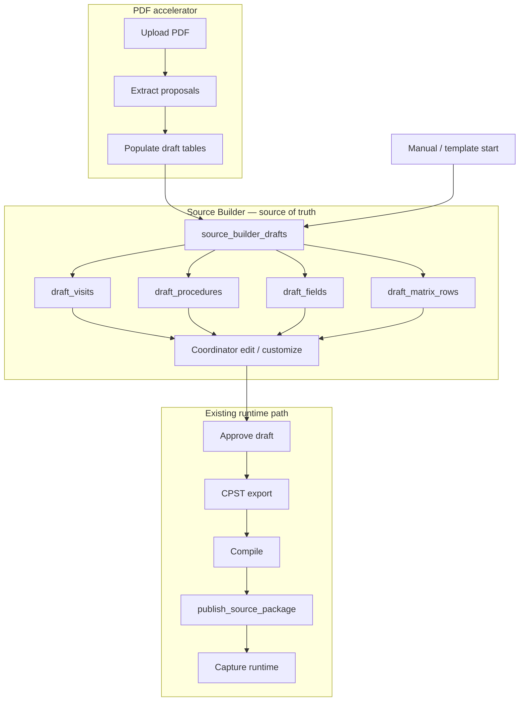

# Phase 6A — Source Document Builder Workspace (Canonical Spec)

**Status:** Planning / architecture only  
**Parents:** [`PHASE6A-COORDINATOR-SOURCE-BUILDER-PLAN.md`](./PHASE6A-COORDINATOR-SOURCE-BUILDER-PLAN.md) · [`PHASE6A.3-PROCEDURE-PROFILE-LIBRARY.md`](./PHASE6A.3-PROCEDURE-PROFILE-LIBRARY.md)

**This document is the authoritative workspace requirement.** All procedure library logic, field customization, visit builder, template overrides, and PDF/SoE review **must** live inside this single section—not in separate tools or runtime paths.

---

## 1. Architectural mandate

> **ALL** of the procedure library, field customization, visit builder, and template override logic lives inside the **Source Document Builder / Source Authoring** section.

This is the operational workspace where the coordinator builds the **study source package** before publish. It is the **source of truth** until `publish_source_package` runs.

| Must live in Source Builder | Must NOT be a separate product surface |
|-----------------------------|--------------------------------------|
| Procedure profile library (browse, attach, clone) | CRA review / monitor workflow |
| Field add / edit / disable / custom fields | Sponsor portal |
| Visit builder | SDV verification engine |
| Visit × procedure matrix editor | Enterprise protocol management |
| Template overrides & custom procedures | Auto-publishing AI pipeline |
| PDF / SoE import **review** (same UI as manual) | Developer JSON/YAML config UI |

---

## 2. Coordinator capabilities (required)

The Source Builder workspace **must** allow the coordinator to:

### 2.1 Create visits manually

Examples (coordinator-defined labels):

- Visit 1, Visit 2, Visit 3  
- Follow-up  
- End of Study (EOS)  
- Phone visit  
- Unscheduled visit  

Stored in: `source_builder_draft_visits`

### 2.2 Attach reusable procedures to visits

- Browse/search the global procedure documentation profile library (`PROC_*`)  
- Attach profiles to one or more visits via the matrix  

Stored in: `source_builder_draft_procedures`, `source_builder_draft_matrix_rows`

### 2.3 Automatically generate minimal operational documentation fields

- On attach, system copies **minimal operational fields** from the selected procedure profile / field template  
- Coordinator may edit immediately; no engineering required  

Stored in: `source_builder_draft_fields` (initial population from library)

### 2.4 Add / edit / remove fields operationally

Without engineering involvement:

- Add sponsor-specific notes, vendor timestamps, local workflow fields  
- Rename labels, toggle required, reorder, helper text, visibility  
- Disable (hide) base library fields  
- Remove draft-only fields  

Mechanisms: `source_builder_draft_fields`, `study_procedure_field_overrides` (see [`PHASE6A.3`](./PHASE6A.3-PROCEDURE-PROFILE-LIBRARY.md) §J)

### 2.5 Add / edit / remove procedures operationally

Per study / protocol:

- Attach library profiles  
- Clone profiles (e.g. Vitals → Pre-dose Vitals)  
- Create fully custom procedures (name, style, field list)  

Mechanisms: `source_builder_draft_procedures`, `custom_procedure_templates`, `study_procedure_template_overrides`

### 2.6 Customize the visit × procedure matrix

Including:

| Matrix concern | Draft field |
|----------------|-------------|
| Required vs optional vs not done | `matrix_marker` |
| Conditional procedures | `conditional_flag`, `condition_summary` |
| Timing notes | `timing_notes` |
| Operational notes | `notes` on row / procedure |
| Window notes | `window_notes`; visit-level `window_start` / `window_end` |

Stored in: `source_builder_draft_matrix_rows`, `source_builder_draft_visits`

### 2.7 Create and save reusable study templates

- Save an approved draft configuration as a **study template** for future studies  
- Clone template into a new draft (`origin=cloned_template`)  
- Org/site scoped; coordinator-operated  

Planning extension: `source_builder_saved_templates` (future table; v1 may use named draft snapshots)

---

## 3. PDF / Schedule of Events ingestion (same workspace)

The Source Builder workspace **also** serves as the **only** review/edit layer for PDF-ingested Schedule of Events. PDF ingestion is an **accelerator**, not a parallel product.

### 3.1 When coordinator uploads a protocol PDF or SoE PDF

**System extracts (proposals only):**

- Visits  
- Procedures  
- Windows  
- Timing  
- Notes  
- Conditional procedures  

**System generates (draft rows only):**

- Draft visits → `source_builder_draft_visits`  
- Draft procedure matrix → `source_builder_draft_matrix_rows`  
- Draft documentation profiles / fields → `source_builder_draft_procedures` + `source_builder_draft_fields`  

Import tracking: `source_builder_import_jobs`, `source_builder_import_warnings`

### 3.2 Coordinator review (inside Source Builder — not a separate app)

The coordinator **must** be able to:

| Action | Applies to |
|--------|------------|
| Accept extraction | Row `import_row_status=accepted` |
| Reject extraction | Row `import_row_status=rejected` |
| Rename visits | `visit_label` |
| Remove procedures | Delete matrix row / draft procedure |
| Add missing procedures | Attach from library or custom |
| Edit generated fields | `source_builder_draft_fields` |
| Add custom fields | Overrides / draft fields |
| Reorder procedures | `execution_order`, `sort_order` |
| Edit timing / windows | Visit + matrix timing fields |
| Mark conditional procedures | `conditional_flag`, `condition_summary` |
| Add operational notes | Procedure / matrix `notes` |

### 3.3 Critical architectural rule

```text
PDF extraction NEVER publishes directly into runtime templates.
```

**Required pipeline:**

```text
Source Builder Draft  →  Coordinator Review  →  Publish
```



---

## 4. Planning-level data concepts (required)

| # | Concept | Role |
|---|---------|------|
| 1 | `source_builder_drafts` | Root working package per study version |
| 2 | `source_builder_draft_visits` | Visit definitions in draft |
| 3 | `source_builder_draft_procedures` | Procedures (library, clone, or custom) |
| 4 | `source_builder_draft_fields` | Effective capture fields per procedure |
| 5 | `source_builder_import_jobs` | PDF upload + extract session |
| 6 | `source_builder_import_warnings` | Extraction confidence / errors |
| 7 | `source_builder_publish_versions` | Audit trail of publish from draft |

### 4.1 `source_builder_drafts`

| Field | Purpose |
|-------|---------|
| `id` | PK |
| `organization_id` | Tenant |
| `study_id`, `study_version_id` | Bind to real study |
| `study_template_id` | CPST template key |
| `origin` | `manual` \| `pdf` \| `cloned_template` |
| `import_job_id` | Nullable; set when PDF path |
| `status` | `editing` → `ready_for_review` → `approved` → `published` |
| `version` | Integer; increments on material edits |
| `approved_by`, `approved_at` | Human approval before export |
| `created_by`, `created_at` | |

### 4.2 `source_builder_draft_visits`

| Field | Purpose |
|-------|---------|
| `draft_id`, `visit_id` | |
| `visit_label` | Coordinator-facing name |
| `visit_group`, `planned_day` | |
| `window_start`, `window_end` | Study day windows |
| `delivery_mode` | onsite, phone, hybrid |
| `sort_order`, `notes` | |
| `import_row_status` | `proposed` \| `accepted` \| `rejected` (PDF path) |

### 4.3 `source_builder_draft_procedures`

| Field | Purpose |
|-------|---------|
| `draft_procedure_id` | PK within draft |
| `base_profile_code` | Nullable; `PROC_*` from library |
| `custom_template_id` | Nullable; coordinator-created |
| `display_name`, `category`, `documentation_style` | |
| `clone_of` | Lineage for cloned profiles |
| `operational_notes` | |

### 4.4 `source_builder_draft_fields`

| Field | Purpose |
|-------|---------|
| `field_key`, `display_label`, `data_type` | |
| `required`, `hidden`, `display_order` | |
| `helper_text`, `conditional_rule_summary` | |
| `base_field_key` | Nullable; library origin |
| `source_override_type` | `add` \| `edit` \| `disable` \| `library_default` |

### 4.5 `source_builder_import_jobs`

| Field | Purpose |
|-------|---------|
| `draft_id` | Target draft |
| `file_storage_path`, `sha256`, `filename` | Preserved PDF reference |
| `status` | `uploaded` → `extracting` → `draft_populated` \| `failed` |
| `created_by`, `extracted_at` | |

### 4.6 `source_builder_import_warnings`

| Field | Purpose |
|-------|---------|
| `job_id`, `severity`, `code`, `message` | |
| `entity_type`, `entity_ref` | Visit / procedure / matrix / field |
| `page` | Optional PDF page |

### 4.7 `source_builder_publish_versions`

| Field | Purpose |
|-------|---------|
| `draft_id`, `draft_version` | What was published |
| `publish_package_id` | Link to `source_publish_packages` |
| `published_by`, `published_at` | |
| `cpst_export_hash` | Integrity check |
| `status` | `success` \| `failed` |

---

## 5. Published output → existing runtime (no fork)

Final publish **must** map into the **existing** architecture only:

| Builder export | Existing runtime target |
|----------------|-------------------------|
| Study template / CPST `Study_Setup` | Study versioning context (`studies`, `study_versions`) |
| `Visit_Templates` rows | `visit_definitions` (optional sync) |
| `Procedure_Library` rows | `procedure_definitions` (optional sync) |
| `Visit_Procedure_Matrix` | `visit_def_procedure_map` (optional sync) |
| `Field_Definitions` | `source_fields` via compile + publish |
| Compiled source definitions | `source_definition_versions` (Phase 4A) |
| `publish_source_package` | `published_*` snapshots (Phase 4C) |
| Bound procedure execution | `open_source_response_set` → capture UI (Phase 4B/5) |

**Pipeline (unchanged from Phase 4C):**

```text
source_builder_drafts (approved)
  → effective CPST import JSON
  → compile-cpst-runtime-graph.mjs
  → compile-source-definitions.mjs
  → build-source-publish-package.mjs
  → publish_source_package (RPC)
  → runtime capture
```

---

## 6. Workspace character

The Source Builder workspace **is:**

| Attribute | Meaning |
|-----------|---------|
| **Coordinator-first** | Primary user = site coordinator |
| **Operational** | Lean fields; what happened / when / action / evidence ref |
| **Editable** | All draft rows mutable until approve |
| **Low-friction** | No-code; inline edits |
| **Draft-based** | Nothing live until publish |
| **Review-before-publish** | Approve draft ≠ publish |

The Source Builder workspace is **not:**

| Excluded | Reason |
|----------|--------|
| Sponsor workflow | Site-first product direction |
| CRA tooling | Deferred (`PHASE5.6B`) |
| SDV engine | Out of scope |
| Enterprise protocol management | Avoid PMO complexity |
| Auto-publishing AI system | PDF/AI proposes; human publishes |

---

## 7. UI surface (planning)

| Surface | Route (proposed) |
|---------|------------------|
| Builder home | `/studies/[studyId]/source-builder` |
| Draft editor | `/studies/[studyId]/source-builder/drafts/[draftId]` |
| Visits panel | Tab: Visits |
| Procedures / library | Tab: Procedures + sidebar library |
| Matrix | Tab: Schedule matrix (visit × procedure grid) |
| Fields | Per-procedure field editor |
| Import | Tab: Import (visible when `import_job_id` set; same editor as manual) |
| Preview / publish | Actions: Preview MD → Approve → Publish |

**No separate “PDF review” route** — import tab within the draft editor only.

---

## 8. Implementation gate

Do **not** ship PDF extraction UI until:

1. Manual draft path works (visits, attach, fields, matrix, customize).  
2. Approve → CPST export → `publish_source_package` → capture verified.  
3. Field overrides and clone procedure work in the **same** draft editor.

---

## 9. Related documents

| Doc | Content |
|-----|---------|
| [`PHASE6A-COORDINATOR-SOURCE-BUILDER-PLAN.md`](./PHASE6A-COORDINATOR-SOURCE-BUILDER-PLAN.md) | Full Phase 6A plan, flows, customization §6 |
| [`PHASE6A.3-PROCEDURE-PROFILE-LIBRARY.md`](./PHASE6A.3-PROCEDURE-PROFILE-LIBRARY.md) | 68 `PROC_*` profiles, field templates, override tables |
| [`fixtures/source-builder/procedure-profile-library.v1.json`](../fixtures/source-builder/procedure-profile-library.v1.json) | Machine-readable library seed |

---

*End of Source Builder workspace canonical spec.*
