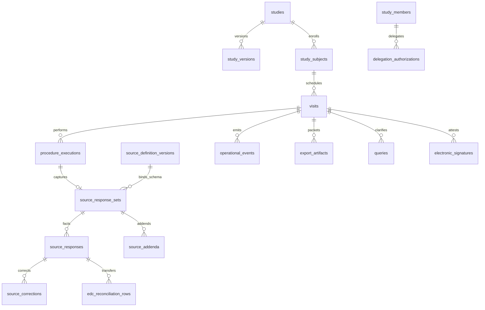

# Regulatory Core — Blueprint and Implementation Roadmap

**Product:** Vilo Research OS (clinical research site operating system)  
**Status:** Architecture planning — **no DDL, UI, PDF, signatures, queries, or RPC changes in this artifact**  
**Regulatory posture:** FDA eSource–informed, 21 CFR Part 11–relevant design, **ALCOA+** as first-class contract  
**Baseline (GREEN, do not alter):** Phase **3C** visit/procedure RPCs; Phase **4A** versioned protocol builder schema applied

**Companion docs:**  
[`FDA-ESOURCE-PART11-READINESS.md`](./FDA-ESOURCE-PART11-READINESS.md) · [`PHASE4A-VERSIONED-PROTOCOL-BUILDER-SCHEMA.md`](./PHASE4A-VERSIONED-PROTOCOL-BUILDER-SCHEMA.md) · [`ARCHITECTURE-VISIT-PDF-PACKET.md`](./ARCHITECTURE-VISIT-PDF-PACKET.md) · [`ARCHITECTURE-VERSIONED-EXPORTS.md`](./ARCHITECTURE-VERSIONED-EXPORTS.md) · [`PHASE2-CLINICAL-DOMAIN-SCHEMA.md`](./PHASE2-CLINICAL-DOMAIN-SCHEMA.md) · `projects/vilo-os/10_DECISIONS/{append-only-event-architecture,audit-strategy,rbac-model,phi-boundaries}.md`

---

## 1. Regulatory Core Objective

The **Regulatory Core** is the inspection-ready documentary substrate of Vilo Research OS. Its purpose is:

> **To reconstruct the clinical-documentary history of each subject visit with complete traceability, attribution, versioning, correction history, signatures, exports, and audit readiness.**

A monitor, sponsor, QA reviewer, or FDA inspector must be able to answer, without ambiguity:

| Question | Regulatory Core must answer via persisted facts + events |
|----------|----------------------------------------------------------|
| What happened? | Visit/procedure/source facts, deviations, AEs, ConMeds |
| Who documented it? | `originator_user_id`, role snapshot, delegation context |
| When? | Server **UTC** timestamps on capture, correction, sign, lock, export |
| Under which protocol/source version? | `study_version_id`, `source_definition_version_id` |
| What changed? | Append-only correction/addendum chains — **no silent overwrite** |
| What was signed, with what meaning? | `electronic_signatures` + linked scope |
| What was exported? | `export_artifacts` + `audit_events` (`RECORD_EXPORTED` class) |
| How does source map downstream? | `edc_mappings` / transfer rows with reconciliation status |

The Regulatory Core sits **below** presentation (eSource UI, Protocol Builder canvas) and **above** operational convenience tables (`visits`, `procedure_executions`). **Authoring surfaces are not the system of record** for historical answers; persisted rows + append-only events are.

---

## 2. Core Object Model

Conceptual entities and relationships. Names align with Phase **4A** DDL and planned Phase **4B+** tables unless noted.

### 2.1 Study spine (existing + Phase 4A)

| Object | Role | Key relationships |
|--------|------|-------------------|
| **Study** | Tenant-scoped trial container | `organization_id`; has many **Study Versions**, **Subjects** |
| **Study Version** | Frozen protocol window / amendment boundary | Binds **Visit Definitions**, optional default **Protocol Version** context |
| **Protocol Version** | Logical label for sponsor-facing protocol revision (may map 1:1 to **Study Version** or be denormalized on exports) | Referenced on visit/source packets for human readability |
| **Visit Definition** | Scheduled visit type in protocol (e.g. Screening, V2) | Maps to **Procedure Definitions** via `visit_def_procedure_map` |
| **Procedure Definition** | Atomic unit of work at a visit | Binds default **Source Definition Version** via `procedure_source_bindings` |

### 2.2 Execution spine (existing Phase 2–3C)

| Object | Role | Key relationships |
|--------|------|-------------------|
| **Subject** | Enrolled participant registry (PHI) | Parent of **Visit Instances** |
| **Visit Instance** (`visits`) | Materialized visit row + lifecycle state | Many **Procedure Executions**; emits **Operational Events** |
| **Procedure Execution** | Per-visit procedure run | Binds `source_definition_version_id` at capture; parent of **Source Response Set** |
| **Operational Event** | Append-only workflow fact | `visit_id`, `procedure_execution_id`, `event_type`, `actor_user_id`, `occurred_at` |

### 2.3 Source instrument spine (Phase 4A applied)

| Object | Role | Key relationships |
|--------|------|-------------------|
| **Source Definition** | Stable instrument lineage (code per study) | Has many **Source Definition Versions** |
| **Source Definition Version** | Published/draft schema snapshot | Has many **Source Fields**; immutable after `published` |
| **Source Field** | Item definition (`field_key`, required, type, validation rules) | Target of **Source Response** rows |

### 2.4 Capture spine (Phase 4B+ — planned)

| Object | Role | Key relationships |
|--------|------|-------------------|
| **Source Response Set** | Container for one capture episode on a procedure (draft → submit → sign) | FK: `procedure_execution_id`, `source_definition_version_id`, `organization_id` |
| **Source Response** | Atomic captured value for one field | FK: `source_response_set_id`, `source_field_id`; lineage columns §3 |
| **Source Correction** | Append-only change to a submitted value | `supersedes_source_response_id`, reason, prior value reference |
| **Source Addendum** | Post-lock explanatory addition (not a silent edit) | Links visit/procedure/set; distinct from correction taxonomy |
| **Source Attachment** | Binary evidence (consent scan, photo) with hash + attribution | Scoped to set or visit; Storage path + metadata row |

### 2.5 Attestation and quality (Phase 4E–4F)

| Object | Role | Key relationships |
|--------|------|-------------------|
| **Signature** (`electronic_signatures`) | Non-boolean attestation with meaning | Polymorphic link: visit, set, execution; integrity hash |
| **Review** | PI/QA/monitor review record | States §5D; may gate `pending_review` → `reviewed` |
| **Query** | Data clarification / monitor query | Linked to visit, procedure, source field; lifecycle §5C |

### 2.6 Safety and compliance adjuncts

| Object | Role | Key relationships |
|--------|------|-------------------|
| **Deviation** | Protocol deviation (visit window, missed procedure, etc.) | May be required by **Visit Window Engine** |
| **AE** | Adverse event capture (may be dedicated source instrument or domain table) | Subject-scoped; exportable in visit packet when visit-linked |
| **ConMed** | Concomitant medication | Subject-scoped; visit linkage when captured at visit |
| **Validation Finding** | Rule breach (edit check, range, completeness) | Resolution lineage; does not replace correction |

### 2.7 Audit, export, integration

| Object | Role | Key relationships |
|--------|------|-------------------|
| **Audit Event** | Security/compliance stream | Exports, role changes, break-glass — **not** every keystroke |
| **Export Artifact** | Stored PDF/CSV/checksum manifest | `visit_id`, version ids, `integrity_reference` |
| **EDC Mapping** | Source field → sponsor EDC coordinates | Drives **EDC Reconciliation** rows |
| **Delegation Authorization** | Who may act for whom on study/task | Date-bounded; Phase **4G** |
| **Training Record** | Qualification validity | Gates regulated actions; Phase **4G** |

### 2.8 Conceptual ERD (Regulatory Core)



---

## 3. Source Data Lineage Model

Every **Source Response** (and every correction row that supersedes it) MUST be reconstructable with the following **minimum lineage vector**. These fields are **authoritative at persist time** — not recomputed from today's live form.

| Lineage dimension | Column / reference | Rules |
|-------------------|-------------------|--------|
| Originator identity | `originator_user_id` | Authenticated user at save/submit; never anonymous |
| Originator role | `originator_role` | Snapshot from `study_members.role` (or successor auth model) at capture |
| Capture device / system | `source_system`, `capture_device_id` | Nullable; required when data imported from device/integration |
| Contemporaneous time | `captured_at` | **Server UTC** — client display time is non-authoritative |
| Execution context | `procedure_execution_id` | Required for procedure-scoped instruments |
| Schema version | `source_definition_version_id` | Required; binds field semantics |
| Field identity | `source_field_id` | FK to frozen `source_fields` row |
| Value | `value` (typed storage) | See `value_type` |
| Value typing | `value_type` | e.g. `text`, `numeric`, `date`, `coded`, `boolean`, `json_ref` |
| Version used | `source_definition_version_id` (duplicate intentional on exports) | Must match execution binding |
| Correction chain | `supersedes_source_response_id`, head via `source_corrections` | Append-only; prior rows retained |
| Signature status | `signature_status` enum on set or response | e.g. `unsigned`, `pending`, `signed` — not a lone boolean |
| Export status | `export_status`, `last_export_artifact_id` | Updated only via export pipeline |
| Downstream EDC | `edc_mapping_id`, reconciliation row FK | Nullable until transfer attempted |

**Immutability rule:** After `source_response_sets.lifecycle_status` reaches `signed` or visit reaches `locked`, **UPDATE of `value` is forbidden**. Changes flow only through **Source Correction** or **Source Addendum** (+ compensating **Operational Event**).

**PHI rule:** Lineage stores identifiers and typed values needed for care; **audit** and **operational** payloads reference `source_response_id` — not full clinical narrative in `audit_events.metadata` (`phi-boundaries.md`).

---

## 4. Audit Trail Model

Vilo maintains **two streams** (locked decision: `audit-strategy.md`, `append-only-event-architecture.md`):

| Stream | Table | Primary use |
|--------|-------|-------------|
| Operational | `operational_events` | Clinical workflow reconstruction |
| Security / compliance | `audit_events` | Exports, permissions, break-glass, sensitive reads |

### 4.1 Field-level audit event schema (conceptual)

For regulated field changes, persist **audit events** or **operational events** with:

| Field | Purpose |
|-------|---------|
| `event_id` | Stable UUID |
| `object_type` | e.g. `source_response`, `visit`, `procedure_execution` |
| `object_id` | UUID of entity |
| `field_name` | `source_field_id` or logical key |
| `old_value_reference` | Pointer, hash, or redacted digest — **not** silent nulling |
| `new_value_reference` | Pointer to new row or correction id |
| `changed_by` | `actor_user_id` |
| `role` | Role snapshot at change |
| `timestamp_utc` | Server-generated |
| `reason_for_change` | Required on correction paths |
| `system_generated` | Boolean — distinguishes user edit vs rule engine |
| `device` / `source_ip` | When available (audit stream) |
| `related_operational_event_id` | Cross-link |
| `related_audit_event_id` | Cross-link when both required by policy |

### 4.2 Non-negotiable audit rules

1. **Append-only** — application roles cannot UPDATE or DELETE audit/operational history.  
2. **Immutable** — corrections add rows; they do not erase prior values.  
3. **No clinical runtime deletes** — visits, executions, submitted source use supersede/invalidate/archive.  
4. **No silent overwrite** — submitted `source_responses` are immutable; changes use **Source Correction** chain.  
5. **No PHI-heavy audit payloads** — max metadata size; reference ids; truncate excerpts (`audit-strategy.md`).  

**Mapping to trail categories** (FDA doc §B): `create`, `correct`, `supersede`, `invalidate`, `lock`, `sign`, `export`, `transfer` → `operational_events.event_type` extensions + `audit_events.action` codes.

---

## 5. State Machines

Materialized columns on convenience tables may mirror these states; **transitions MUST emit operational events** in the same transaction.

### 5A. Visit lifecycle

| State | Meaning | Typical entry |
|-------|---------|---------------|
| `scheduled` | Visit planned | `VISIT_SCHEDULED` |
| `in_progress` | Subject on site / procedures underway | check-in / first procedure |
| `completed` | Required procedures satisfied | `complete_visit` RPC (GREEN) |
| `locked` | QC freeze; immutability enforced | `lock_visit` RPC (GREEN) |
| `amended` | Controlled post-lock amendment path opened | amendment RPC + policy |
| `archived` | Retention tier; read-only | archive job |

**Note:** Phase **3C** today implements `completed` and `locked`. `amended` and `archived` are Regulatory Core extensions without altering GREEN RPC contracts until approved change order.

Allowed transitions (simplified):

```text
scheduled → in_progress → completed → locked
locked → amended → locked   (controlled)
* → archived                 (retention; no delete)
```

### 5B. Source document (response set) lifecycle

| State | Meaning |
|-------|---------|
| `draft` | Editable; not yet evidentiary |
| `in_progress` | Active capture |
| `pending_review` | Awaiting PI/QA review |
| `reviewed` | Review complete; may await signature |
| `signed` | Attestation recorded |
| `locked` | Tied to visit lock or execution freeze |
| `corrected` | At least one correction in chain; set may still be signed |
| `addended` | Addendum attached post-lock |
| `archived` | Retention |

```text
draft → in_progress → pending_review → reviewed → signed → locked
locked → corrected → (re-sign policy TBD)
locked → addended
* → archived
```

### 5C. Query lifecycle

| State | Meaning |
|-------|---------|
| `open` | Raised, awaiting response |
| `answered` | Site responded |
| `closed` | Accepted resolution |
| `reopened` | Monitor/sponsor rejected answer |

Every transition: `QUERY_*` operational event + optional audit when export-related.

### 5D. Review lifecycle

| State | Meaning |
|-------|---------|
| `pending` | Awaiting reviewer |
| `reviewed` | Accepted content |
| `rejected` | Sent back for correction |
| `signed` | Reviewer attestation when review requires signature |

---

## 6. Delegation and Authorization Engine

**Phase 4G** — requirements for regulated actions (capture, correct, sign, lock, export).

| Rule | Requirement |
|------|-------------|
| Study/task delegation | User MUST appear on **Delegation Authorization** for study + task class (e.g. obtain consent, sign PI attestation) |
| Date validity | Delegation effective **on date of action** (`valid_from` ≤ action date ≤ `valid_to`) |
| Training currency | **Training Record** MUST be current for role/task before write |
| Role permission | `study_members.role` + server policy matrix allows action |
| PI / sub-I signatures | Signer MUST be delegated investigator role; system verifies against delegation log |
| CRC boundary | CRC **cannot** sign investigator-only attestations (`meaning_of_signature` catalog enforced server-side) |
| Monitor access | **Read-only**; query open/answer may be allowed; no source edit; all access traceable via audit |

**Enforcement layers:** RLS (backstop) → RPC/policy function (gate) → UI (display only).

Does **not** replace `study_members`; **narrows** who may perform regulated acts.

---

## 7. Visit Window Engine

**Phase 4I** — automates protocol schedule compliance on **Visit Instance**.

| Field / flag | Purpose |
|--------------|---------|
| `visit_window_start` | Protocol-derived earliest date |
| `visit_window_end` | Protocol-derived latest date |
| `actual_visit_date` | From `visits.actual_date` / completion RPC |
| `out_of_window` | Computed boolean |
| `deviation_required` | When out of window and policy mandates deviation record |
| `outside_window_reason` | Narrative/code when visit proceeds OOW |
| Event | `VISIT_OUT_OF_WINDOW` (or equivalent) on `operational_events` when flag set |

Completing or locking a visit **does not** silently clear OOW — deviation row or waiver reason required per study config.

---

## 8. Query / Review Layer

**Phase 4F** — data quality and monitor workflow.

| Query type | Typical actor | Linkage |
|------------|---------------|---------|
| Internal query | CRC, study_admin | `visit_id`, `procedure_execution_id`, `source_field_id` |
| CRA / monitor query | `monitor` role | Same anchors + read-only site response path |
| PI review comment | PI / sub-I | Review entity §5D |
| QA finding | QA role | May map to `validation_findings` |
| Data clarification record (DCR) | Sponsor-facing | Exportable in visit packet |

**Requirements:**

- All queries link to **visit**, and when field-specific: **procedure execution** + **source field** + optional `source_response_id`.  
- Full **query lifecycle audit trail** (state machine §5C) on `operational_events`.  
- Resolution MUST NOT mutate historical source values — site answers via correction workflow or documented rationale.

---

## 9. EDC Reconciliation Layer

**Phase 4H** — traceability from site source to sponsor EDC.

| Field | Purpose |
|-------|---------|
| `source_field_id` | Origin field definition |
| `source_response_id` | Origin fact row (or correction head) |
| `edc_field_identifier` | Sponsor field OID/name |
| `edc_form_name` | Target form |
| `edc_visit_name` | Target visit folder |
| `transfer_status` | `pending`, `sent`, `acknowledged`, `failed` |
| `transferred_at` | Server UTC |
| `transferred_by` | User or named integration identity |
| `reconciliation_status` | `matched`, `discrepant`, `pending`, `waived` |
| `discrepancy_reason` | Required when `discrepant` |

Transfers emit **operational** or **data_transfer** events (§J FDA doc); exports of transfer logs are **version-scoped** like clinical exports.

---

## 10. Source Packet Engine

**Phase 4D** — visit-level **inspection-readable** PDF (requirements; no renderer in this phase).

Each **visit packet** MUST assemble:

| Section | Content |
|---------|---------|
| Visit metadata | Definition, status, scheduled vs actual, window flags |
| Protocol / study / source version | `study_version_id`, `protocol_version` label, per-procedure `source_definition_version_id` |
| Procedures | Execution status, performer attribution, timestamps |
| Source responses | Rendered facts under bound versions — **no version mixing** |
| Corrections / addenda | Human-readable timeline |
| Signatures | Signer, role, `meaning_of_signature`, `signed_at` |
| Audit / event references | ids + action codes — **not** full payloads |
| Attachments index | Filename, hash, uploader, timestamp |
| Export metadata | Generator, artifact hash, `RECORD_EXPORTED` audit ref |
| Lock status | Visit + execution-level freeze |

See [`ARCHITECTURE-VISIT-PDF-PACKET.md`](./ARCHITECTURE-VISIT-PDF-PACKET.md) for presentation rules and ALCOA+ **Legible / Available** alignment.

---

## 11. Validation / URS–FRS Traceability

Each regulatory requirement MUST map to validation evidence before production claims:

| Artifact | Purpose |
|----------|---------|
| **URS** | User requirement — what the site/sponsor needs |
| **FRS** | Functional requirement — what Vilo implements |
| **Test case** | Executable proof (RLS, RPC, integration) |
| **Expected evidence** | Screenshot, export sample, audit log excerpt, validator output |
| **Validation status** | `planned` → `in_progress` → `passed` / `failed` / `waived` |

**ALCOA+ validators** (future `db:validate-*`) must prove attributable actors, server UTC, version-consistent exports, correction chain integrity, locked-visit immutability — per [`FDA-ESOURCE-PART11-READINESS.md`](./FDA-ESOURCE-PART11-READINESS.md).

**Traceability matrix** (starter — expand in validation pack):

| URS theme | FRS anchor | Test hook | Evidence |
|-----------|------------|-----------|----------|
| Audit trail for source changes | §4 audit model | RLS + correction INSERT-only | Event row + prior value ref |
| No delete of clinical data | §4.2 rules | Forbidden DELETE policies | Policy grep / negative test |
| Version-bound capture | §3 lineage | `source_definition_version_id` NOT NULL | Schema + validator |
| Visit lock immutability | §5A `locked` | Phase 3C + 4B guards | `lock_visit` + post-lock save denied |
| Inspection PDF | §10 packet | Phase 4D golden file | Stored `export_artifacts` checksum |
| Role-based sign | §6 delegation | Phase 4G policy tests | CRC denied PI meaning codes |

---

## 12. Phase Roadmap

Phase **4A** (**Versioned Protocol Builder**) is **applied**. Subsequent phases build the Regulatory Core without modifying GREEN Phase **3C** RPCs until an approved change order.

| Phase | Name | Regulatory Core deliverable |
|-------|------|------------------------------|
| **4B** | Versioned Dynamic eSource Runtime schema | `source_response_sets`, `source_responses`, draft/submit lifecycle, bind `procedure_executions.source_definition_version_id` |
| **4C** | Source data lineage + correction/addendum engine | Lineage columns §3, `source_corrections`, `source_addenda`, `validation_findings`, compensating events |
| **4D** | Source packet PDF export engine | Visit packet §10, `export_artifacts`, `RECORD_EXPORTED` audit |
| **4E** | Electronic signatures + review/attestation | `electronic_signatures`, review states §5D, meaning catalog |
| **4F** | Query / QC / data review engine | Query entity §8, lifecycle §5C |
| **4G** | Delegation / training / authorization engine | §6 objects, pre-action policy RPCs |
| **4H** | EDC reconciliation / export mapping | §9 reconciliation rows, transfer events |
| **4I** | Visit window / deviation automation | §7 flags, deviation linkage, OOW events |

**Phase renumbering note:** Older docs mapped PDF to **4C** and tabular export to **4D**. This blueprint adopts the **lineage-before-packet** order above so inspection-ready **facts** exist before PDF/EDC carriers. Tabular export remains governed by [`ARCHITECTURE-VERSIONED-EXPORTS.md`](./ARCHITECTURE-VERSIONED-EXPORTS.md) (may ship adjacent to **4D** or **4H**).

### 12.1 Explicit non-goals per phase (until phase opens)

| Phase | Do not ship early |
|-------|-------------------|
| 4B | eSource UI canvas, PDF, signatures, monitor queries |
| 4C | PDF renderer |
| 4D | Live eSource form builder changes |
| 4E–4I | Breaking changes to `complete_visit` / `lock_visit` / `complete_procedure_execution` |

---

## 13. Immediate Next Build Recommendation

### Phase 4B — DDL design (documentation + migration PR when approved)

Design and review **only** the following tables and constraints before any UI:

#### `source_response_sets`

| Column group | Notes |
|--------------|-------|
| Keys | `id`, `organization_id`, `study_id`, `visit_id`, `procedure_execution_id` |
| Version bind | `source_definition_version_id` NOT NULL |
| Lifecycle | `lifecycle_status` enum §5B |
| Attribution | `created_by_user_id`, `submitted_by_user_id`, `submitted_at` (server UTC) |
| Signature summary | `signature_status` (aggregate; detail in 4E) |

Unique: one **active** set per `(procedure_execution_id, source_definition_version_id)` unless policy allows superseded sets.

#### `source_responses`

| Column group | Notes |
|--------------|-------|
| Lineage §3 | `originator_user_id`, `originator_role`, `captured_at`, `source_system`, `capture_device_id` |
| Value | `source_field_id`, `value_type`, `value` (typed columns or validated JSONB keyed by field) |
| Chain | `supersedes_source_response_id` nullable |
| Immutability | Trigger/policy: no UPDATE to `value` after set `signed` / visit `locked` |

#### `source_corrections` (Phase 4B stub or 4C full)

| Column group | Notes |
|--------------|-------|
| `source_response_id`, `correction_type`, `correction_reason` | Required narrative |
| `prior_value_reference`, `new_source_response_id` | Chain |
| `corrected_by`, `corrected_at` | Server UTC |
| `operational_event_id` | Required link |

#### `source_addenda` (4B nullable table or 4C)

Post-lock narrative; FK to `visit_id` / `source_response_set_id`; `addendum_reason`; `created_by`; no in-place value edit.

#### `validation_findings`

| Column group | Notes |
|--------------|-------|
| `source_response_set_id`, `source_field_id`, `rule_code`, `severity` | |
| `finding_status` | `open`, `resolved`, `waived` |
| `resolved_by`, `resolved_at`, `resolution_note` | |

#### RLS and RPC posture

- Every table: `organization_id` + `study_members` gate.  
- Writes: `SECURITY INVOKER` RPCs only — no `service_role` on clinical path.  
- Inserts: companion `operational_events` (`FORM_SAVED`, `SOURCE_SUBMITTED`, etc.).  
- **Do not** alter GREEN Phase **3C** RPC bodies in the 4B PR.

#### Suggested migration sequence (after 4A `0019`)

| Order | Migration | Content |
|-------|-----------|---------|
| 1 | `0020_source_response_sets.sql` | Set container + RLS |
| 2 | `0021_source_responses.sql` | Facts + lineage columns |
| 3 | `0022_source_corrections_addenda.sql` | Correction/addendum (minimal if deferred to 4C) |
| 4 | `0023_validation_findings.sql` | Edit-check persistence |
| 5 | `0024_source_capture_rpcs.sql` | Draft save / submit — **new** RPCs only |

Deliverable for 4B close: **`PHASE4B-ESOURCE-RUNTIME-SCHEMA.md`** + `validate-phase4b.mjs` mirroring Phase 4A pattern.

---

## Appendix A — Operational event types (planned extensions)

Non-exhaustive additions to `operational_events.event_type`:

`SOURCE_DRAFT_SAVED`, `SOURCE_SUBMITTED`, `SOURCE_CORRECTED`, `SOURCE_ADDENDED`, `SOURCE_REVIEW_REQUESTED`, `SOURCE_SIGNED`, `QUERY_OPENED`, `QUERY_ANSWERED`, `QUERY_CLOSED`, `QUERY_REOPENED`, `VISIT_OUT_OF_WINDOW`, `DEVIATION_RECORDED`, `EDC_TRANSFER_SENT`, `EDC_RECONCILIATION_DISCREPANT`, `EXPORT_ARTIFACT_CREATED`

---

## Appendix B — Green baseline inventory

| Capability | Status |
|------------|--------|
| Multi-tenant RLS (`organization_id`) | Applied |
| Studies / subjects / visits / procedures | Applied |
| `operational_events` append-only | Applied |
| `complete_procedure_execution` RPC | GREEN |
| `complete_visit` / `lock_visit` RPC | GREEN |
| Versioned protocol builder (4A) | Applied |
| FDA / Part 11 / ALCOA+ architecture docs | Published |
| Regulatory Core runtime tables (4B+) | **Not started** |

---

*This document is regulatory-informed engineering posture, not legal advice or validation certification.*
